```
艺名：木易    老杨    名字只是个称呼  随意就好   
课前须知：
	1. 上课时间： 每周一到周五  共五天  每天晚上八点到十点   
	2. 上班时间： 每周一到周六  13:00 ~ 23:00 

0基础  难不难  能不能学好    
针对从0基础开始的   编程本身并不难  Python可以说是最简单的一种
难度：  不怕万人阻挡，只怕自己投降

学习的建议：
	本人的上课风格，习惯   学会举例子和生活对应起来，知识点就更容易掌握了
	重点是掌握到本质   

本节课主要都会讲到那些东西
	1. 软件的安装  
	2. 计算机的常识  铺垫的知识基础入门知识
	3. 接下来都要学习什么东西
	4. 同学们比较关注的话题    
```

学习编程第一件事：

常识事情：

打开文件扩展名

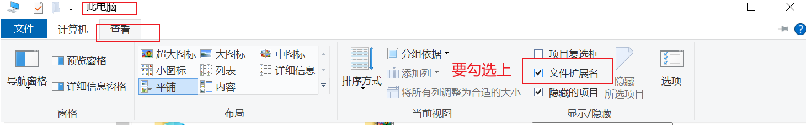

手机能编程吗？       也不是不可以，但是非常不方便       

电脑  性能没有什么要求    基本上市面上的电脑都能满足需求    (不要用这个名头去找家长买游戏本)

操作系统：  win10    推荐的     扩展 ： win11   目前还存在很多系统问题，不建议升级    

之后的笔记，typora的工具   ===》程序员写笔记   markdown 语法 

学习资料，笔记，源码内容都会在百度网盘    下课后发在群公告  

 工具安装：

收费的版本  ===》以前的版本是免费的    我这里有一个64位的版本   

这个工具的使用基本规则：

# 标题1    

ctrl+1~6可以生成标题

```python

```

三个英文的顿号 

python工具

截图工具  snipaste  官网下载即可   F1可截图 

# 卸载工具

点击控制面板==》点击程序和功能 ==》 选中你要卸载的工具  ==》右键卸载  

英语  ===》 编程和英语并没有多大关系     这一点不用的担心  

执行需要记住一些常用的单词就可以  ==》  看到了自然而然就会了

# 安装Python

所有的工具安装  不要使用360，去对应下载软件的官网下载        

Python目前存在两个大的版本   Python2的大版本和3的版本   

选择3的版本即可以了        Python2的版本已经不再更新和维护   

选择最新版本就可以了    

境外网站  访问速度会比较慢        

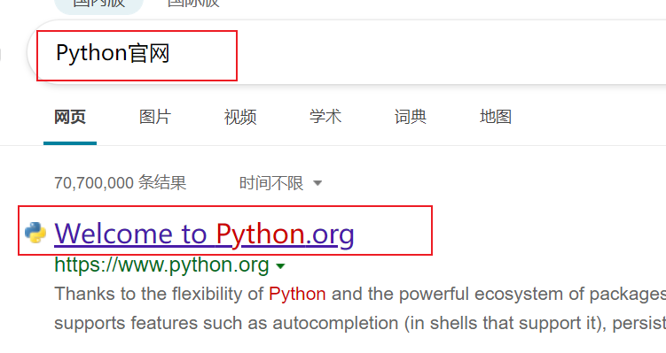

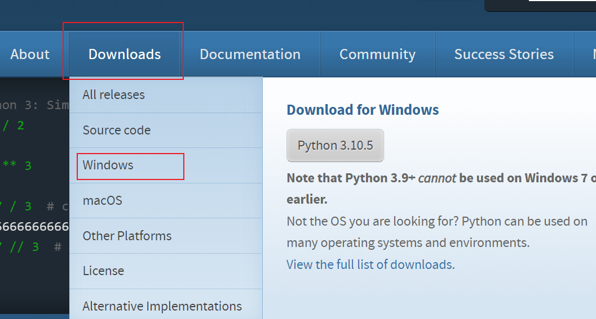

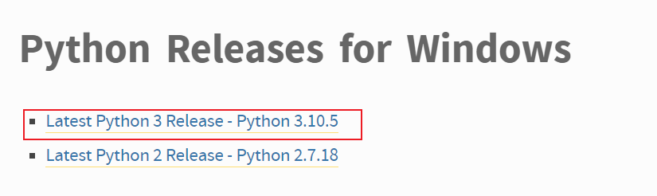

win7的操作   装旧版本  3.6 的版本就可以         

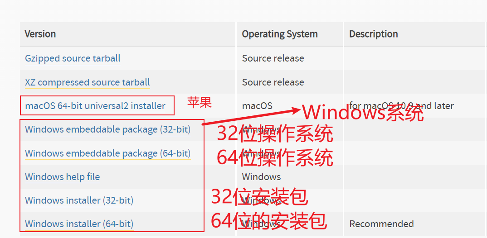

Windows操作系统      32位     64位操作 

最基本的概念     车道      32条车道        64条车道       

软件   32位    64位的概念

64位的软件   只可以运行在64位操作系统之上     

32位的软件   可以运行在  32位的操作系统和64位的操作系统之上  

如何查看你的操作系统位数

右键此电脑

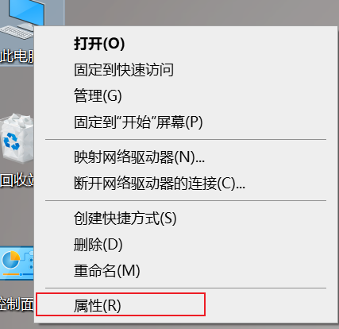

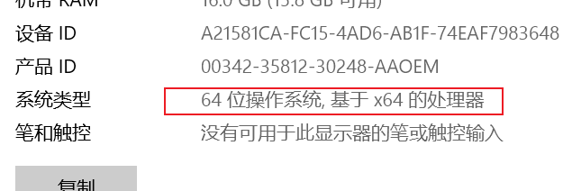

​    

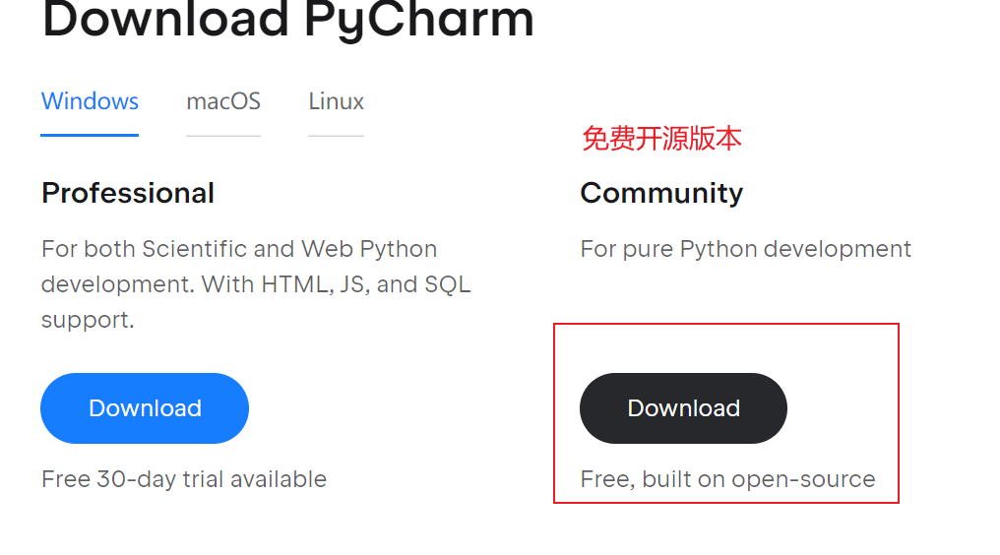

双击下载好的python的软件

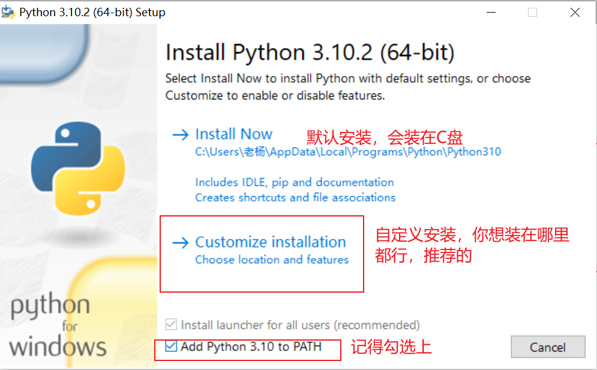

以我个人为例    下载的工具  不会装在C盘，因为会卡      听懂扣6    没做分区的没关系 

自己建立一个空的文件夹     需要注意的     最好不要有中文出现    容易有问题         

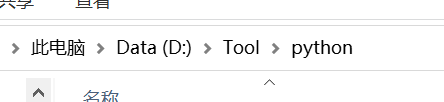

​     

英文字符  数字  最好不要有中文  养成良好的习惯        

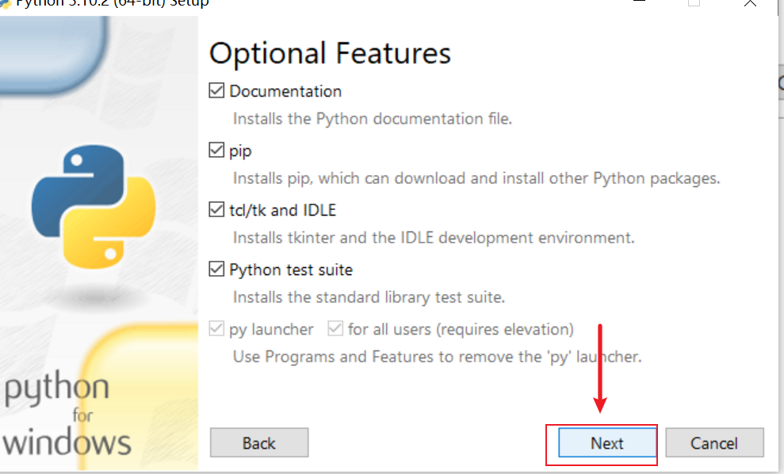

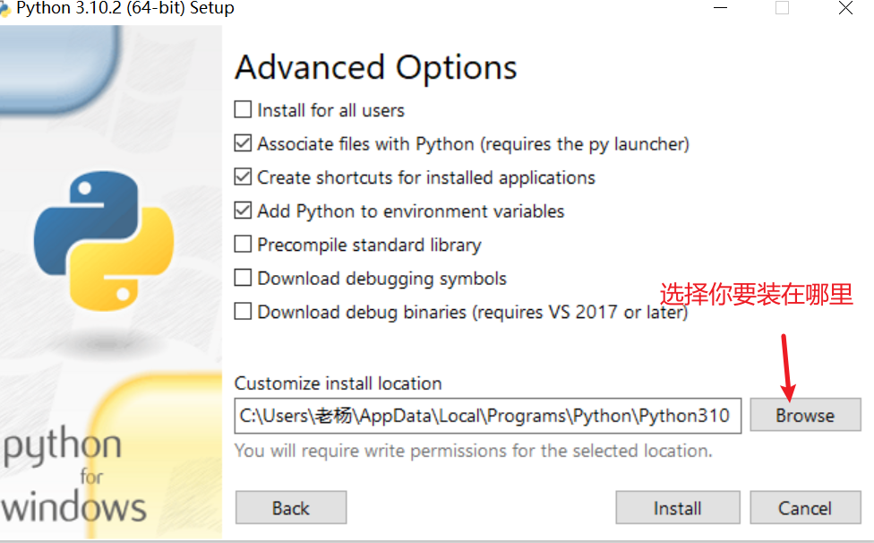

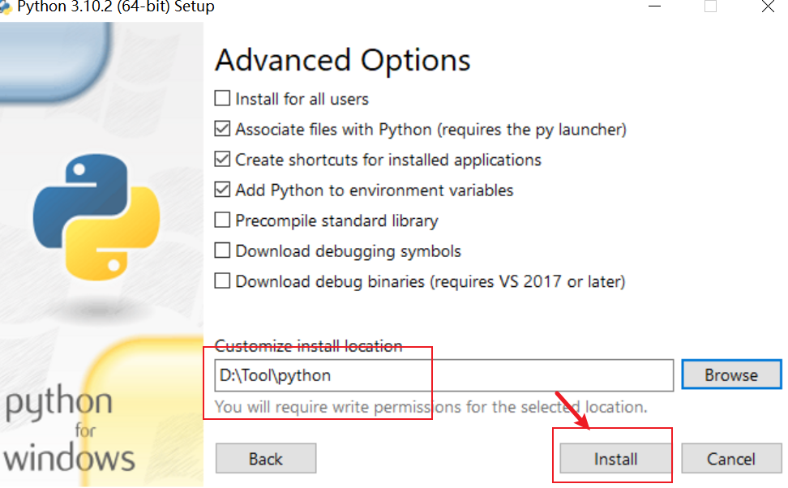

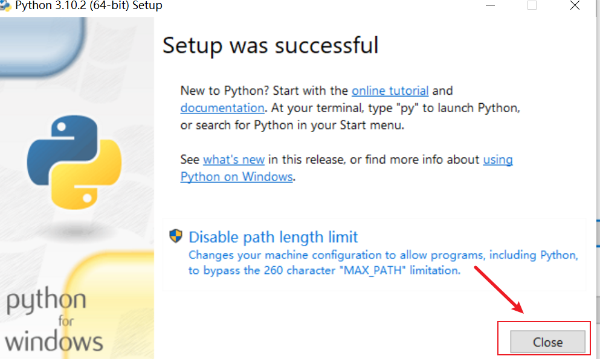

到此为止，你的Python就已经安装成功了，安装在你自己选择的那个地方

安装pycharm

vscode   sublime   都是可以的,只是用来方便我们敲代码的一个工具而已，但是我们Python开发推荐使用的

pycharm   

Python和pycharm的安装就搞定了            


软件的下载安装   都是有套路的

去官网下载   ===》 download   ===》 next  ===》install   （推荐自定义安装，安装在非C盘 ）

扩展的知识点环境变量：    类似于一个操作系统的快捷方式  可以让系统快速的找到你的软件  

Python的安装   pycharm的安装     只有c盘的默认安装就可以了       

收费版本  ===》免费版本   


总结：

1. 下载软件去官网
2. 下载软件  根据自己的操作系统位数来   查看位数  右键此电脑选择属性
3. 建议：做了分区的最好不要装在c盘，最好不要出现中文的名字

可以在群里加我微信 ，备注好自己的真实姓名     

讲解一下我们之后会学习得到的东西       有一定的编程基础知识    


Python后端语言    前端 是一个专门的岗位     对于前端部分只是学习基础   

1.    基础语法阶段       ===》Python的相关基础的语法     4周左右的时间
2.    高级阶段
   1. 面向对象         分水岭    语言的难度在这里开始进行划分      高级语法知识   
   2. 网络编程        实现网络通信       
   3. 并发编程        同时做多件事请
   4. 数据库          关系型数据库   mysql      
3. 前端   
   1. html
   2. css
   3. js
   4. jquery
   5. bootstrap
4. 框架  django 
5. 项目实战
6. 爬虫部分
7. 数据分析      

前端学习方向的    前端学习班级     数据分析    单独的课程体系          

真实的接触到编程的基础知识   


# 计算机基础知识

掌握本质

学会举例子

专业术语   ===》 简单的方式去理解     举例子   

他是啥   为什么要有他   他怎么使用的     对一个知识点   可以是吃透的

**一定要形成自己的笔记，加深理解**     上课的时候 不要记笔记    下课的时候  对照我的视频去记

1. 什么是语言？
   1.  沟通，交流的介质          
2. 为什么要有语言？ 
   1. 借助于语言   才能实现物种和物种之间的沟通，交流  控制 
3.  想法出现      有一种机器能够按照我们的想法去干活       ===》 电脑                 
4.  电脑     通电的大脑         希望电脑 可以真的像人一样去干活    ===》解放人力  
5. ​    说一种电脑能够理解的语言？          电脑语言         编程语言

编程语言 

所谓的编程语言     可以实现人和机器沟通交流的一种语言  人可以控制机器  按照人类的想法去干活  解放人力的目的

编程语言    ===》 操作电脑     解放人力

电脑又是个啥   他又是怎么干活的？  

电脑：

编程  生活  专业术语     ：  难   浅显的道理   高逼格的词汇      

以后学习专业术语  知识点     接地气的例子     方便我们去理解   

电脑       通电的大脑       计算机  电脑  ==》本质  解放人力  希望像人类的一样的去干活

电脑        和人类的功能对应起来        

大脑  ==》思考的功能   最重要最核心的一个部分

人类的大脑也有两部分 ：  逻辑思维 ，思考            控制 你的肢体   

电脑   ===》 CPU    中央处理器   ==》人类的大脑   

1. 运算器      ======》 人类的大脑中的思考的那部分     负责电脑的逻辑，运算，判断

2. 控制器     ====》 人类大脑的控制的那部分     

   控制器+运算器==》CPU 

3. 存储器     对应的是人类的记忆功能    现实生活的记忆    短期 记忆  记在脑子里      长期记忆     记在本子上

   1. 内存    ===》人的短期记忆        快     缺点：断电就丢失       关机就没了       容量小      256G 内存的电脑   
   2. 外存   ===》 人的长期记忆       硬盘   缺点：慢             永久保存        容量大     256G    

4. 输入设备     键盘    麦克风   摄像头   鼠标  接受外部的信息        ===》 眼睛   耳朵   

   1. 获得，得到外界的信息       

5. 输出设备    扬声器          显示器   打印机  

   1. 输出信息给外界            ====》  嘴巴说话给别人   肢体动作    

   

 总结一下

电脑：

1. 运算器    
2. 控制器   
3. 存储器
   1. 内存    人的记忆   短期记忆
   2. 外存   长期记忆    记在本子上     
4. 输入设备    获取外界的信息    对应人体的        眼睛   
5. 输出设备    将信息给外界           对应人体的          嘴巴 

本质   现在能否理解        

人和电脑的沟通  交流了  

我 《==      王帅

完成这件事情：帮他去买一份麻辣烫，加麻加辣不要烫

1. 接受到他的信息      输入设备
2. 存储器               记在脑子里           记在本子上     
3. 运算器           思考        
4. 控制器          走路    
5. 说给麻辣烫的老板听   输出设备

一个程序运行的三大核心硬件部分    推导 

**CPU  内存   外存**         

顺序

一个程序运行起来的顺序

外存 ==》 内存 ==》CPU

例子：  思考爸妈的生日是啥时候

本子上   ==》大脑的记忆 ===》 大脑  

用生活的例子去理解   

几个部分的知识   时间快到10点          拖堂再讲一点     1       总结不讲新知识      2  

**操作系统**         硬件  看得见摸得到的东西        软件  看得到，摸不到     

操作系统是电脑的灵魂    

电脑   开发软见    让电脑运行起来  第一步    

不要重复造轮子      别人做过的事情  你就不需要做了   

  懒，是推动科技发展的重要生产力        

有人   我让电脑动起来先     操作系统    

操作系统   初始的了解    操作系统是软件    

1.  可以让硬件运行起来     控制计算机硬件的基本的运行
2. 提供一个入口/方式 ，可以给我们去使用，利用这个方式，可以操作计算机的硬件

操作系统  先了解到这里     后续还会继续再深入的了解             

总结：

1. 下载安装工具 

   1.    python      编程语言中的一种        
   2.    pycharm       敲代码的工具  ===》牛逼版本的记事本   

   操作系统的位数    32位   64位          根据你的操作系统的位数选择Python的版本  

2. 计算机的基本组成

   1. 五大部分   
   2. 最核心的三大硬件  

语言  人和人沟通的媒介     

预习   笔记的一些方式

csdn   老杨玩Python   我的个人技术博客   Python之路的专栏   带数字   大体上会参考我的技术博客讲解课程

一定要养成记笔记的习惯         

pycharm 版本任意即可       编辑器        

python版本  3.5  3.6  3.7  3.8  3.9 3.10           是3的版本就可以了  

 