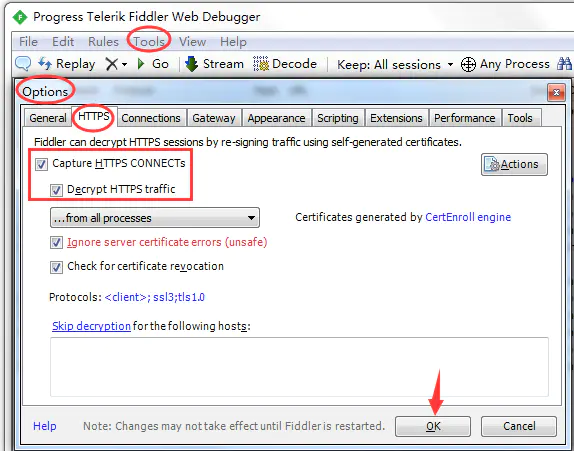
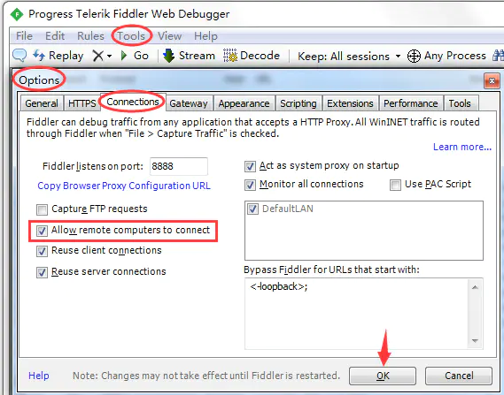
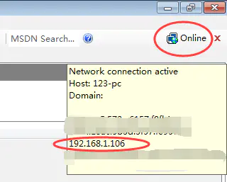
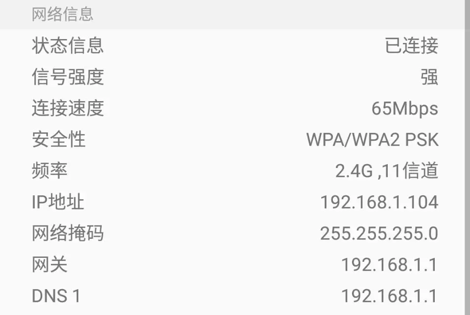
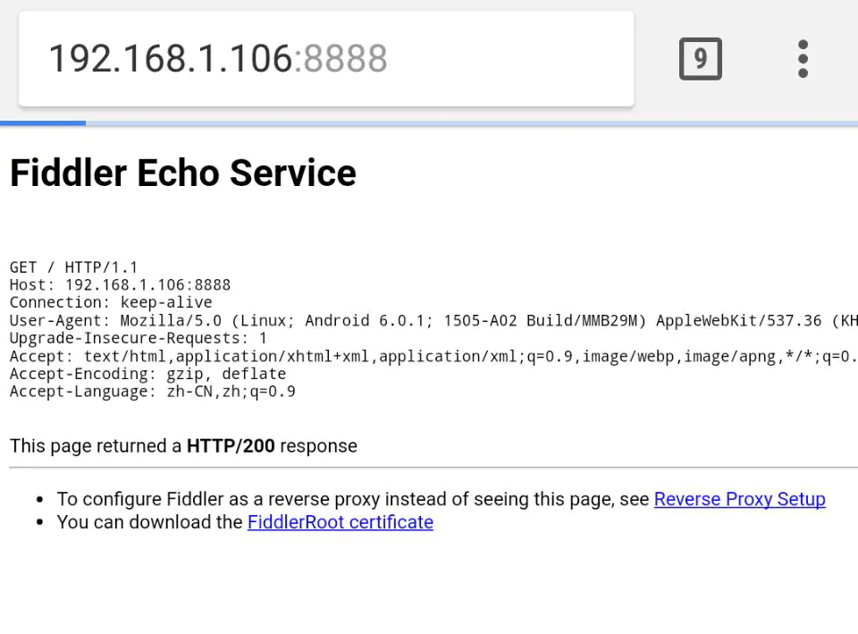
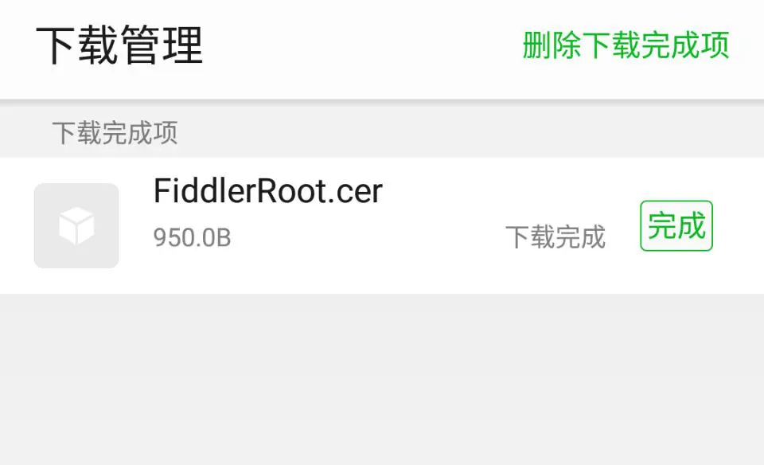
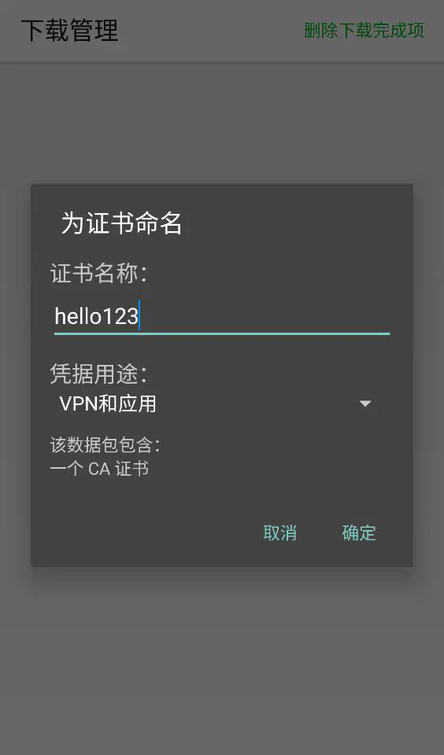
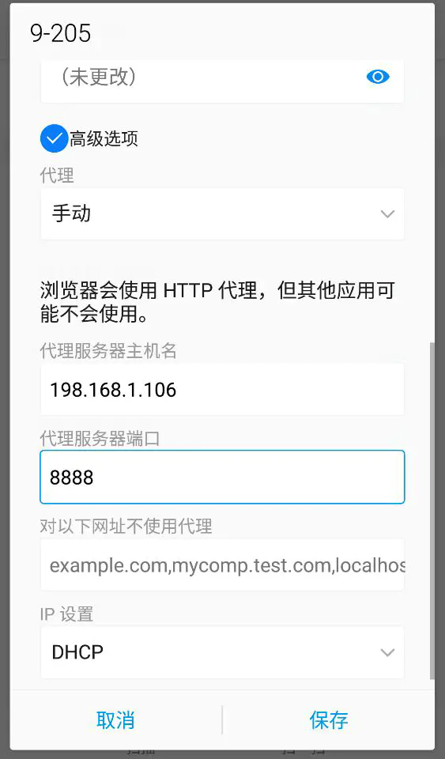

# 使用fiddler实现手机抓包

fiddler没有手机客户端，都是安装在PC上，要实现对手机上的程序抓包，则需要对PC上的fiddler和手机端做一些配置。步骤如下：

## 一、PC端fiddler配置

### 1. 安装HTTPS证书

手机上的应用很多涉及到个人信息，采用比较安全的HTTPS加密过，而fiddler默认只捕获http会话而不抓取HTTPS报文，导致打开fiddler后就打不开https网页（比如百度），解决办法：**打开Fiddler->Tool->Fiddler Options->HTTPS tab，勾选上并Capture HTTPS CONNECTs（捕获 HTTPS 连接）和 Decrypt HTTPS traffic （HTTPS 请求解密），并安装证书（首次使用无证书，会弹出是否信任fiddler证书和安全提示，直接点击yes就行），重启Fiddler生效。**

</img>

### 2. 允许手机远程连接

如果想要捕获手机上的通信数据，就需要手机连接上Fiddler代理，而Fiddler默认是不允许其他设备进行连接的，解决办法：**点击 Fiddler->Tools -> Options，在 Connections 面板选中 Allow remote computers to connect 允许其他设备连接（此操作需重启Fiddler生效）。**

</img>

### 3. 查看IP地址

电脑ip地址可通过cmd命令行输入ipconfig查询，或网络连接信息中找到，最直观的方法是**将鼠标置于fiddler右上角的online中即可显示电脑的ip地址。**如下图我的IP是192.168.1.106。

</img>

## 二、手机端配置

需要在移动终端（手机或pad）上指定代理服务器为Fiddler所在主机IP（需要处于同一网络），端口默认8888。

### 1. 接入网络

要保证手机和安装有fiddler的电脑处在同一局域网内，手机能ping通电脑。方法：**家用或办公环境把PC和手机WLAN连接上同一个路由器的无线SSID获取到同一网段内的IP地址即可。台式机要插入无线网卡才能连WiFi，最好用笔记本电脑和手机连同一WiFi很方便。**如下图，我的手机IP是192.168.1.104，与电脑192.168.1.106可互通，就能访问192.168.1.106:8888。

</img>

### 2. 手机安装根证书

在手机上需要安装Fiddler根证书，因为Fiddler是通过自己生成的证书对网络请求重新签名进行https会话解密的，如果不安装证书的话只能抓取HTTP请求。

（1）手机和电脑连接同一个网络，打开手机浏览器，输入Fiddler Server地址[http://ipv4.fiddler:8888/](https://link.jianshu.com?t=http%3A%2F%2Fipv4.fiddler%3A8888%2F)（因为fiddler装在PC上，所以Fiddler Server地址就是PC的IP地址，带上端口号8888，我的是http://192.168.1.106:8888/）， 跳转到 Fiddler Echo Service 证书下载页，点击FiddlerRoot certificate下载并安装；

</img>

</img>

（2） 为证书命名后点击确定；</img>

（3）要求设置一个手机密码，自己设置一个，记住密码就行，最后不用了去系统-安全-密码中去掉即可；

</img>

### 3. 手机代理设置

更改手机无线网的代理方法：**打开系统设置-WLAN，长按WiFi接入的SSID修改网络，点击高级选项，代理选择手动，主机名输入fiddler的电脑ip地址192.168.1.106，端口号输入8888，保存即可。**

</img>

## 三、抓包

PC上和手机上的配置完成后就可以操作手机，在电脑上用fiddler抓包了，比如访问一些网站和APP，fiddler中就会显示捕获到的手机上HTTP/HTTPS通讯记录，抓包成功。

## 四、还原手机状态

抓包结束后，需要手动还原手机状态，方法如下（不同机型可能有些微差别）：
 （1） 停止电脑对手机的网络监控：系统设置-WLAN，长按wifi修改网络，高级选项找到代理，去掉手动代理即可；
 （2）删除手机中证书：安卓系统设置 系统 设备安全 受信任的凭据  用户 ，点击证书删除即可；
 （3） 删除手机上密码：手机系统—安全—密码，删除系统密码即可。

