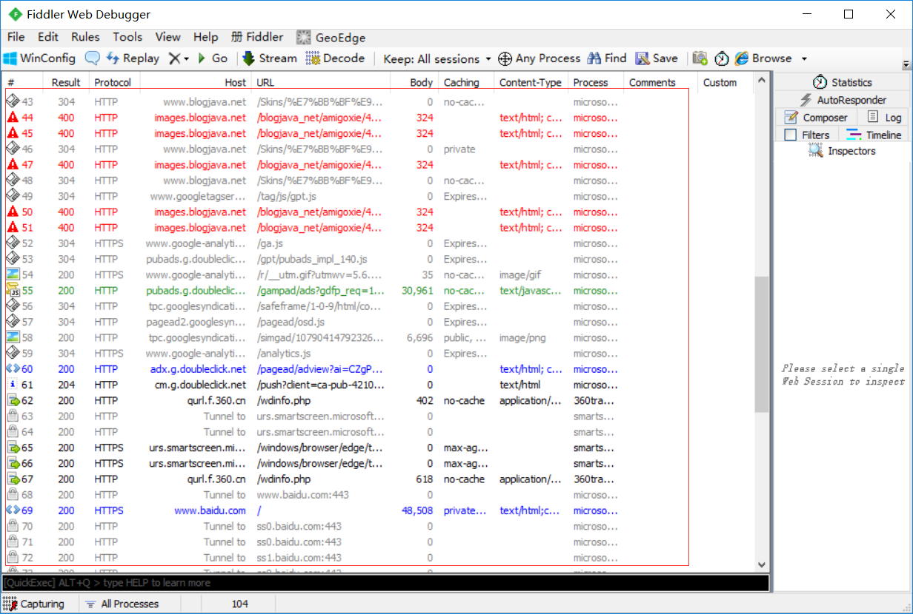
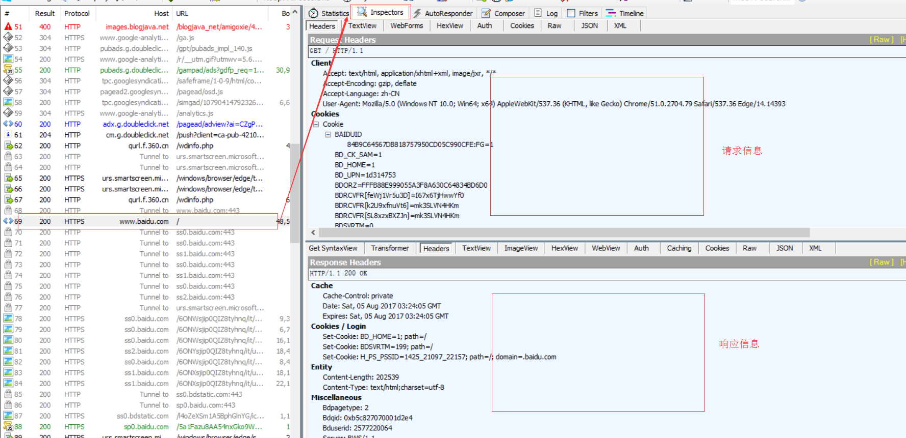
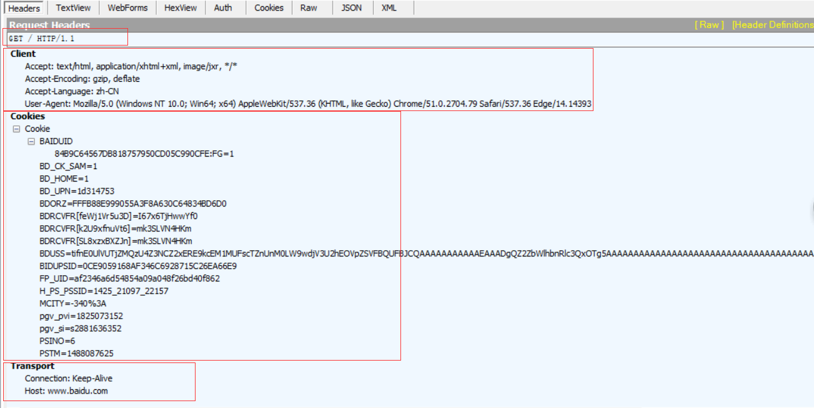
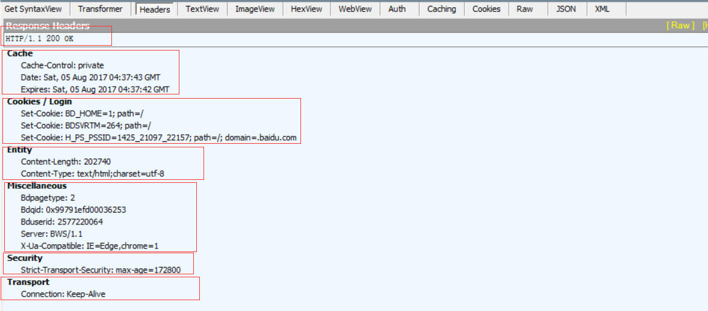

## fiddler使用说明：

</img>

\#：顺序号，按照抓包的顺序从1递增

Result：HTTP状态码　　　　　　

Protocol：请求使用的协议，如HTTP/HTTPS/FTP等

HOST：请求地址的主机名或域名

URL：请求资源的位置

Body：请求大小

Caching：请求的缓存过期时间或者缓存控制值

Content-Type：请求响应的类型

Process：发送此请求的进程ID

Comments：备注 

Custom：自定义值

1.每个Fiddler抓取到的数据包都会在该列表中展示，点击具体的一条数据包可以在右侧菜单点击Insepector查看详细内容。主要分为请求（即客户端发出的数据）和响应（服务器返回的数据）两部分。

</img>

2.HTTP Request Header：以百度为例，查看请求百度主页这条数据包的请求数据，从上面的Headers中可以看到如下内容：

</img>

请求方式：GET

协议： HTTP/1.1

Client 头域：

Accept: text/html, application/xhtml+xml, image/jxr, */*               ---------浏览器端可以接受的媒体类型

Accept-Encoding: gzip, deflate                                 ---------压缩方法

Accept-Language: zh-CN                                     ---------语言类型

User-Agent: Mozilla/5.0 (Windows NT 10.0; Win64; x64) AppleWebKit/537.36 (KHTML, like Gecko) Chrome/51.0.2704.79 Safari/537.36 Edge/14.14393               ---------客户端使用的操作系统和浏览器的名称和版本

COOKIE头域：将cookie值发送给服务器

Transport 头域：

Connection：当网页打开完成后，客户端和服务器之间用于传输HTTP数据的TCP连接是否关闭。keep-alive表示不会关闭，客户端再次访问这个服务器上的网页，会继续使用这一条已经建立的连接；close表示关闭，客户端再次访问这个服务器上的网页，需要重新建立连接。

HOST：主机名或域名，若没有指定端口，表示使用默认端口80.

3.HTTP Response Header：继续以百度为例，如图所示：

</img>

协议：HTTP/1.1

状态码：200

Cache头域：
Cache-Control: private                        ---------此响应消息不能被共享缓存处理，对于其他用户的请求无效

Date: Sat, 05 Aug 2017 04:37:43 GMT           ---------生成消息的具体时间和日期

Expires: Sat, 05 Aug 2017 04:37:42 GMT         ---------浏览器会在指定过期时间内使用本地缓存

Cookie/Login 头域：

Set-Cookie: BDSVRTM=264; path=/              ---------把cookie发送到客户端
Set-Cookie: BD_HOME=1; path=/
Set-Cookie: H_PS_PSSID=1425_21097_22157; path=/; domain=.baidu.com

Entity头域

Content-Length: 202740                       ---------正文长度
Content-Type: text/html;charset=utf-8             ---------告知客户端服务器本身响应的对象的类型和字符集

Miscellaneous 头域：
Bdpagetype: 2

Bdqid: 0x99791efd00036253

Bduserid: 2577220064
Server: BWS/1.1                             ---------指明HTTP服务器的软件信息

X-Ua-Compatible: IE=Edge,chrome=1
Security头域：
Strict-Transport-Security: max-age=172800        ---------基于安全考虑而需要发送的参数，关于这个参数的解释，请参考：http://www.freebuf.com/articles/web/66827.html

Transport头域：

Connection: Keep-Alive

| 字段     | 说明                                                         |
| -------- | ------------------------------------------------------------ |
| TextView | 显示请求或响应的数据                                         |
| WebForms | 请求部分以表单形式显示所有的请求参数和参数值；响应部分与TextView内容是一样的 |
| Auth     | 显示认证信息，如Authorization                                |
| Cookies  | 显示所有cookies                                              |
| Raw      | 显示Headers和Body数据                                        |
| JSON     | 若请求或响应数据是json格式，以json形式显示请求或响应内容     |
| XML      | 若请求或响应数据是xml格式，以xml形式显示请求或响应内容       |

