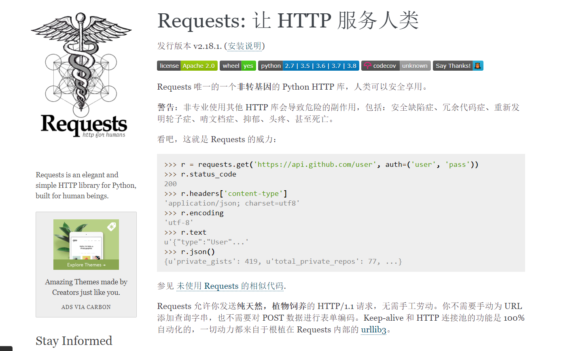

### 了解urllib模块：

文档：urllib.note
链接：http://note.youdao.com/noteshare?id=df7416274cfb2e7a1feaf412fe7a5e93&sub=820D89C5C96741769347AC1FEA05F977

# requests模块

### 学习目标：

```
掌握requests对应的response属性方法
掌握发送带headers的请求以及过滤headers中的键值对
掌握发送带参数的请求两种方式
```

------

**作用：**发送http请求，获取响应数据

官方文档：https://requests.readthedocs.io/zh_CN/latest/index.html

</img>

```reStructuredText
requests模块是一个第三方模块，需要在你的python(虚拟)环境中额外安装
pip/pip3 install requests
源安装：pip install requests -i https://mirrors.aliyun.com/pypi/simple
```


## 1.requests模块发送get请求，获取响应

> 需求：通过requests向百度首页发送请求，获取该页面的源码，观察输出结果

```python
# 简单的代码实现
import requests 

# 目标url
url = 'https://www.baidu.com' 

# 向目标url发送get请求
response = requests.get(url)

# 打印响应内容
print(response.text)
```

## 2.response响应对象

> 观察上边代码运行结果发现，有好多乱码；这是因为编解码使用的字符集不同早造成的；我们尝试使用下边的办法来解决中文乱码问题
>

```python
# response.content
import requests 

# 目标url
url = 'https://www.baidu.com' 

# 向目标url发送get请求
response = requests.get(url)

# 打印响应内容
# print(response.text)
print(response.content.decode()) # 注意这里！
```

1. **response.text是requests模块按照chardet模块推测出的编码字符集进行解码的结果**
2. 网络传输的字符串都是bytes类型的，所以response.text = response.content.decode('推测出的编码字符集')
3. 我们可以在网页源码中搜索`charset`，尝试参考该编码字符集，注意存在不准确的情况


### response.text 和response.content的区别：

 - response.text
   - 类型：str
   - 解码类型： requests模块自动根据HTTP 头部对响应的编码作出有根据的推测，推测的文本编码
 - response.content
   - 类型：bytes
   - 解码类型： 没有指定

### 通过对response.content进行decode，来解决中文乱码

- `response.content.decode()` 默认utf-8
- `response.content.decode("GBK")`
- 常见的编码字符集
  - utf-8
  - gbk
  - gb2312
  - ascii  （读音：阿斯克码）	
  - iso-8859-1


## 3.response响应对象的其它常用属性或方法

> `response = requests.get(url)`中response是发送请求获取的响应对象；response响应对象中除了text、content获取响应内容以外还有其它常用的属性或方法：

- `response.url`响应的url；有时候响应的url和请求的url并不一致
- `response.status_code` 响应状态码
- `response.request.headers` 响应对应的请求头
- `response.headers` 响应头
- `response.request._cookies` 响应对应请求的cookie；返回cookieJar类型
- `response.cookies` 响应的cookie（经过了set-cookie动作；返回cookieJar类型
- `response.json()`自动将json字符串类型的响应内容转换为python对象（dict or list）

```python
import requests

# 发送请求，获取response响应
response = requests.get("http://www.baidu.com")

# 查看响应内容，response.text 返回的是str类型
print(response.text)

# 查看响应内容，response.content返回的字节流数据
print(respones.content)

# 查看响应的url地址
print(response.url)

# 查看响应头部字符编码
print(response.encoding)

# 查看响应状态码
print(response.status_code)
```


## 4.发送带header的请求

> headers是一个字典

```python
import requests

url = 'https://www.baidu.com'

response = requests.get(url)

print(response.content.decode())  # 源码内容获取不完整

# 打印响应对应请求的请求头信息
print(response.request.headers)

# -------------------------------------------分割线-------------------------------------------------------------
headers = {"User-Agent": "Mozilla/5.0 (Windows NT 10.0; Win64; x64) AppleWebKit/537.36 (KHTML, like Gecko) Chrome/54.0.2840.99 Safari/537.36"}

# 在请求头中带上User-Agent，模拟浏览器发送请求
response1 = requests.get(url, headers=headers) 

print(response1.content.decode())  # 源码获取完整        

# 打印请求头信息
print(response1.request.headers) 
```

> **结论：headers的作用：模拟浏览器，欺骗服务器，获取和浏览器一致的内容**


## 5.发送带参数的请求

> 我们在使用百度搜索的时候经常发现url地址中会有一个 `?`，那么该问号后边的就是请求参数，又叫做查询字符串

### 1.在url携带参数 

直接对含有参数的url发起请求

```python
import requests

headers = {"User-Agent": "Mozilla/5.0 (Windows NT 10.0; Win64; x64) AppleWebKit/537.36 (KHTML, like Gecko) Chrome/54.0.2840.99 Safari/537.36"}

url = 'https://www.baidu.com/s?wd=python'

response = requests.get(url, headers=headers)

print(response.content.decode())
```

### 2.通过params携带参数字典

​	1.构建请求参数字典

​	2.向接口发送请求的时候带上参数字典，参数字典设置给params

```python
import requests

headers = {"User-Agent": "Mozilla/5.0 (Windows NT 10.0; Win64; x64) AppleWebKit/537.36 (KHTML, like Gecko) Chrome/54.0.2840.99 Safari/537.36"}

# 这是目标url
# url = 'https://www.baidu.com/s?wd=python'

# 最后有没有问号结果都一样
url = 'https://www.baidu.com/s?'

# 请求参数是一个字典 即wd=python
kw = {'wd': 'python'}

# 带上请求参数发起请求，获取响应
response = requests.get(url, headers=headers, params=kw)

print(response.content.decode())
```

### 3.关于参数的注意点

在url地址中，很多参数是没有用的，比如百度搜索的url地址，其中参数只有一个有用，其他的都可以删除

对应的，在后续的爬虫中，越到很多参数的url地址，都可以尝试删除参数