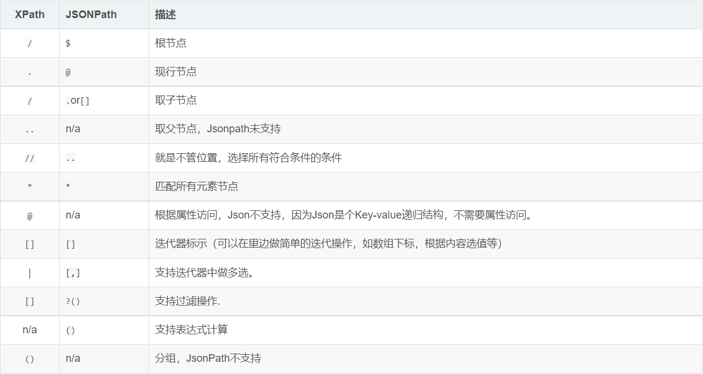
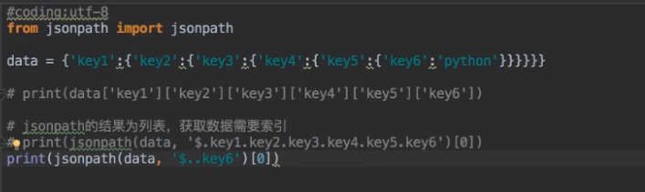
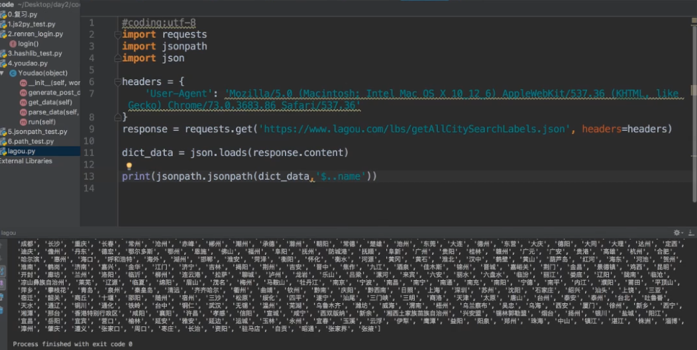

## 数据提取之jsonpath模块

pip install jsonpath 

使用场景：多层嵌套的复杂的字典，直接提取数据

**方法:**

 ret = jsonpath(a, 'jsonpath语法规则字符串')    #a是需要提取数据的目标字典

常用节点：

$	根节点（最外层的大括号）

.	字节点（）

..	内部任意位置，子孙节点

</img>

**示例1：**

</img>

**示例2：**

</img>