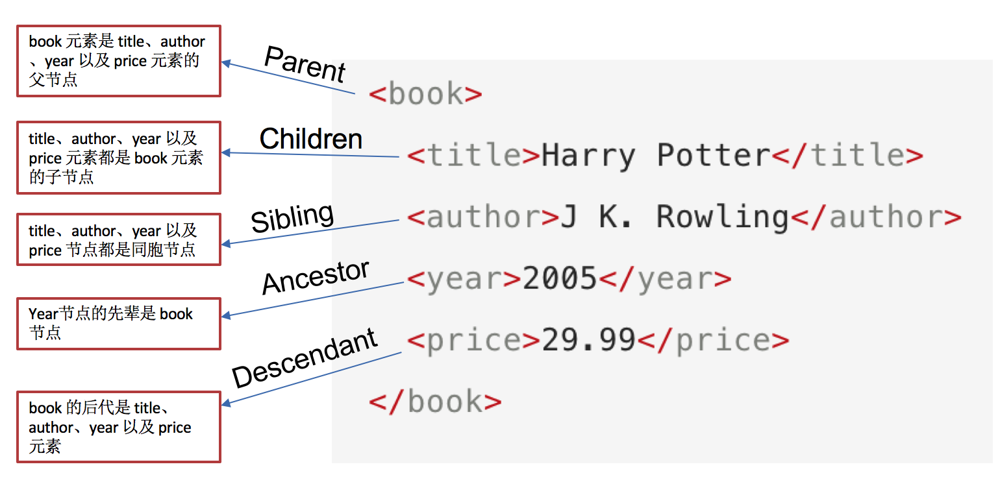

# 数据提取之lxml模块与xpath工具

> 目标：了解xpath的定义
>
> ​			了解lxml
>
> ​			掌握xpath的语法
>
> lxml是一款高新能的python html/xml解析器，我们可以利用xpath，来快速的定位特定元素以及获取节点信息

------

## 1. 了解 lxml模块和xpath语法

> 对html或xml形式的文本提取特定的内容，就需要我们掌握lxml模块的使用和xpath语法。

- lxml模块可以利用XPath规则语法，来快速的定位HTML\XML 文档中特定元素以及获取节点信息（文本内容、属性值）
- XPath (XML Path Language) 是一门在 HTML\XML 文档中查找信息的**语言**，可用来在 HTML\XML 文档中对**元素和属性进行遍历**。
  - W3School官方文档：<http://www.w3school.com.cn/xpath/index.asp>
- 提取xml、html中的数据需要lxml模块和xpath语法配合使用


## 2. 谷歌浏览器xpath helper插件的安装和使用

> 要想利用lxml模块提取数据，需要我们掌握xpath语法规则。接下来我们就来了解一下xpath helper插件，它可以帮助我们练习xpath语法**(安装包见课件--工具文件夹)**

1. 下载Chrome插件 XPath Helper

   - 可以在chrome应用商城进行下载

2. 将rar压缩包解压到当前文件夹

3. 打开谷歌浏览器---->右上角三个点---->更多工具---->扩展程序

   </img>

   

4. 在扩展程序界面，点击右上角的开关，进入开发者模式后，将xpath文件夹拖进，释放鼠标即可


</img>

5. 安装完成，校验

</img>


## 3. xpath的节点关系





## 4. xpath语法-基础节点选择语法

> 1. XPath 使用路径表达式来选取 XML 文档中的节点或者节点集。
> 2. 这些路径表达式和我们在常规的**电脑文件系统中看到的表达式**非常相似。
> 3. **使用chrome插件选择标签时候，选中时，选中的标签会添加属性class="xh-highlight"**

### xpath定位节点以及提取属性或文本内容的语法

| 表达式   | 描述                                                       |
| -------- | ---------------------------------------------------------- |
| nodename | 选中该元素。                                               |
| /        | 从根节点选取、或者是元素和元素间的过渡。                   |
| //       | 从匹配选择的当前节点选择文档中的节点，而不考虑它们的位置。 |
| .        | 选取当前节点。                                             |
| ..       | 选取当前节点的父节点。                                     |
| @        | 选取属性。                                                 |
| text()   | 选取文本。                                                 |


## 5. xpath语法-节点修饰语法

> 可以根据标签的属性值、下标等来获取特定的节点

### 5.1 节点修饰语法

| 路径表达式                          | 结果                                                         |
| ----------------------------------- | ------------------------------------------------------------ |
| //title[@lang="eng"]                | 选择lang属性值为eng的所有title元素                           |
| /bookstore/book[1]                  | 选取属于 bookstore 子元素的第一个 book 元素。                |
| /bookstore/book[last()]             | 选取属于 bookstore 子元素的最后一个 book 元素。              |
| /bookstore/book[last()-1]           | 选取属于 bookstore 子元素的倒数第二个 book 元素。            |
| /bookstore/book[position()>1]       | 选择bookstore下面的book元素，从第二个开始选择                |
| //book/title[text()='Harry Potter'] | 选择所有book下的title元素，仅仅选择文本为Harry Potter的title元素 |
| /bookstore/book[price>35.00]/title  | 选取 bookstore 元素中的 book 元素的所有 title 元素，且其中的 price 元素的值须大于 35.00。 |

### 5.2 关于xpath的下标

- 在xpath中，第一个元素的位置是1
- 最后一个元素的位置是last()
- 倒数第二个是last()-1


## 6. xpath语法-其他常用节点选择语法

> - **//** **的用途**
>
> - - //a 当前html页面上的所有的a
>   - bookstore//book bookstore下的所有的book元素
>
> - **@** **的使用**
>
> - - //a/@href 所有的a的href
>   - //title[@lang="eng"] 选择lang=eng的title标签
>
> - **text()** **的使用**
>
> - - //a/text() 获取所有的a下的文本
>   - //a[texts()='下一页'] 获取文本为下一页的a标签
>   - a//text() a下的所有的文本
>
> - **xpath查找特定的节点**
>
> - - //a[1] 选择第一个s
>   - //a[last()] 最后一个
>   - //a[position()<4] 前三个
>
> - **包含**
>
> - - //a[contains(text(),"下一页")]选择文本包含下一页三个字的a标签**
>   - //a[contains(@class,'n')] class包含n的a标签


## 7. lxml模块的安装与使用示例

> lxml模块是一个第三方模块，安装之后使用

### 7.1  lxml模块的安装

对发送请求获取的xml或html形式的响应内容进行提取

```
pip/pip3 install lxml
```


### 7.2 爬虫对html提取的内容

- 提取标签中的**文本内容**
- 提取标签中的**属性的值**
  - 比如，提取a标签中href属性的值，获取url，进而继续发起请求

### 7.3 lxml模块的使用

1. 导入lxml 的 etree 库

   `from lxml import etree`

2. 利用etree.HTML，将html字符串（bytes类型或str类型）转化为Element对象，Element对象具有xpath的方法，返回结果的列表

   ```python
   html = etree.HTML(text) 
   ret_list = html.xpath("xpath语法规则字符串")
   ```

3. xpath方法返回列表的三种情况

   - 返回空列表：根据xpath语法规则字符串，没有定位到任何元素
   - 返回由字符串构成的列表：xpath字符串规则匹配的一定是文本内容或某属性的值
   - 返回由Element对象构成的列表：xpath规则字符串匹配的是标签，列表中的Element对象可以继续进行xpath

###  lxml模块使用示例

> 运行下面的代码，查看打印的结果

```python
from lxml import etree
text = ''' 
<div> 
  <ul> 
    <li class="item-1">
      <a href="link1.html">first item</a>
    </li> 
    <li class="item-1">
      <a href="link2.html">second item</a>
    </li> 
    <li class="item-inactive">
      <a href="link3.html">third item</a>
    </li> 
    <li class="item-1">
      <a href="link4.html">fourth item</a>
    </li> 
    <li class="item-0">
      a href="link5.html">fifth item</a>
  </ul> 
</div>
'''

html = etree.HTML(text)

#获取href的列表和title的列表
href_list = html.xpath("//li[@class='item-1']/a/@href")
title_list = html.xpath("//li[@class='item-1']/a/text()")

#组装成字典
for href in href_list:
    item = {}
    item["href"] = href
    item["title"] = title_list[href_list.index(href)]
    print(item)
```

------


### 练习

> 将下面的html文档字符串中，将每个class为item-1的li标签作为1条新闻数据。提取a标签的文本内容以及链接，组装成一个字典。

```python
text = ''' <div> <ul> 
        <li class="item-1"><a>first item</a></li> 
        <li class="item-1"><a href="link2.html">second item</a></li> 
        <li class="item-inactive"><a href="link3.html">third item</a></li> 
        <li class="item-1"><a href="link4.html">fourth item</a></li> 
        <li class="item-0"><a href="link5.html">fifth item</a> 
        </ul> </div> '''
```

- 注意：

  - **先分组，再提取数据**，可以避免数据的错乱

  - 对于空值要进行判断

  


每一组中继续进行数据的提取

```python
 for li in li_list:
      item = {}
      item["href"] = li.xpath("./a/@href")[0] if len(li.xpath("./a/@href"))>0 else None
      item["title"] = li.xpath("./a/text()")[0] if len(li.xpath("./a/text()"))>0 else None
      print(item)
```

  ```python
##### 知识点：掌握 lxml模块中使用xpath语法定位元素提取属性值或文本内容
##### lxml模块中etree.tostring函数的使用
####> 运行下边的代码，观察对比html的原字符串和打印输出的结果

from lxml import etree
html_str = ''' <div> <ul> 
        <li class="item-1"><a href="link1.html">first item</a></li> 
        <li class="item-1"><a href="link2.html">second item</a></li> 
        <li class="item-inactive"><a href="link3.html">third item</a></li> 
        <li class="item-1"><a href="link4.html">fourth item</a></li> 
        <li class="item-0"><a href="link5.html">fifth item</a> 
        </ul> </div> '''

html = etree.HTML(html_str)

handeled_html_str = etree.tostring(html).decode()
print(handeled_html_str)
  ```

### 现象和结论

> 打印结果和原来相比：
>
> 1. 自动补全原本缺失的`li`标签
> 2. 自动补全`html`等标签

```html
<html><body><div> <ul> 
<li class="item-1"><a href="link1.html">first item</a></li> 
<li class="item-1"><a href="link2.html">second item</a></li> 
<li class="item-inactive"><a href="link3.html">third item</a></li> 
<li class="item-1"><a href="link4.html">fourth item</a></li> 
<li class="item-0"><a href="link5.html">fifth item</a> 
</li></ul> </div> </body></html>
```

**结论**：

- lxml.etree.HTML(html_str)可以自动补全标签

- `lxml.etree.tostring`函数可以将转换为Element对象再转换回html字符串
- 爬虫如果使用lxml来提取数据，应该以`lxml.etree.tostring`的返回结果作为提取数据的依据

# 课后练习

### 初步使用

我们利用它来解析 HTML 代码，简单示例：

```python
# lxml_test.py

# 使用 lxml 的 etree 库
from lxml import etree

html = '''
<div>
    <ul>
         <li class="item-0"><a href="link1.html">first item</a></li>
         <li class="item-1"><a href="link2.html">second item</a></li>
         <li class="item-inactive"><a href="link3.html">third item</a></li>
         <li class="item-1"><a href="link4.html">fourth item</a></li>
         <li class="item-0"><a href="link5.html">fifth item</a> # 注意，此处缺少一个 </li> 闭合标签
     </ul>
 </div>
'''

#利用etree.HTML，将字符串解析为HTML文档
xml_doc = etree.HTML(html)

# 按字符串序列化HTML文档
html_doc = etree.tostring(xml_doc)

print(html_doc)
```

输出结果：

```html
<html><body>
<div>
    <ul>
         <li class="item-0"><a href="link1.html">first item</a></li>
         <li class="item-1"><a href="link2.html">second item</a></li>
         <li class="item-inactive"><a href="link3.html">third item</a></li>
         <li class="item-1"><a href="link4.html">fourth item</a></li>
         <li class="item-0"><a href="link5.html">fifth item</a></li>
</ul>
 </div>
</body></html>
```

lxml 可以自动修正 html 代码，例子里不仅补全了 li 标签，还添加了 body，html 标签。

### 文件读取：

除了直接读取字符串，lxml还支持从文件里读取内容。我们新建一个hello.html文件：

```html
<!-- hello.html -->

<div>
    <ul>
         <li class="item-0"><a href="link1.html">first item</a></li>
         <li class="item-1"><a href="link2.html">second item</a></li>
         <li class="item-inactive"><a href="link3.html"><span class="bold">third item</span></a></li>
         <li class="item-1"><a href="link4.html">fourth item</a></li>
         <li class="item-0"><a href="link5.html">fifth item</a></li>
     </ul>
 </div>
```

再利用 etree.parse() 方法来读取文件。

```python
# lxml_parse.py

from lxml import etree

# 读取外部文件 hello.html
html = etree.parse('./hello.html')
result = etree.tostring(html, pretty_print=True)

print(result)
```

输出结果与之前相同：

```html
<html><body>
<div>
    <ul>
         <li class="item-0"><a href="link1.html">first item</a></li>
         <li class="item-1"><a href="link2.html">second item</a></li>
         <li class="item-inactive"><a href="link3.html">third item</a></li>
         <li class="item-1"><a href="link4.html">fourth item</a></li>
         <li class="item-0"><a href="link5.html">fifth item</a></li>
</ul>
 </div>
</body></html>
```

### XPath实例测试

#### 1. 获取所有的 `<li>` 标签

```python
# xpath_li.py

from lxml import etree

xml_doc = etree.parse('hello.html')
print type(html)  # 显示etree.parse() 返回类型

result = xml_doc.xpath('//li')

print result  # 打印<li>标签的元素列表
print len(result)
print type(result)
print type(result[0])
```

输出结果：

```python
<type 'lxml.etree._ElementTree'>
[<Element li at 0x1014e0e18>, <Element li at 0x1014e0ef0>, <Element li at 0x1014e0f38>, <Element li at 0x1014e0f80>, <Element li at 0x1014e0fc8>]
5
<type 'list'>
<type 'lxml.etree._Element'>
```

#### 2. 继续获取`<li>` 标签的所有 `class`属性

```python
# xpath_li.py

from lxml import etree

html = etree.parse('hello.html')
result = html.xpath('//li/@class')

print result
```

运行结果

```c
['item-0', 'item-1', 'item-inactive', 'item-1', 'item-0']
```

#### 3. 继续获取`<li>`标签下`href` 为 `link1.html` 的 `<a>` 标签

```python
# xpath_li.py

from lxml import etree

html = etree.parse('hello.html')
result = html.xpath('//li/a[@href="link1.html"]')

print result
```

运行结果

```
[<Element a at 0x10ffaae18>]
```

#### 4. 获取`<li>` 标签下的所有 `<span>` 标签

```python
# xpath_li.py

from lxml import etree

html = etree.parse('hello.html')

#result = html.xpath('//li/span')
#注意这么写是不对的：
#因为 / 是用来获取子元素的，而 <span> 并不是 <li> 的子元素，所以，要用双斜杠

result = html.xpath('//li//span')

print result
```

运行结果

```
[<Element span at 0x10d698e18>]
```

#### 5. 获取 `<li>` 标签下的`<a>`标签里的所有 class

```python
# xpath_li.py

from lxml import etree

html = etree.parse('hello.html')
result = html.xpath('//li/a//@class')

print result
```

运行结果

```
['blod']
```

#### 6. 获取最后一个 `<li>` 里边的 `<a>` 的 href属性值

```python
# xpath_li.py

from lxml import etree

html = etree.parse('hello.html')

result = html.xpath('//li[last()]/a/@href')
# 谓语 [last()] 可以找到最后一个元素

print result
```

运行结果

```
['link5.html']
```

#### 7. 获取倒数第二个元素的内容

```python
# xpath_li.py

from lxml import etree

<a href="www.xxx.com">abcd</a>

html = etree.parse('hello.html')
result = html.xpath('//li[last()-1]/a')

# text 方法可以获取元素内容
print result[0].text
```

运行结果

```
fourth item
```

#### 8. 获取 `class` 值为 `bold` 的标签名

```python
# xpath_li.py

from lxml import etree

html = etree.parse('hello.html')

result = html.xpath('//*[@class="bold"]')

# tag方法可以获取标签名
print result[0].tag
```

运行结果

```
span
```