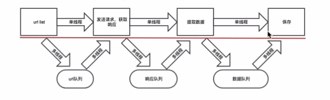

## 多线程爬虫

目标：掌握多线程在爬虫中的应用

线程：程序运行的最小单位

## 1.  多线程方法

在python3中，主线程主进程结束，子线程，子进程不会结束

为了能够让主线程回收子线程，可以把子线程设置为守护线程，即该线程不重要，主线程结束，子线程结束

## 多线程实现思路刨析

1.把爬虫中的每个步骤封装成函数，分别用线程去执行

2.不同的函数通过队列互相通信，函数间解耦

</img>

```python
from threading import Thread


def func(x, y):
    print(f'我是{y}, 收到{x}')


if __name__ == '__main__':
    # 线程创建
    # target=func  func代表线程执行的函数，做什么任务
    # args=(3,)  kwargs={'x': 4}  参数传递的两种方式
    # start()  进程开启，执行
    for i in range(3):
        Thread(target=func, args=(i, 's')).start()
        Thread(target=func, kwargs={'x': i, 'y': 'a'}).start()
```

## 2.线程使用案例解析（LOL）

```python
from requests_html import HTMLSession
from fake_useragent import UserAgent
import threading
import jsonpath, os
session = HTMLSession()
ua = UserAgent()


class Lol(object):
    def __init__(self):
        self.start_url = 'https://game.gtimg.cn/images/lol/act/img/js/heroList/hero_list.js'
        self.p_url = 'https://game.gtimg.cn/images/lol/act/img/js/hero/{}.js'

    def parse_url(self):
        """
        提取c，提取英雄的名称
        :return: item_id_list, name_list
        """
        response_json = session.get(url=self.start_url).json()
        # 提取英雄的id
        item_id_list = jsonpath.jsonpath(response_json, '$..heroId')

        return item_id_list

    def parse_item(self, item_id_list):
        for id in item_id_list:
            referer = 'https://lol.qq.com/data/info-defail.shtml?id={}'.format(id)
            headers = {
                "user-agent": ua.chrome,
                "referer": referer
            }
            name_json = session.get(url=self.p_url.format(id), headers=headers).json()
            win_img_list = jsonpath.jsonpath(name_json, '$..mainImg')
            phone_img_list = jsonpath.jsonpath(name_json, '$..loadingImg')
            # print(win_img_list)
            # print(phone_img_list)
            # 自动创建文件夹的名称
            title = jsonpath.jsonpath(name_json, '$..title')[0]
            # print(title)
            print('保存文件夹创建中-----------logging----------')
            os_path = os.getcwd() + '/' + title + '/'
            if not os.path.exists(os_path):
                os.mkdir(os_path)
            # 图片命名名称
            title_name_list = jsonpath.jsonpath(name_json, '$..name')[1::]
            # print(title_name_list)
            self.threading_run(win_img_list, phone_img_list, os_path, title_name_list)

    def save_data(self, img_list, os_path, title_name_list, num):
        if num == 1:
            for img_url, name in zip(img_list, title_name_list):
                if img_url != '':
                    if '/' in name:
                        name = name[2::]
                    data = session.get(url=img_url).content
                    with open(os_path + name + '电脑版.jpg', 'wb')as f:
                        f.write(data)
                        print('电脑版图片----------{}----------保存完成'.format(name))
        if num == 2:
            for img_url, name in zip(img_list, title_name_list):
                if img_url != '':
                    data = session.get(url=img_url).content
                    if '/' in name:
                        name = name[2::]
                    with open(os_path + name + '手机版.jpg', 'wb')as f:
                        f.write(data)
                        print('手机版图片----------{}----------保存完成'.format(name))

    def threading_run(self, win_img_list, phone_img_list, os_path, title_name_list):
        """

        :param win_img_list: 电脑版图片列表
        :param phone_img_list: 手机版图片列表
        :param os_path: 图片保存路径
        :param title_name_list: 保存图片的名称列表
        :return:
        """
        threading.Thread(target=self.save_data, args=(win_img_list, os_path, title_name_list, 1)).start()
        threading.Thread(target=self.save_data, args=(phone_img_list, os_path, title_name_list, 2)).start()

    def run(self):
        item_id_list = self.parse_url()
        self.parse_item(item_id_list)


if __name__ == '__main__':
    lol = Lol()
    lol.run()
```

## 3.线程间共享全局变量（代码解析）

```python
from threading import Thread
import time

def func(x):

    x.append(4)
    print('我是func', x)


def function(x):
    print('我是function', x)

x = [1, 2, 3]

if __name__ == '__main__':
    Thread(target=func, args=(x,)).start()
    Thread(target=function, args=(x,)).start()
```

## 4.阻止线程间共享全局变量

```python
from threading import Thread
import threading
import time

x = ['a', 'b', 'c']


def func(num):
    global x
    mutex.acquire()  # 上锁
    time.sleep(2)
    for i in range(num):
        x.append(i)
    print('我是func', x)
    mutex.release()  # 解锁


def function(num):
    global x
    mutex.acquire()  # 上锁
    time.sleep(2)
    for i in range(num):
        x.append(i)
    print('我是function', x)
    mutex.release()  # 解锁


if __name__ == '__main__':
    mutex = threading.Lock()
    Thread(target=func, args=(3,)).start()
    Thread(target=function, args=(5,)).start()
```


## 5.  队列模块的使用

```python
from queue import Queue
q = Queue(maxsize=100)
item = {}
q.put_nowait(item)  # 不等待，直接放
q.put(item)  # 放入数据，队列满的时候回等待
q.get_nowait()  # 不等待直接取，队列空的时候会报错
q.get()  # 取出数据，队列为空的时候会等待
q.qsize()  # 获取队列中现存数据的个数
q.join()  # 队列中维持了一个计数，计数不为0时候让主线程阻塞等待，队列计数为0的时候才会继续往后执行
q.task_done()
# put的时候计数+1，get不会-1，get需要和task_done一起使用才会-1
```


## 6.线程队列代码解析

```python
from threading import Thread
from queue import Queue


class Love(object):
    def __init__(self):
        # 队列容量,队列创建 ，[]， {}
        self.q = Queue()

    def parse_data(self):
        """功能：往队列添加数据"""
        data = "第{}天----我爱你----"
        for i in range(1, 100):
            # 将数据放入队列，put的时候计数+1，get不会-1，get需要和task_done一起使用才会-1
            self.q.put(data.format(i))
        # 等待task_done()返回的信号量和put进去的数量一直才会往下执行
        # join所完成的工作就是线程同步，即主线程任务结束之后，进入阻塞状态，一
        # 直等待其他的子线程执行结束之后，主线程在终止，否则主线程会杀死子线程
        # 主线程结束后子线程无论是否执行完毕都将结束，因此join的作用就显现出来了
        self.q.join()

    def func2(self):
        """功能：从队列中获取数据"""
        while True:
            # 循环从队列中获取, 取出数据，队列为空的时候会等待
            result = self.q.get()
            print(result)
            # 使队列计数-1
            self.q.task_done()

    def run(self):
        # 进程创建
        """进程：功能：往队列中添加数据"""
        m1 = Thread(target=self.parse_data)
        """进程：功能：从队列里面获取数据"""
        m2 = Thread(target=self.func2)
        m1.start()
        # 将m2设置成守护进程 因为m2一直是死循环,设置成守护进程之后当主程序代码运行完毕,m2就会结束,不会成为僵尸进程
        # 即只在需要的时候才启动，完成任务后就自动结束
        m2.daemon = True
        m2.start()
        # 队列中维持了一个计数，计数不为0时候让主线程阻塞等待，队列计数为0的时候才会继续往后执行

        m1.join()


if __name__ == '__main__':
    love = Love()
    love.run()
```

## 7.线程池代码解析

```python
# 有资源竞争的问题
from concurrent.futures import ThreadPoolExecutor
import threading
import time


# 定义一个准备作为线程任务的函数
def action(max):
    my_sum = 0
    for i in range(max):
        # 了解
        # threading.current_thread().name = 'aef'
        print(threading.current_thread().name + '  ' + str(i))
        # threading.current_thread() 进行中的进程 代码表示获取进行中的进程名称
        # print(threading.current_thread().getName() + '  ' + str(i))
        my_sum += i
    return my_sum


# 创建一个包含2条线程的线程池
pool = ThreadPoolExecutor(max_workers=3)

# 向线程池提交一个task(任务), 50会作为action()函数的参数
f1 = pool.submit(action, 1000)

# 向线程池再提交一个task(任务), 100会作为action()函数的参数
f2 = pool.submit(action, 1000)

# # 判断future1代表的任务是否结束
# print(future1.done())
# time.sleep(3)
#
# # 判断future2代表的任务是否结束
# print(future2.done())
#
# # 查看future1代表的任务返回的结果
# print('运行结果', action(50), '\t\n')
print('运行结果', f1.result(), '\t\n')
#
# # 查看future2代表的任务返回的结果
# print(future2.result())

# 关闭线程池
pool.shutdown()
```


## 5.  线程池使用方法介绍

目标：掌握线程池的使用

​		  掌握协程池的使用

**5.1.实例化线程池对象**

```python
 from multiprocessing.dummy import Pool
 pool = Pool(process=5) #默认大小是cup的个数
```

**5.2.把从发送请求，提取数据，到保存合并成一个函数，交给线程池异步执行使用方法pool.apply_async(func)**

```python
 def exetute_requests_item_save(self):
     url = self.queue.get()
     html_str = self.parse_url(url)
     content_list = self.get_content_list(html_str)
     self.save_content_list(content_list)
     self.total_response_num +=1

 pool.apply_async(self.exetute_requests_item_save)
```

**5.3.添加回调函数**

通过`apply_async`的方法能够让函数异步执行，但是只能够执行一次

为了让其能够被反复执行，通过添加回调函数的方式能够让_callback 递归的调用自己

同时需要指定递归退出的条件

```python
def _callback(self,temp):
     if self.is_running:
          pool.apply_async(self.exetute_requests_item_save,callback=self._callback)

 pool.apply_async(self.exetute_requests_item_save,callback=self._callback)
```

**5.4.确定程序结束的条件 程序在获取的响应和url数量相同的时候可以结束**

```python
 while True: #防止主线程结束
     time.sleep(0.0001)  #避免cpu空转，浪费资源
     if self.total_response_num>=self.total_requests_num:
         self.is_running= False
         break
 self.pool.close() #关闭线程池，防止新的线程开启
# self.pool.join() #等待所有的子线程结束
```

**5.5.实现**

```python
# coding=utf-8
import requests
from lxml import etree
from queue import Queue
from multiprocessing.dummy import Pool
import time


class QiubaiSpider:
    def __init__(self):
        self.url_temp = "https://www.qiushibaike.com/8hr/page/{}/"
        self.headers = {"User-Agent": "Mozilla/5.0 (Macintosh; Intel Mac OS X \
        10_13_3) AppleWebKit/537.36 (KHTML, like Gecko) Chrome/64.0.3282.186 Safari/537.36"}
        self.queue = Queue()
        self.pool = Pool(5)
        self.is_running = True
        self.total_requests_num = 0
        self.total_response_num = 0

    def get_url_list(self):  # 获取url列表
        for i in range(1, 14):
            self.queue.put(self.url_temp.format(i))
            self.total_requests_num += 1

    def parse_url(self, url):  # 发送请求，获取响应
        return requests.get(url, headers=self.headers).content.decode()

    def get_content_list(self, html_str):  # 提取段子
        html = etree.HTML(html_str)
        div_list = html.xpath("//div[@id='content-left']/div")
        content_list = []
        for div in div_list:
            content = {}
            content["content"] = div.xpath(".//div[@class='content']/span/text()")
            print(content)
            content_list.append(content)
        return content_list

    def save_content_list(self, content_list):  # 保存数据
        pass

    def exetute_requests_item_save(self):
        url = self.queue.get()
        html_str = self.parse_url(url)
        content_list = self.get_content_list(html_str)
        self.save_content_list(content_list)
        self.total_response_num += 1

    def _callback(self, temp):
        if self.is_running:
            self.pool.apply_async(self.exetute_requests_item_save, callback=self._callback)

    def run(self):
        self.get_url_list()

        for i in range(2):  # 控制并发
            self.pool.apply_async(self.exetute_requests_item_save, callback=self._callback)

        while True:  # 防止主线程结束
            time.sleep(0.0001)  # 避免cpu空转，浪费资源
            if self.total_response_num >= self.total_requests_num:
                self.is_running = False
                break


if __name__ == '__main__':
    qiubai = QiubaiSpider()
    qiubai.run()
```

