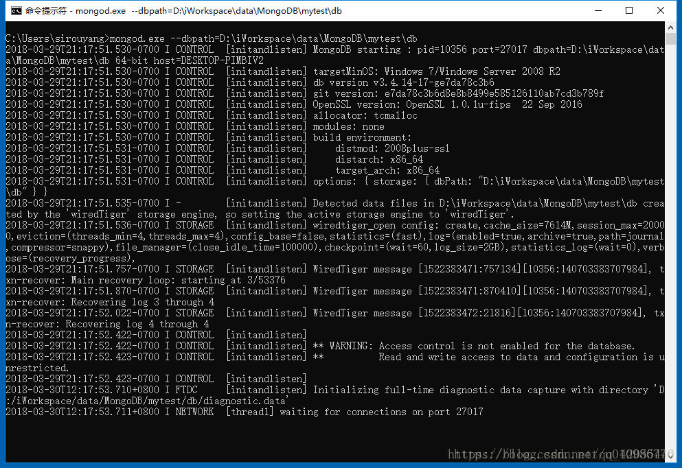
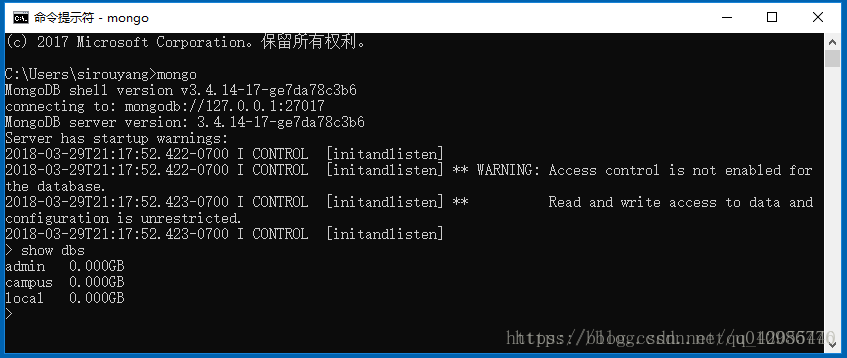
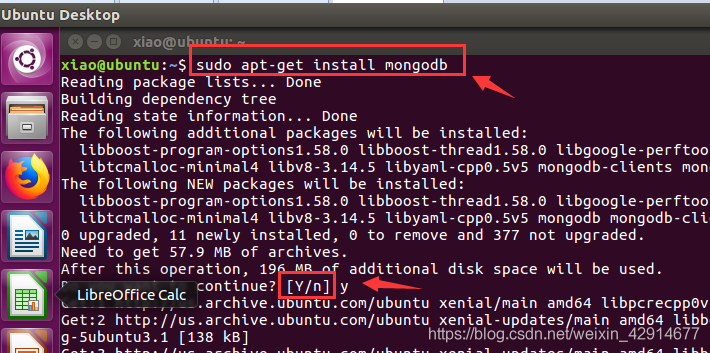
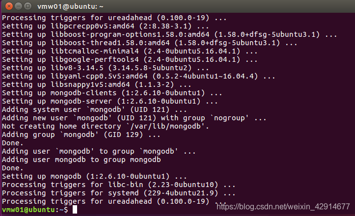
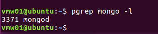
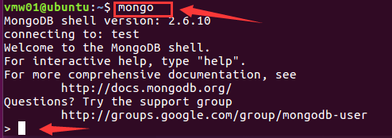

## MongoDB的安装

##### 学习目标

1. 掌握mongodb的安装


## @Centos下MongoDB的安装

```shell
1.在/etc/yum.repos.d 创建一个 mongodb-org.repo 文件
    sudo touch /etc/yum.repos.d/mongodb-org.repo
2.编辑 mongodb-org.repo 文件
    sudo vi /etc/yum.repos.d/mongodb-org.repo  按a进入inset模式
3.输入以下内容后 保存退出
    [mongodb-org]
    name=MongoDB Repository
    baseurl=http://mirrors.aliyun.com/mongodb/yum/redhat/7Server/mongodb-org/3.2/x86_64/
    gpgcheck=0
    enabled=1
4.安装MongoDB
    sudo yum install -y mongodb-org
5.启动MongoDB
    sudo service mongod start
6.设置开机启动
    sudo chkconfig mongod on
7.打开MongoDB
    sudo /bin/mongo
8.修改mongodb配置文件
	sudo vi /etc/mongod.conf
	将bindip 127.0.0.1 换成0.0.0.0
```


## @Windows下MongoDB的安装

+ MongoDB下载地址：https://www.mongodb.com/download-center?jmp=nav#community

+ 可视化工具MongoChef下载地址：https://download.csdn.net/download/u011671022/10116590

+ 它们的安装很简单，使用默认的配置进行安装即可，安装路径中不要含有中文；
  如果后续遇到服务不能正常运行的问题，请使用管理员命令行执行安装程序；
  为了后续方便，可以选择将MongoDB安装路径的bin目录添加到系统的Path环境变量


+ ### 安装校验

+ 在任意位置创建数据库文件存储路径，例如：D:\MongoDb\data\db
  打开命令行终端，进入MongoDB安装路径的bin目录下，默认为：C:\Program Files\MongoDB\Server\3.4\bin
  命令行运行如下命令，开启MongoDB服务，注意把路径换成你自己的数据库存储路径：

  ```shell
  mongod --dbpath=D:\MongoDb\data\db
  ```

  ##### 此时窗口输出运行信息，注意到MongoDB的端口是27017，最终程序阻塞在原地，这代表服务已经正常运行了

</img>

重新开启一个终端，执行以下命令启动db

```shell
mongo.exe
```

查看数据库：

```
show dbs1
```

其中，admin和local是系统自带的两个数据库

</img>

至此，安装MongoDB并启动已经完成，可以执行其命令


## @Ubuntu下MongoDB的安装

+ **1、**打开虚拟机，进入ubuntu系统，我是的ubuntu16.04版本

+ **2、**开启root用户，如果已经开启root用户，那么下面就不用再开启
  + 输入：

```shell
sudo passwd root
```

+ **3、**开始安装mongodb，注意，这是在线安装的，需要联网，才能保证安装成功。
  + 输入：

```shell
sudo apt-get install mongodb
```

</img>

**下载时间稍微有点长，请耐心等待！！！！如果看到以下界面，说明安装成功！否则，要么重新安装，要么重新安装ubuntu系统**

</img>

+ **4、**查看mongodb数据库是否启动

  输入：

```shell
pgrep mongo -l
```

</img>

​		说明已经有mongodb服务，启动成功！

​		如果没有启动，请参照启动、停止命令

​		**停止**：sudo service mongodb stop 　

​		**启动**：sudo service mongodb start

+ **5、**进入mongodb数据库

  输入：

```shell
mongo
```

</img>

**将会看到<,那么就说明进入mongodb shell界面，接下来就可以做数据库操作了**


## @测试

### @mongodb服务端的启动

- 默认端口：27017
- 默认配置文件的位置：/etc/mongod.conf
- 默认日志的位置：/var/log/mongodb/mongod.log

### @mongodb服务端启动分别两种方式：

- 本地测试方式的启动（只具有本地数据增删改查的功能）
- 生产环境启动（具有完整的全部功能）

### @测试方式启动

- 启动: sudo service mongod start (sudo service mongod start)
- 停止: sudo service mongod stop
- 重启: sudo service mongod restart

### @生产环境正式的启动方式

> 启动: sudo mongod [--auth --dbpath=dbpath --logpath=logpath --append --fork] [-–f logfile ]

- 只以 sudo mongod 命令启动时，默认将数据存放在了 /data/db 目录下，需要手动创建
- --dbpath: 指定数据库的存放路径
- --logpath: 指定日志的存放路径
- --append: 或--logappend 设置日志的写入形式为追加模式
- --fork: 或-fork 开启新的进程运行mongodb服务
- --f: 或-f 配置文件路径(可以将上述配置信息写入文件然后通过该文件中的参数进行加载启动)
- --auth: 以权限认证的方式启动，我们会在后边的课程中学习该内容

#### @查看是否启动成功

> ps aux | grep mongod

### @启动mongodb的客户端：进入mongo shell

- 启动本地客户端: mongo
- 查看帮助：mongo –help
- 退出：exit或者ctrl+c


