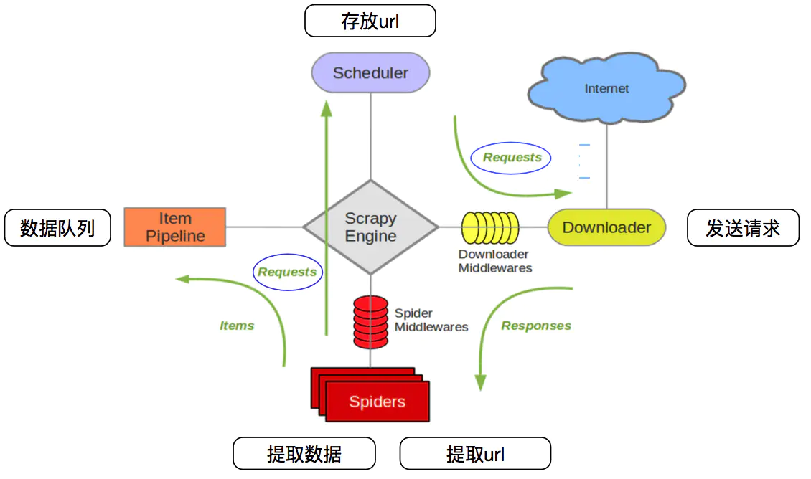
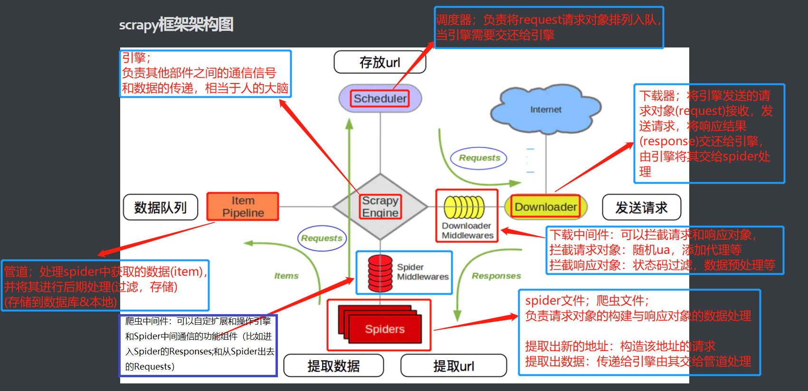

## scrapy框架的介绍

+ Scrapy是用纯Python实现一个为了爬取网站数据、提取结构性数据而编写的应用框架，用途非常广泛

+ 框架的力量，用户只需要定制开发几个模块就可以轻松的实现一个爬虫，用来抓取网页内容以及各种图片，非常之方便


## scrapy框架架构图

</img>


### @scrapy组件与功能解析：

</img>


### @scrapy原理流程

```reStructuredText
# 1.spider将起始的地址请求对象由引擎(engine)传给调度器(Scheduler)存放排列入队<去重，过滤重复对象>，当引擎需要时传递给引擎
# 2.引擎将请求对象传递给下载器(发送请求)，传递经过下载中间件(随机ua，添加代理等)
# 3.下载器获取的响应response交还给引擎由其交给spider
	下载器--引擎：经过下载中间件：拦截响应对象(数据预处理，状态码异常校验，请求对象重构)
	引擎--spider：经过爬虫中间件：自定扩展和操作引擎和Spider中间通信的功能组件
							（比如进入Spider的Responses;和从Spider出去的Requests）
# 4.spider解析响应
	@解析需要继续跟进的地址url：构造请求对象，传递给引擎，由其交给调度器存放入队
	@解析出item中定义的数据：传递给引擎，由其交给管道(pipeline)，保存
```


**crapy Engine(引擎)**: 负责Spider、ItemPipeline、Downloader、Scheduler中间的通讯，信号、数据传递等。

**Scheduler(调度器)**: 它负责接受引擎发送过来的Request请求，并按照一定的方式进行整理排列，入队，当引擎需要时，交还给引擎。

**Downloader（下载器）**：负责下载Scrapy Engine(引擎)发送的所有Requests请求，并将其获取到的Responses交还给Scrapy Engine(引擎)，由引擎交给Spider来处理，

**Spider（爬虫）**：它负责处理所有Responses,从中分析提取数据，获取Item字段需要的数据，并将需要跟进的URL提交给引擎，再次进入Scheduler(调度器)，

**Item Pipeline(管道)**：它负责处理Spider中获取到的Item，并进行进行后期处理（详细分析、过滤、存储等）的地方.

**Downloader Middlewares**（下载中间件）：你可以当作是一个可以自定义扩展下载功能的组件。

**Spider Middlewares**（Spider中间件）：你可以理解为是一个可以自定扩展和操作引擎和Spider中间通信的功能组件（比如进入Spider的Responses;和从Spider出去的Requests）

</img>


