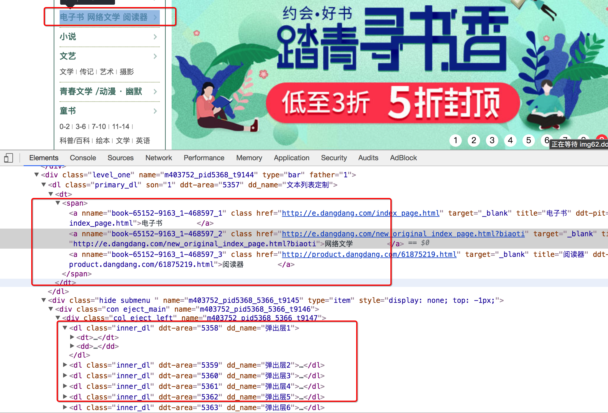
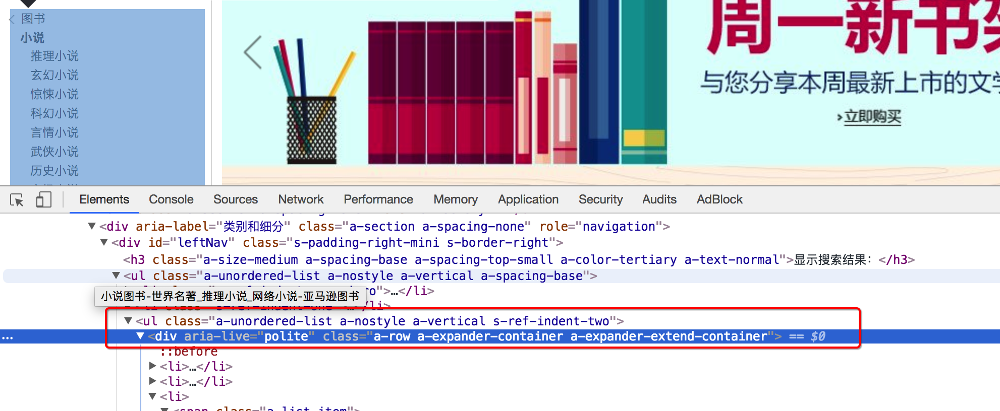

## @scrapy_redis实现分布式爬虫

```
通过观察代码：

- 继承自父类为RedisSpider
- 增加了一个redis_key的键，没有start_urls，因为分布式中，如果每台电脑都请求一次start_url就会重复
- 多了`__init__`方法，该方法不是必须的，可以手动指定allow_domains
```

</img>


## @需求

需求：抓取当当图书的信息

目标：抓取当当图书又有图书的名字、封面图片地址、图书url地址、作者、出版社、出版时间、价格、图书所属大分类、图书所属小的分类、分类的url地址

url：http://book.dangdang.com

##### 思路分析：

1. 程序的入口

   当当图书中，从大分类入手，还有一个中间分类，以及小分类，小分类对一个的地址就是列表页的地址

   注意，url地址的响应和elements略微不同，其中不是每个大分类都在a标签中，中间部分分类不在span标签中

   </img>

2. 确定列表页的url地址和程序终止条件

   存在下一页

   </img>

   不存在下一页

   </img>

3. 确定数据的位置

   数据都在url地址对应的响应中，包括列表 

   </img>

4. 完善spider

   可以使用scrapy的方式创建爬虫，只需要把父类进行修改，添加redis_key

   同时在settings.py中进行配置


## @RedisCrawlSpider

##### 分析demo中的代码

和scrapy中的crawlspider的区别在于，继承自的父类不相同，redis_key需要添加

</img>


##### @亚马逊图书爬虫

需求：抓取亚马逊图书的信息

目标：抓取亚马逊图书又有图书的名字、封面图片地址、图书url地址、作者、出版社、出版时间、价格、图书所属大分类、图书所属小的分类、分类的url地址

url：[https://www.amazon.cn/%E5%9B%BE%E4%B9%A6/b/ref=sd_allcat_books_l1?ie=UTF8&node=658390051](https://www.amazon.cn/图书/b/ref=sd_allcat_books_l1?ie=UTF8&node=658390051)

##### 思路分析：

1. 确定rule中的规则

   可以通过连接提取器中的restrict_xpath来实现url地址的，不需要定位到具体的url地址字符串，定位到准确的标签位置即可

   注意：定位到的标签中不能包含不相关的url，否则请求不相关的地址后，数据提取会报错

   通过分析大分类和小分类的url地址，发现他们的规则仙童，即一个Rule可以实现从大分类到小分类的到列表页的过程

   1. 大分类url地址

      </img>

   2. 小分类url地址

      </img>

   3. 列表页翻页的url地址位置

      </img>

   4. 进入详情页翻页的url地址位置

      详情页在h2标签的上一级，定位到h2后，通过`..`即可实现获取该url

      </img>

2. 详情页数据的抓取

   在详情页中，数据有两种，一种是电子书的信息，一种是纸质书的信息，两种页面，数据位置不同

   1. 确定书的分类，是电纸书还是纸质书

      电子书

      </img>

      纸质书 

      </img>

   2. 不同类型的书籍分别写xpath，比如价格的提取

3. 在settings中进行配置

### 小结

1. scrapy_redis中RedisSPider实现分布式爬虫的方法
2. demo中RedisCrawlspider类实现分布式爬虫的方法
3. 完成当当图书案例
4. 完成苏宁易购图书案例