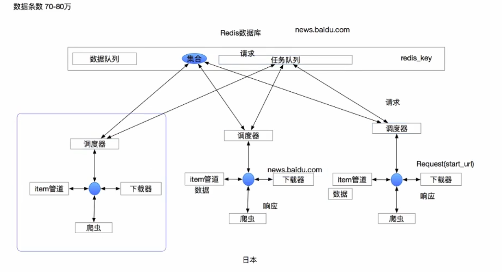
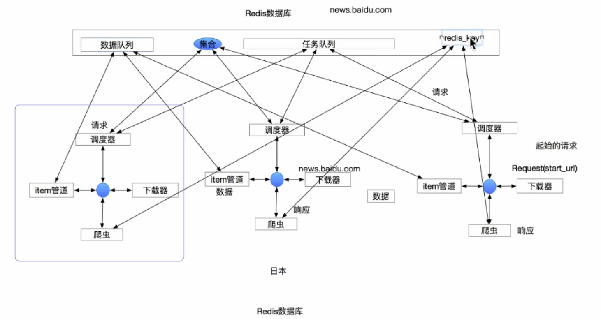

## Scrapy_Redis分布式原理


在前面scrapy框架中我们已经能够使用框架实现爬虫爬取网站数据,如果当前网站的数据比较庞大, 我们就需要使用分布式来更快的爬取数据

```shell
应用场景：百万级别起步
    概念：scrapy_redis是scrapy框架的基于redis的分布式组件
    作用：通过持久化请求队列 * 和请求的指纹集合 * 来实现(即请求队列和集合去重)
            1.断点续爬 *
            2.分布式快速抓取，但是需要的资源(硬件&网络)依然还是原有的
            3.单个节点的不稳定性，不影响整个系统的稳定性
                场景例子：有十个节点(一个爬虫代表一个节点，日本的这个节点，由于地震，机房炸了，而其他的节点照样运行)
```


## @回顾scrapy的原理

</img>


## @Scrapy_Redis原理

- 在scrapy_redis中，所有的带抓取的对象和去重的指纹都存在所有的服务器公用的redis中
- 所有的服务器公用一个redis中的request对象
- 所有的request对象存入redis前，都会在同一个redis中进行判断，之前是否已经存入过
- 在默认情况下所有的数据会保存在redis中

具体流程如下：

</img>


</img>

</img>

```python
流程：
    -在scrapy_redis中，所有的待抓取的request对象和去重的request对象指纹都存在所有的服务器公用的redis中
    -所有的服务器中的scrapy进程公用同一个redis中的request对象的队列
    -所有的request对象存入redis前，都会通过该redis中的request指纹集合进行判断，之前是否已经存入过
    -在默认情况下所有的数据会保存在redis中
    注意：爬取下来的数据会默认将数据交给数据队列，管道保存，次要的注意点，并不影响分布式的实现

特点：加快项目的运行速度，但是需要资源（硬件&网络）依然还是原有的
     单个节点的不稳定性不影响整个系统的稳定性

原理：1.爬虫运行后，每一个分布式爬虫会去redis数据库中抢redis_key这个健，redis_key的值就是起始的url，谁先拿到谁先执行，谁快谁先执行
     2.调度器将url放入有序集合中去重，能够放进去，则将这个url的请求对象放入任务队列中


总结：去重集合，任务队列，数据队列，redis_key
```

```
win系统配置redis
    1.下载地址：https://github.com/MSOpenTech/redis/releases
    2.版本选择：3.2.100zip
    3.下载之后，保存至任意路径，从该路径进入CMD命令执行界面
    4.输入redis-server.exe redis.windows.conf 启动服务端
    5.打开另一个cmd界面，输入redis-cli.exe -h 127.0.0.1 -p 6379 启动即可
        测试： set mykey abc
              set mykey
        结果：abc
    键值对的形式

    redis的界面软件：Redis Desktop Manager
    https://pan.baidu.com/s/1Jvr9MbgFn4UJh4M1AMo3gA 提取码：3i9b
    教程连接：https://blog.csdn.net/qq_35568099/article/details/80434967
```