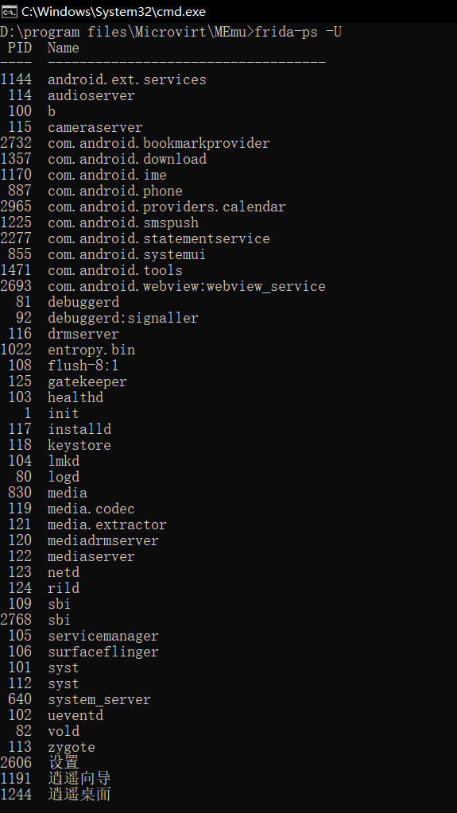

## @Android Hook工具之Frida 安装配置教程

------

Frida是一款基于Python + JavaScript的Hook调试框架，可以将自己编写的JavaScript代码注入到Windows，MACOS，Linux， iOS，Android和QNX 的应用中从而进行Hook，其实Frida功能不仅仅是Hook，还包括以下这些功能:

- 访问进程的内存
- 在应用程序运行时覆盖一些功能
- 从导入的类中调用函数
- 在堆上查找对象实例并使用这些对象实例
- Hook，跟踪和拦截函数等等

> Frida官网地址：https://www.frida.re

Frida可以运行在多个平台上，这次主要讲解使用Windows当宿主机的使用方式

- 宿主机系统：Windows
- Android手机: 已Root过的Android 手机或使用Android模拟器也可以（PS:我使用的华为荣耀6p的Android 6.0系统，模拟器没用过不知道会不会有坑）
- Frida: Frida有多重安装方式,这里主要记录一下常用的两种方式。
   方式一:  直接通过Pip安装Frida，

```stylus
pip install frida-tools
```

安装完成后，直接在终端中输入`frida-ps`命令查看，如果能显示当前系统进程则证明安装成功

```stylus
frida-ps
 PID  Name
----  ---------------------------------------------
 416  AirPlayUIAgent
 596  Android Studio
 551  AppleSpell.service
 529  CoreServicesUIAgent
 264  Dock
 266  Finder
 402  FolderActionsDispatcher
 553  Google Chrome
 505  LaterAgent
 517  QQ
 530  QQ jietu plugin
```

- Frida-server: 直接去官网下载:https://github.com/frida/frida/releases 对应的版本即可，注意：Frida-server的版本必须跟你宿主机的Frida版本一致,比如我宿主机Frida的版本是15.0.8

</img>

- 查看模拟器的手机cpu版本

</img>

- 模拟器的手机是x86的，那么应该下载：frida-server-15.0.8-android-x86.xz文件。
   下载后解压文件到模拟器路径中，并将文件重命名为: `frida-server`, 重命名完成后使用`adb push`命令推送到手机中

```stylus
adb push frida-server /data/local/tmp/
```

</img>

推送完成后进入adb shell执行Frida-server，使用以下命令:

```stylus
frida-server
```

注意：frida-server运行成功之后，界面是无显示的，切勿关闭该终端，否则会关闭frida-server进程

注1： 如果frida-server没有启动，查看一下你是否使用的是Root用户来启动，如果使用Root用户则应该是`#`
注2： 如果要启动frida-server作为后台进程、可以使用这个命令`./frida-server &`
 正常启动后，另开一个终端，使用`frida-ps -U`命令检查Frida是否正常运行，如果正常运行则会列出Android设备上当前正在运行的进程.

</img>

```stylus
frida-ps -U
  PID  Name
-----  ------------------------------------------
 3835  31:0
 3724  HwCamCfgSvr
 3954  adbd
 5011  android.process.acore
 5029  android.process.media
 3739  bastetd
 3736  check_longpress
 3764  check_longpress
13962  com.UCMobile:channel
14462  com.UCMobile:push
```

参数-U 代表USB，意思让Frida检查USB设备，使用`frida-ps -R` 也可以，但是需要进行转发。执行`adb forward tcp:27042 tcp:27042`后执行`frida-ps -R`也可以看到手机上的进程.
 到此为止，Frida工作环境已经准备好了


## @Android Hook工具之Frida 基础使用

------

- 使用*frida-trace*命令跟踪某个特定的函数:
   `frida-trace -U -i [函数名] [程序包名]`
   例: 跟踪Chrome中的open函数，先在手机中启动Chrome，否则会跟踪失败，启动后，在终端窗口中输入*frida-trace*命令

```stylus
frida-trace -U -i open com.android.chrome
Instrumenting functions...                                              
open: Auto-generated handler at "/Users/wangw/unapk/frida/__handlers__/libc.so/open.js"
Started tracing 1 function. Press Ctrl+C to stop. 
```

跟踪成功后，会在当前路径下创建以下JavaScript文件(/Users/wangw/unapk/frida/**handlers**/libc.so/open.js),Frida会将JavaScript文件中的代码注入到进程中并跟踪指定的函数调用，可以修改生成的JavaScript文件实现Hook功能，下面就是自动生成Js文件内容

```stylus
{
  onEnter: function (log, args, state) {
    log("open(" +
      "path=\"" + Memory.readUtf8String(args[0]) + "\"" +
      ", oflag=" + args[1] +
    ")");
  },

  onLeave: function (log, retval, state) {
  }
}
```

跟踪成功后就会打印出Chrome调用open函数每一次调用，输出结果类似下面这样:

```stylus
frida-trace -U -i open com.android.chrome
Instrumenting functions...                                              
open: Auto-generated handler at "/Users/wangw/unapk/frida/__handlers__/libc.so/open.js"
Started tracing 1 function. Press Ctrl+C to stop.                       
           /* TID 0x2252 */
  1312 ms  open(path="/data/user/0/com.android.chrome/code_cache/com.android.opengl.shaders_cache", oflag=0xc2)
  1314 ms  open(path="/data/user/0/com.android.chrome/code_cache/com.android.opengl.shaders_cache", oflag=0xc2)
           /* TID 0x2298 */
  3264 ms  open(path="/data/user/0/com.android.chrome/shared_prefs/com.android.chrome_preferences.xml", oflag=0x241)
```

- 强制启动一个应用进程
   `frida -U --no-pause -f [应用包名]`
   使用`-f`选项表示强制启动一个应用程序，`--no-pause`选项表示不中断应用程序的启动，如果不使用这个选项总是会遇到 在强制启动应用程序2秒左右后程序自动退出，
   例: 强制启动Chrome并attach到当前进程

```stylus
frida -U --no-pause -f com.android.chrome
     ____
    / _  |   Frida 10.6.52 - A world-class dynamic instrumentation toolkit
   | (_| |
    > _  |   Commands:
   /_/ |_|       help      -> Displays the help system
   . . . .       object?   -> Display information about 'object'
   . . . .       exit/quit -> Exit
   . . . .
   . . . .   More info at http://www.frida.re/docs/home/
Spawned `com.android.chrome`. Resuming main thread!                     
[HUAWEI EVA-AL10::com.android.chrome]-> 
```

当attach成功后，就可以开始Hook Java函数和对象了。
 关于Friada框架中Java部分的API可以查看[官方文档](https://link.jianshu.com?t=https%3A%2F%2Fwww.frida.re%2Fdocs%2Fjavascript-api%2F%23java)，下面总结几个常用的API。

- `Java.available`  返回一个Boolean值，表示当前进程是否加载了 JVM也就是是否运行在Dalvik 或 ART环境中.如果返回false则Java 相关的API则无法调用

```stylus
[HUAWEI EVA-AL10::com.android.chrome]-> Java.available
true
```

- `Java.enumerateLoadedClasses(callbacks)` 列出已加载的类

```stylus
[HUAWEI EVA-AL10::com.android.chrome]-> Java.perform(function(){Java.enumerateLo
adedClasses({"onMatch":function(className){ console.log(className) },"onComplete
":function(){console.log(onComplete) }})})
org.chromium.chrome.browser.ntp.ContentSuggestionsNotifier
org.chromium.chrome.browser.snackbar.undo.UndoBarController
```

所有的代码逻辑都封装在`Java.perform(function(){ … })`中，逻辑很简单，就是使用Java.enumerateLoadedClassesFridas API 列出所有已加载的类，并将每个类的className输出到控制台，这种使用方式是Frida框架中最常用的，它其实就是一个回调对象模板，

```javascript
{
  "onMatch":function(arg1, ...){ ... },
  "onComplete":function(){ ... },
}
```

一旦Frida匹配到你的请求，就会使用一个或多个参数调用onMeth方法，如果匹配完成时就会调用onComplete，

- `Java.use(className)` 根据className动态获取一个JavaScript wrapper，获取到后可以调用`$new()`方法来实例化一个对象，也可以调用`$dispose()`方法进行释放

```stylus
Java.perform(function () {
    var Activity = Java.use("android.app.Activity");
    var Exception = Java.use("java.lang.Exception");
    Activity.onResume.implementation = function () {
        throw Exception.$new("Test!");
    };
});
```

- Frida框架还支持加载外部脚本代码，而不用直接写到Cli中运行，使用`-f`选项后面跟着脚本文件路径即可，比如我们将上面的代码保存到一个文件中并命名为Test.js，使用命令运行：

```javascript
frida -U -l Test.js --no-pause -f com.android.chrome
```

- Frida有时候会有超时的提示，为防止这种情况，可以将脚本里面的代码包装在`setImmediate`函数中或[导出为rpc](https://link.jianshu.com?t=https%3A%2F%2Fwww.frida.re%2Fdocs%2Fjavascript-api%2F%23rpc)
   例: 将Test.js中的代码修改一下，然后再次运行上面的命令重新部署一下即可。

```javascript
setImmediate(function() {
    Java.perform(function () {
    var Activity = Java.use("android.app.Activity");
    var Exception = Java.use("java.lang.Exception");
    Activity.onResume.implementation = function () {
        throw Exception.$new("Test!");
    };
});
});
```

### 如何Hook一个java方法

1. 使用`Java.use(className)`命令获取 JavaScript wrapper
2. 调用获取到的 JavaScript wrapper对象的方法`[JavaScript wrapper对象].[要Hook的方法名].implementation=function(){...}`

> 注1: 如果要Hook的方法有多个重载时，必须使用`overload()`方法调用，参数必须是完全匹配的，参数类型必须是全类名的也就是全引用名的。
>  注2: Hook方法中的参数，可以通过`arguments`数组访问，也可以在`implementation`函数中声明对应的形参

Android 代码：

```java
public class MainActivity extends AppCompatActivity {

    @Override
    protected void onCreate(Bundle savedInstanceState) {
        super.onCreate(savedInstanceState);
        setContentView(R.layout.activity_main);

        findViewById(R.id.mBtnTest).setOnClickListener(new View.OnClickListener() {
            @Override
            public void onClick(final View v) {
                helloAndroid();
                test1();
                test2(123);
                test3("str");
                test4("str", true);
            }
        });
    }
    
    private void helloAndroid() {
        System.out.println("helloAndroid()");
    }

    private void test() {
        System.out.println("test1()");
    }

    private void test(int i) {
        System.out.println("test2(int) " + i);
    }

    private void test(String s) {
        System.out.println("test3(String) " + s);
    }

    private void test(String s, boolean b) {
        System.out.println("test4(String, boolean) " + s + ", " + b);
    }
}
```

JavaScript Hook代码

```javascript
Java.perform(function () {
    var MainActivity = Java.use("com.github.fridademo.MainActivity");
    MainActivity.helloAndroid.implementation = function () {
        console.log("helloAndroid()");
        this.private_func();
    };
    MainActivity.test.overload().implementation = function () {
        console.log("test1()");
        this.private_func();
    };
    MainActivity.test.overload("int").implementation = function (i) {
        console.log("test2(int): " + i);
        this.private_func(i);
    };
    MainActivity.test.overload("java.lang.String").implementation = function () {
        console.log("test3(String): " + arguments[0]);
        this.private_func(arguments[0]);
    };
    MainActivity.test.overload("java.lang.String", "boolean").implementation = function (s, b) {
        console.log("test4(String,boolean): " + s + ", " + b);
        this.private_func(s, b);
    };
});
```

