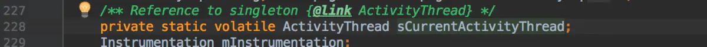
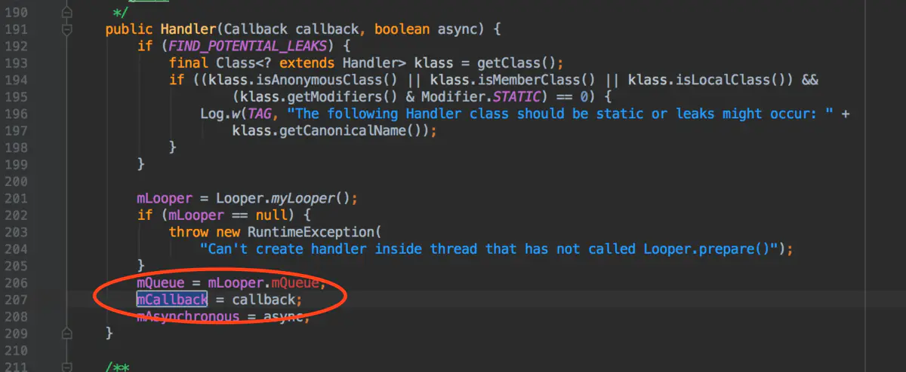

## @还原 Activity

------

  接下来，我们就把你想要真正跳转到的 Activity 还原到界面上，想要去东京就去东京，想去巴黎就去巴黎，想去土耳其就去土耳其。
  我们需要思考一个问题，正常情况下，为什么没有在清单文件注册的 Activity 不能打开，因为 Android 系统他会通过 AMS 来进行检测，如果我们躲过了这个检测，就可以不用注册了，那么如何躲避？
  首先，App 是以事件驱动来进行运转的，本质是一个无线循环的 main 函数，那么 App 的入口是在 ActivityThread 类里面的 main 方法。
  Android 中的所有消息都存储在消息泵里面，比如开启 Activity，消息的取出是通过 Handler，消息的处理也是通过 Handler 来处理的（handleMessage）。当外界开启 Activity 的时候，handler 会发送一个值为 100 的消息，如果 handler 发送了该消息，就表明启动该 Activity  已经经过了 AMS 的检查，可以开始启动了，最终会调用 Handler.CallBack 的 handleMessage 方法对消息值为 100 的消息来进行处理。
  那么，我们要做的就是在 handler 发送了 100 的消息后，hook 他的 handleMessage 方法，然后将跳转的页面还原，将 ProxyActivity 还原成原来的 Activity 就可以了。所以我们需要 hook 的是 handler 对象以及 handleMessage 方法

</img>

</img>


  找到了 Handler 对象 mh，并且我们看到一个常量 LAUNCH_ACRTIVITY = 100，就是我们前面说的 Activity 启动的时候 Handler 会发送一个值为 100 的消息。Handler 是找到了，但是问题是它不是静态的，这个 H 属于 ActivityThread，如果 ActivityThread 是静态的，那么就可以拿到系统的 H 了。

</img>

</img>

</img>

  是静态的，那么这个 sCurrentActivityThread 就是我们的伪 hook 点。接下来就看 handleMessage 方法如何拉到系统外执行了。

</img>

</img>

</img>

  解释一下上面的操作，首先 Handler 里面有一个 Callback 接口，该接口只有一个方法，就是 handleMessage 方法，而这个 Callback 实例化是在 Handler 的构造方法里面实例化的，所以我们肯定不能这样拿到这个 Callback，因为如果你要通过构造方法来那，肯定就要 new Handler，那 new 出来的对象肯定和系统不是同一个对象，没有任何意义，而且也没有 setCallback 方法，所以还是只能通过反射来获取。

```kotlin
public class HookUtils {

    private Context context;

    //...

    public void hookActivityHm(){
        try {
            Class<?> activityThreadClass = Class.forName("android.app.ActivityThread");
            Field sCurrentActivityThreadField = activityThreadClass.getDeclaredField("sCurrentActivityThread");
            sCurrentActivityThreadField.setAccessible(true);
            //拿到系统的 ActivityThread 对象
            Object activityTreadObj = sCurrentActivityThreadField.get(null);

            //那 Handler
            Field mhField = activityThreadClass.getDeclaredField("mH");
            mhField.setAccessible(true);
            //拿到系统的 Handler，真正的 hook 点已经拿到
            Handler mhHandler = (Handler) mhField.get(activityTreadObj);

            //hook handleMessage 方法
            //先拿到 callback
            Field mCallbackField = Handler.class.getDeclaredField("mCallback");
            mCallbackField.setAccessible(true);
            /*
                接下来就是将 handleMessage 方法拉到系统外面来执行了，
                但是注意，由于 callback 就是一个接口，那么我们就用系统的
                这个对象但是重写他里面的方法，就可以完成将系统代码拉到外面来执行的目的了，
                这就是特定的情景才能使用，不一定非要使用动态代理。
             */
            //这里将 Callback 替换成我们自己定义的 Callback
            mCallbackField.set(mhHandler,new MyCallback(mhHandler));

        } catch (Exception e) {
            e.printStackTrace();
        }
    }

    class MyCallback implements Handler.Callback {

        private Handler systemHandler;

        public MyCallback(Handler systemHandler){
            this.systemHandler = systemHandler;
        }

        @Override
        public boolean handleMessage(Message msg) {
            if(msg.what == 100){
                //如果是 100 启动 Activity 的消息，我们需要特殊处理
                handleLaunchActivity(msg);
            }
            //这句话不能忘，其他的全部交给系统处理
            systemHandler.handleMessage(msg);
            return true;
        }

        /**
         * 如果执行到该方法，说明启动 Activity 已经经过 AMS 的检查了，
         * 我们在这里只需要将 Activity 进行还原即可。
         */
        private void handleLaunchActivity(Message msg) {
            /*
                这里有个小知识点，就是如果是启动 Activity 的话，肯定会有如下结构：
                msg 里面有一个 obj,而该 obj 中也会有一个 intent 属性
             */
            Object obj = msg.obj;
            try {
                Field intentField = obj.getClass().getDeclaredField("intent");
                intentField.setAccessible(true);

                //这个获得的是被我们篡改后的 Intent
                Intent tamperIntent = (Intent) intentField.get(obj);
                //从该 Intent 中获取真正想要跳转到的目标 Activity
                Intent oldIntent = tamperIntent.getParcelableExtra("oldIntent");
                if(oldIntent != null){
                    //实现集中式登录
                    SharedPreferences share = context.getSharedPreferences("radish",Context.MODE_PRIVATE);
                    boolean login = share.getBoolean("login", false);
                    if(login){
                        //登录了
                        tamperIntent.setComponent(oldIntent.getComponent());
                    }else{
                        //没登录
                        ComponentName componentName = new ComponentName(context,LoginActivity.class);
                        tamperIntent.putExtra("extraIntent",oldIntent.getComponent().getClassName());
                        tamperIntent.setComponent(componentName);
                    }

                }
            } catch (Exception e) {
                e.printStackTrace();
            }
        }
    }
}
```

  如果我们想为哪个界面添加白名单，那么修改下面这行代码即可。

</img>

  这样的效果，就是跳转 SecondActivity 是不需要登录的，而其他的界面是需要登录的。

</img>

> 注意：这里有一个坑，所有在 AndroidManifest.xml 中没有注册过的 Activity 必须 extends Activity 而不能 extends AppCompatActivity，否则会报错。


