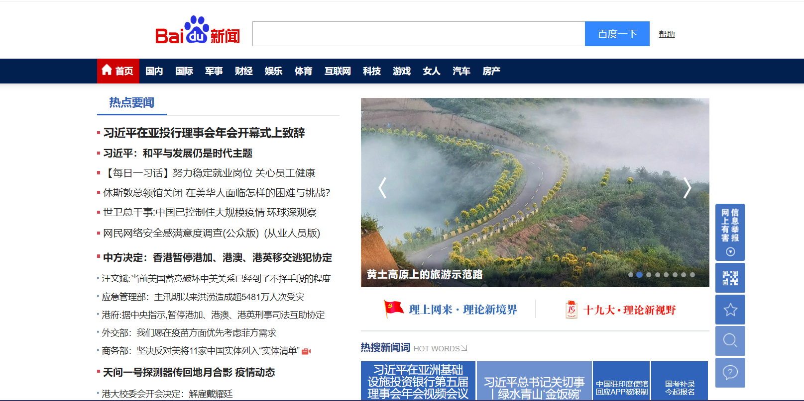
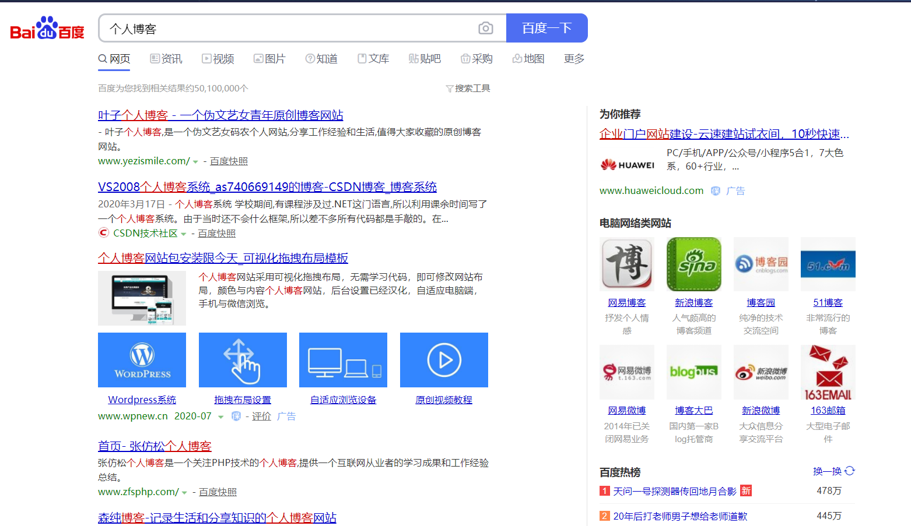
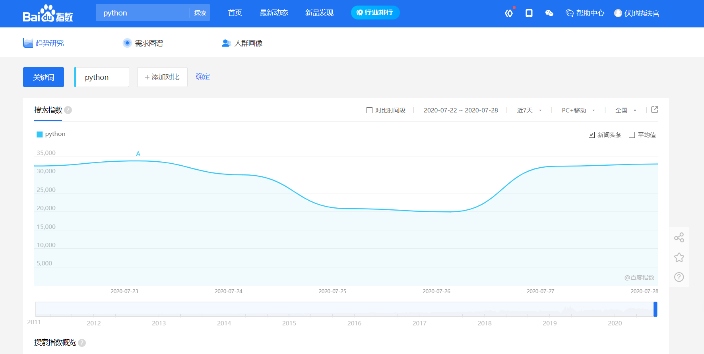

## 走进爬虫

## 1.    什么是爬虫？

本节课程的内容是介绍什么是爬虫？爬虫有什么用？以及爬虫是如何实现的？从这三点一起来寻找答案！

</img>

**1.1    初识网络爬虫**

**网络爬虫（又被称为网页蜘蛛，网络机器人，在FOAF社区中间，更经常的称为网页追逐者），是一种按照一定的规则，自动地抓取万维网信息的程序或者脚本**。

也就是说，**爬虫可以自动化浏览网络中的信息**，当然浏览信息的时候需要按照我们制定的规则进行，这些规则我们称之为网络爬虫算法。而Python可以很方便地编写出爬虫程序，进行互联网信息的自动化检索。

**搜索引擎**离不开爬虫，比如**百度**搜索引擎的爬虫叫作百度蜘蛛（Baiduspider）。百度蜘蛛每天会在海量的互联网信息中进行爬取，爬取优质信息并收录，当用户在百度搜索引擎上检索对应关键词时，百度将对关键词进行分析处理，从收录的网页中找出相关网页，按照一定的排名规则进行排序并将结果展现给用户。

**1.1.1    百度新闻案例说明**

</img>

在这个过程中，百度蜘蛛起到了至关重要的作用。那么，如何覆盖互联网中更多的优质网页？又如何筛选这些重复的页面？这些都是由百度蜘蛛爬虫的算法决定的。采用不同的算法，爬虫的运行效率会不同，爬取结果也会有所差异。

**1.1.2    网站排名（访问权重pv）**

</img>

所以，我们在研究爬虫的时候，不仅要了解爬虫如何实现，还需要知道一些常见爬虫的算法，如果有必要，我们还需要自己去制定相应的算法，在此，我们仅需要对爬虫的概念有一个基本的了解。

## **2.    爬虫的领域（为什么学习爬虫 ?）**

我们初步认识了网络爬虫，但是为什么要学习网络爬虫呢？

如今，人工智能，大数据离我们越来越近，很多公司在开展相关的业务但是人工智能和大数据中有一个东西非常重要，那就是数据，但是数据从哪里来呢？

首先，我们先看下面这个例子  http://index.baidu.com/v2/main/index.html#/trend/python?words=python

</img>

这是百度的百度指数的一个截图，它把用户在百度上的搜索关键词做了一个统计，然后根据统计结果得出一个流行趋势，之后进行了简单的展示。

像微博上的热搜，就是这么一个原理，类似的指数网站还有很多，比如阿里指数，360指数等等，而这些网站有非常大的用户量，他们能够获取自己用户的数据进行统计和分析

那么，对于一些中小型的公司，没有如此大的用户量的时候，他们该怎么办呢？

### 2.1    数据的来源

1.去第三方的公司购买数据（比如：企查查）

2.去免费的数据网站下载数据（比如：国家统计局）

3.通过爬虫爬取数据

4.人工收集数据（比如：问卷调查）

在上面的数据来源中，人工的方式费时费力，效率低下，免费的数据网站上面的数据质量不佳，很多第三方的数据公司他们的数据往往也是爬虫获取的，所以获取数据最有效的途径就是通过爬虫爬取

**2.2    爬虫等于黑客吗？**

**爬虫和黑客的区别**：

黑客和爬虫最大的区别就是行为目的不同，黑客是干坏事，爬虫是干好事。因为黑客和爬虫使用的技术都是差不多，都是通过计算机网络技术进行对用户电脑、网站、服务器进行入侵然后获取数据信息。区别是黑客是非法入侵，爬虫是合法入侵。比如黑客通过破解网站后台验证码技术然后模拟登陆网站数据库，把数据库删掉或者直接修改人家数据库，这种是非法入侵，破坏性行为、违法行为。 同样也是破解验证码技术，但是爬虫就不同了，比我需要获取某些政府网站的一些公开数据，但是每次都需要输入验证码很麻烦，为了提高数据分析的工作效率，爬虫技术也是通过绕过验证码技术去采集网站公开、开放的数据，不会获取隐私不公开的数据。 **如果把数据比喻女人，爬虫和黑客是男人，那么爬虫是男朋友，是在正当合法、名正言顺的情况下和女的发生了关系，然而黑客不同，黑客就是强奸犯了**，因为女的不是自愿的，黑客是强制性，甚至用暴力来和女的发生关系。这个就是黑客和爬虫的本质不同地方，虽然采用类似的技术手段来获取数据，但是采取的技术行为和最终导致的后果性质是不同的。一个是违法需要承担法律后果，一个是国家支持鼓励的是合法的。不管是爬虫还是黑客技术 都是一个工具而已，就像是菜刀一样，有人拿去切菜，有人拿去杀人，那菜刀是好还是坏呢，其实菜刀只是一个工具而已，好坏在于使用者的行为的结果

</img>

**2.3    大数据和爬虫又有啥关系？**

爬虫是在互联网上抓取数据，而获取的数据的量，决定了与大数据的兄弟关系是否更加亲密

**2.4    爬虫的领域，前景**

- **人脸识别：**您做人工智能是需要大数据的，举个例子您想做一个自动识别人脸的人工智能机器。您首先需要根据人脸生物特征建立AI模型，然后需要几千万或者几十亿张人脸图片进行不断的训练这个模型，最后才得到精准的人脸识别AI。几十亿的人脸图片数据哪里来呢？ 公安局给你？不可能的！一张张去拍照？更不现实啦！ 那就是通过网络爬虫技术建立人脸图像库，比如我们可以通过爬虫技术对facebook、qq头像、微信头像等进行爬取，来实现建立十几亿的人脸图像库。
- **市场分析：**电商分析、商圈分析、一二级市场分析等
- **市场监控：**电商、新闻、房源监控等
- **商机发现：**招投标情报发现、客户资料发掘、企业客户发现等
- 。。。等等

学到后面的数据分析，还可以用爬虫获取金融股票数据进行数据分析，技术型炒股

## 3.    总结

**什么是爬虫？**

网络爬虫（又被称为网页蜘蛛，网络机器人）就是模拟客户端发送网络请求，接收请求响应，一种按照一定的规则，自动的抓取互联网信息的程序。

原则上，只要是浏览器（客户端）能做的事情，爬虫都能够做，也就是说万物皆可爬，可视即可爬

##### 爬虫能抓取拿些数据？

- 网页文本

- 图片

- 视频，音频

- 其他（只要能请求到的 就意味着都能获取到）

  

