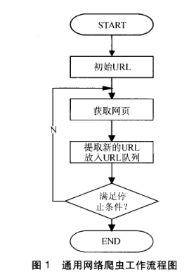
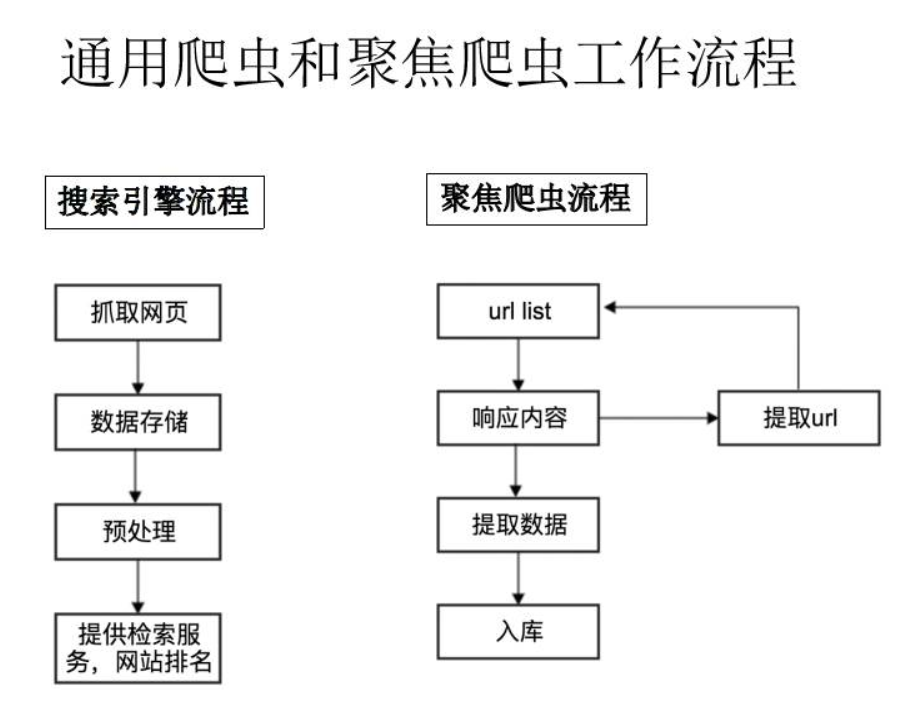

## 爬虫的分类

网络爬虫按照系统结构和实现技术，大致可分为4类，即通用网络爬虫、聚焦网络爬虫、增量网络爬虫和深层次网络爬虫。

#### 1.通用网络爬虫：搜索引擎的爬虫

比如用户在百度搜索引擎上检索对应关键词时，百度将对关键词进行分析处理，从收录的网页中找出相关的再根据一定的排名规则进行排序后展现给用户，那么就需要尽可能多的互联网的优质网页。

从互联网中搜集网页，采集信息，这些网页信息用于为搜索引擎建立索引从而提供支持，**它决定着整个引擎系统的内容是否丰富，信息是否即时，因此其性能的优劣直接影响着搜索引擎的效果。**

#### 2.聚焦网络爬虫：针对特定网页的爬虫

也叫主题网络爬虫，爬取的 `目标网页定位在与主题相关的页面中` ，主要为某一类特定的人群提供服务，可以节省大量的服务器资源和带宽资源。**聚焦爬虫在实施网页抓取时会对内容进行处理筛选，尽量保证只抓取与需求相关的网页信息。**

比如要获取某一垂直领域的数据或有明确的检索需求，此时需要过滤掉一些无用的信息。

**例如**：那些比较价格的网站，就是爬取的其他网站的商品。

#### 3.增量式网络爬虫

增量式网络爬虫（Incremental Web Crawler），所谓增量式，即增量式更新。增量式更新指的是再更新的时候只更新改变的地方，而为改变的地方则不更新，所以该爬虫**只爬取内容发生变化的网页或者新产生的网页**。比如：招聘网爬虫

#### 4.深层网络爬虫

深层网络爬虫（Deep Web Crawler），首先，什么是深层页面？

在互联网中，网页按存在方式划分为表层页面和深层页面。所谓表层页面，指的是不需要提交表单，使用静态的链接能够到达的静态页面；而深层页面是需要调教一定的关键词之后才能获取的页面。在互联网中，深层页面数量往往比表层页面多得多。

深层网络爬虫主要由URL列表、LVS【虚拟服务器】列表、爬行控制器、解析器、LVS控制器、表单分析器、表单处理器、响应分析器等构成。

**后面我们主要学习聚焦爬虫，聚焦爬虫学会了，其他类型的爬虫也就能轻而易举的写出来**

## 通用爬虫与聚焦爬虫的原理

**通用爬虫：**

**第一步**：抓取网页（url）

</img>

1. start_url发送请求，在获取响应解析；
2. 从响应解析中获取到了需要的新的url，将这些URL放入待抓取URL队列；
3. 取出待抓取URL，解析DNS得到主机的IP，并将URL对应的网页下载下来，存储进已下载网页库中，并且将这些URL放进已抓取URL队列。
4. 分析已抓取URL队列中的URL，分析其中的其他URL，并且将URL放入待抓取URL队列，从而进入下一个循环....

**第二步**：数据存储

搜索引擎通过爬虫爬取到的网页，将数据存入原始页面数据库。其中的页面数据与用户浏览器得到的HTML是完全一样的。

搜索引擎蜘蛛在抓取页面时，也做一定的重复内容检测，一旦遇到访问权重很低的网站上有大量抄袭、采集或者复制的内容，很可能就不再爬行。

**第三步**：预处理

搜索引擎将爬虫抓取回来的页面，进行各种步骤的预处理。

- 提取文字
- 中文分词
- 消除噪音（比如版权声明文字、导航条、广告等……）
- 索引处理
- 链接关系计算
- 特殊文件处理
- ....

除了HTML文件外，搜索引擎通常还能抓取和索引以文字为基础的多种文件类型，如 PDF、Word、WPS、XLS、PPT、TXT 文件等。我们在搜索结果中也经常会看到这些文件类型。

但搜索引擎还不能处理图片、视频、Flash 这类非文字内容，也不能执行脚本和程序。

**第四步**：提供检索服务，网站排名

搜索引擎在对信息进行组织和处理后，为用户提供关键字检索服务，将用户检索相关的信息展示给用户。

**聚焦爬虫**：

</img>

第一步：start_url 发送请求

第二步：获取响应（response）

第三步：解析响应，若响应中有需要的新的url地址，重复第二步；

第四步：提取数据

第五步：保存数据

通常，我们会把获取响应，解析放在一个步骤中完成，所以说，聚焦爬虫的步骤，通俗的来讲一共四步

