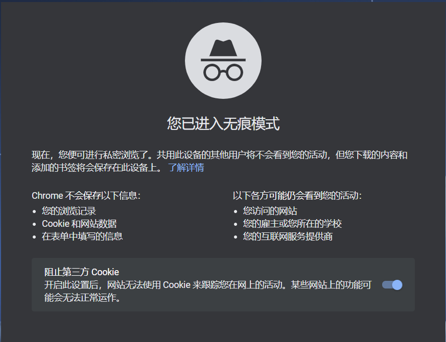
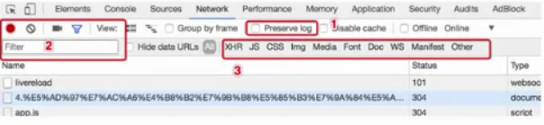
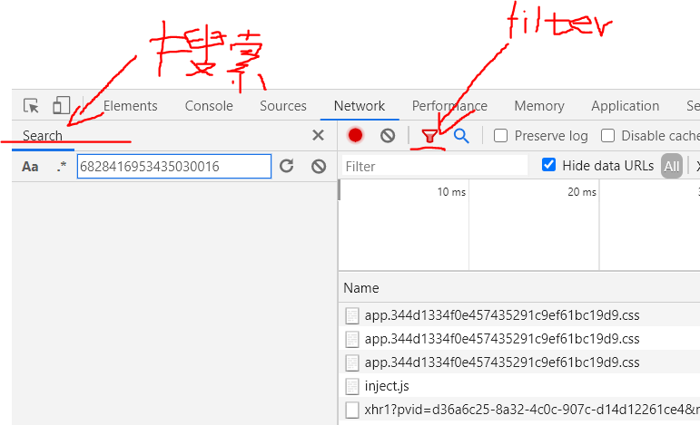
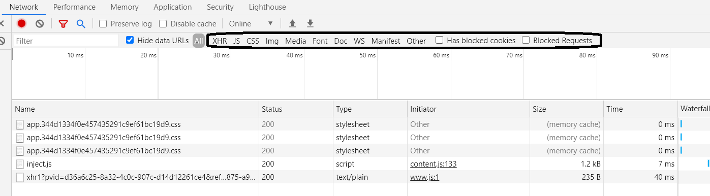
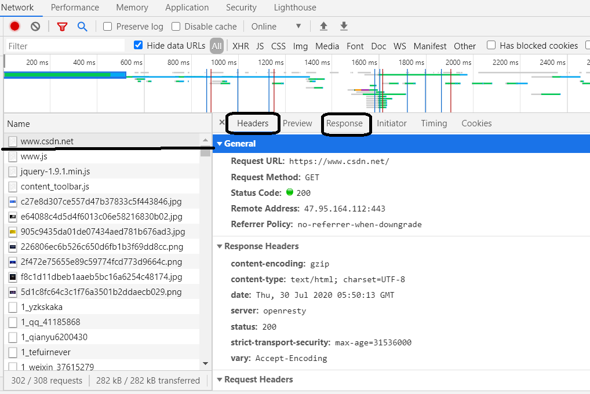
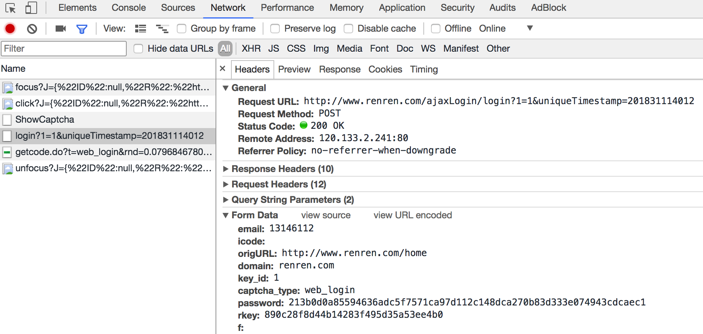

## chrome浏览器抓包说明

**目标：掌握chrome在爬虫中的使用**

## 1.  新建隐身窗口（无痕窗口）

</img>

作用：在打开无痕窗口的时候，第一次请求某个网站是没有携带cookie的，和代码请求一个网站一样，这样就能够尽可能理解代码请求某个网站的结果，除非数据是通过js加密加载出来的，不然爬虫请求到的数据和浏览器请求到的数据大部分时候是相同的

## 2.  chrome中network的更多功能

</img>

**2.1  Perserve log**

默认情况下，页面发生跳转之后，之前的请求url地址信息都会消失，勾选perserve log后，之前的请求都会被保留

</img>

**2.2  filter过滤**

在url地址很多的时候，可以在filter中输入部分url地址，对所有的url地址起到一定的过滤效果，具体位置在上面的图中2号位置

</img>

**2.3  观察特定种类的请求**

</img>

图中有很多选项，默认是选择all，即会观察到所有种类的请求，很多时候处于自己的目的的可以选择all右边的其他选项，比如常见的选项：

XHR：大部分情况表示ajax请求

JS：js请求

CSS：css请求

但是很多时候我们并不能保证我们需要的请求是什么类型，特别是我们不清楚一个请求是否为ajax请求的时候，直接选择all，从前往后观察即可，其中js，css，图片等不去观察即可

不要被浏览器中的一堆请求吓到了，这些请求中除了js，css，图片请求外，请他的请求并没有多少个

**2.4  其他方法**

search all file

确定js文件位置

js中添加断点

## 3.  抓包分析说明

</img>

通常，我们所抓的第一个包，就是我们访问这个url地址的响应，在点击所抓的第一个包，右边的headers里面包含了，请求所携带的请求头，响应头等等信息，爬虫在遇到反爬的时候，可以通过查看判断分析，加入缺少的请求信息即可

response里面放入的是请求这个url地址的响应，通常是请求url地址的源码或者json数据

## 4.  寻找登录接口

**4.1 寻找action对的url地址**

> 回顾之前人人网的爬虫我们找到了一个登陆接口，那么这个接口从哪里找到的呢？

</img>

可以发现，这个地址就是在登录的form表单中action对应的url地址，回顾前端的知识点，可以发现就是进行表单提交的地址，对应的，提交的数据，仅仅需要：`用户名的input标签中，name的值作为键，用户名作为值，密码的input标签中，name的值作为键，密码作为值即可`

##### 思考：

如果action对应的没有url地址的时候可以怎么做？

**4.2 通过抓包寻找登录的url地址**

</img>

通过抓包可以发现，在这个url地址和请求体中均有参数，比如`uniqueTimestamp`和`rkey`以及加密之后的`password`

这个时候我们可以观察手机版的登录接口，是否也是一样的

</img>

可以发现在手机版中，依然有参数，但是参数的个数少一些，这个时候，我们可以使用手机版作为参看，来学习如何分析js

##### 思考：

确定了url地址之后，那么对于参数中的字段怎么办呢？

