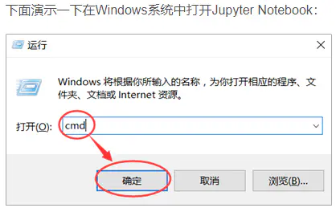
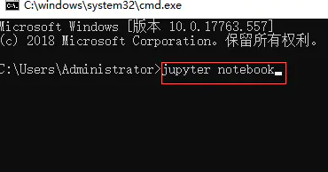
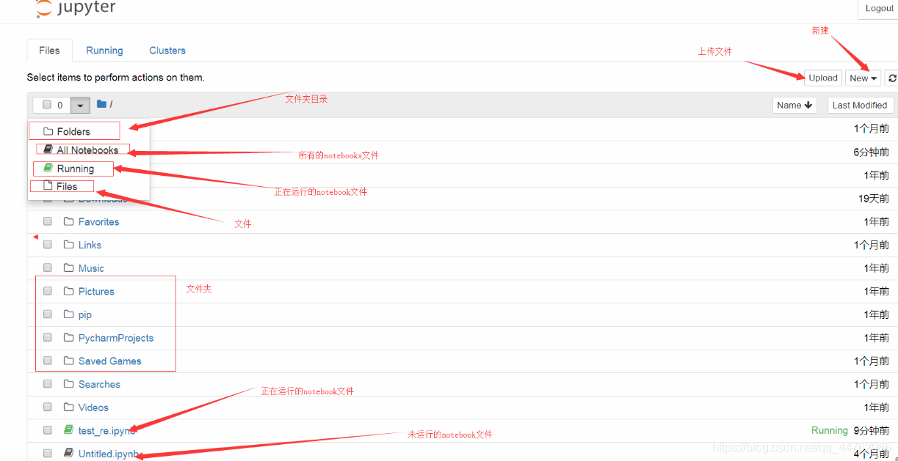
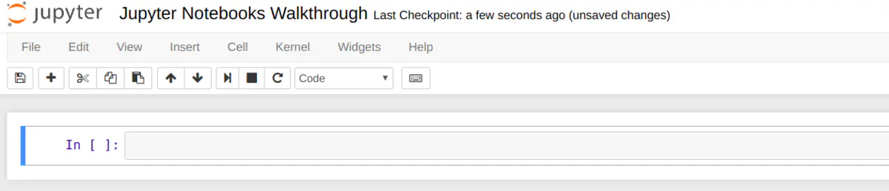
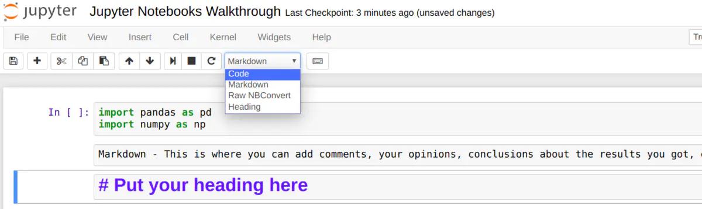

# 一，认识jupyter notebook

**Jupyter Notebook（此前被称为 IPython notebook）是一个交互式笔记本，支持运行 40 多种编程语言。**

1，jupyter notebook是一款编程/文档/笔记/展示软件

2，ipynb后缀结尾的文件并不是一个py文件

3，跟markdown一样 #是一级标题，两个#是二级标题

4，原生NBConvert就是原生的 没有任何格式，跟文本文档一样 写什么是什么

## 二，安装使用

安装Jupyter Notebook的前提是需要安装了Python环境（3.3版本及以上，或2.7版本）

1，通过pip管理工具直接下载 输入指令 **pip install  jupyter notebook**

​		pip install jupyter notebook -i https://pypi.tuna.tsinghua.edu.cn/simple/

**以上这种安装方式大部分人可能会失败，请严格按照一下顺序下载：**

1，先安装老师上面发给你们的微软的exe程序

2，打开cmd窗口     **强调：一定要把cmd以管理员身份运行**

3，在cmd窗口输入命令：python -m pip install --upgrade pip 将python的pip升级
4，最后再输入notbooke安装命令（换源安装），例如：pip install jupyter notebook -i https://pypi.tuna.tsinghua.edu.cn/simple/

5，如果继续报错的同学：可以利用国内镜像源安装：pip install jupyterthemes -i http://pypi.douban.com/simple/ --trusted-host pypi.douban.com

**如何使用**：

- 打开cmd窗口，输入jupyter notebook
- 安装脚本

## 三，运行Jupyter Notebook

1. 成功安装Jupyter Notebook后，在Terminal (Mac / Linux)或Command Prompt(Windows)中运行以下命令就可打开Jupyter Notebook

   

   

2. 输入 ：jupyter notebook

   

   

3. 执行上面命令之后， Jupyter Notebook 将在你的默认浏览器中打开，网址为：http://localhost:8888/tree

   

#### 1，主面板(Notebook Dashboard)

打开Notebook，可以看到主面板。在菜单栏中有Files（文件）、Running（运行）、Clusters（集群）、三个选项。用到最多的是Files，我们可以在这里完成notebook的新建、重命名、复制等操作。

- **Files 基本上列出了所有的文件，**
- **Running 显示你当前已经打开的终端和Notebooks，**

- **Clusters 由 IPython parallel 包提供，用于并行计算。**

要打开一个新的 Jupyter Notebook，请单击页面右侧的“New”选项卡。在这里，你有四个选项可供选择：

⦁	Python 3

⦁	Text File (文本文件)

⦁	Folder (文件夹)

⦁	Terminal (终端)

1. 在 "Text File" 选项中，你会得到一个空白的文档。输入你喜欢的任何字母，单词和数字。它基本上是一个文本编辑器（类似于 Ubuntu 上的应用程序）。你也可以选择一种语言（支持非常多的语言），然后用该语言来写一个脚本。你还可以查找和替换文件中的单词。
2. 在 "Folder" 选项中， 顾名思义它的功能就是创建文件夹。你可以创建一个新文件夹来放入文件，重新命名或者删除它。
3. "Terminal" 的工作方式与你的 Mac 电脑或 Linux 电脑上的终端完全相同（或者 Windows 上的 cmd ）。它在你的Web浏览器中支持终端会话。在这个终端中输入 python ，瞧！现在你已经可以开始写 python 脚本了。

#### 2，创建python文件

从“New”选项中选择 "Python 3" 选项。你会看到如下的截图：

代码上方的菜单栏提供了操作单元格的各种选项：

- edit (编辑)，
- insert (添加)，
- cut (剪切)，
- move cell up/down (上下移动单元格)，
- run cells(在单元格中运行代码)，
- interupt (停止代码)，
- save (保存工作)，
- 以及 restart (重新启动内核)

在下拉菜单中（如上所示），你有四个选项：

- Code - 这是你输入代码的地方
- Markdown - 这是你输入文本的地方。你可以在运行代码后添加结论，添加注释等。
- Raw NBConvert - 这是一个命令行工具，可将你的笔记本转换为另一种格式（如 HTML）
- Heading - 你可以将标题添加到单独的小节并使你的 Notebook 看起来干净整洁。这个选项现在已经集成到 Markdown 选项中。添加一个“##”，以确保在你之后输入的内容将被视为标题

其他详细使用可以访问 ： https://www.jianshu.com/p/061c6e5c4b0d

