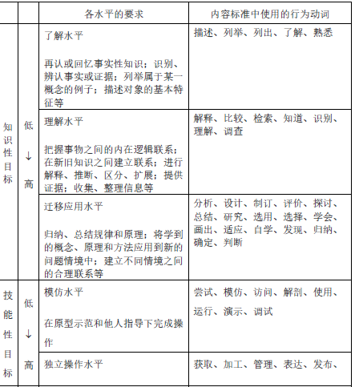
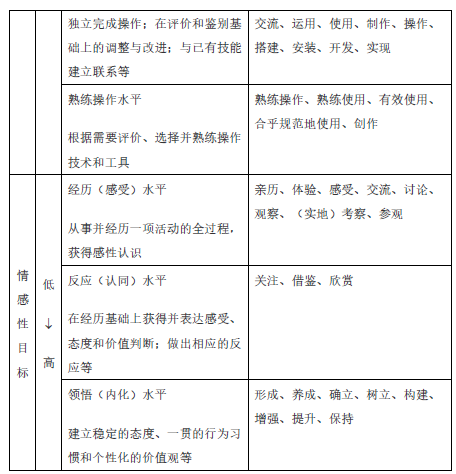
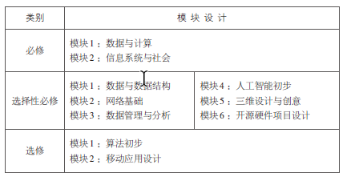

# 教学论

## 03年

### 课程基本理念

1. 提升信息素养，培养信息时代的合格公民

2. 营造良好的信息环境，打造终身学习的平台

3. 关照全体学生，建设有特色的信息技术课程

4. 强调问题解决，倡导运用信息技术进行创新实践

5. 注重交流与合作，共同建构健康的信息文化

### 课程设计

高中信息技术课程包括必修与选修两个部分，共六个模块，每个模块2学分。高中信息技术课程总学分为 2＋2＋（x），其中必修2学分，科目内选修2学分，跨领域选修x学分。

必修部分只有 “信息技术基础” 一个模块，该模块以信息处理与交流、信息技术与社会实践为主线，强调让学生掌握信息的获取、加工、管理、表达与交流的基本方法

信息技术科目的选修部分包括“算法与程序设计”“多媒体技术应用”“网络技术应用”“数据管理技术”和“人工智能初步”五个模块

#### 学习目标

### 课程目标

（一） 知识与技能

1. 理解信息及信息技术的概念与特征，了解利用信息技术获取、加工、管理、表达与交流信息的基本工作原理，了解信息技术的发展趋势。
2. 能熟练地使用常用信息技术工具，初步形成自主学习信息技术的能力，能适应信息技术的发展变化。

（二） 过程与方法

1. 能从日常生活、学习中发现或归纳需要利用信息和信息技术解决的问题，能通过问题分析确定信息需求。
2. 能根据任务的要求，确定所需信息的类型和来源，能评价信息的真实性、准确性和相关性。
3. 能选择合适的信息技术进行有效的信息采集、存储和管理。
4. 能采用适当的工具和方式呈现信息、发表观点、交流思想、开展合作。
5. 能熟练运用信息技术，通过有计划的、合理的信息加工进行创造性探索或解决实际问题，如辅助其他学科学习、完成信息作品等。
6. 能对自己和他人的信息活动过程和结果进行评价，能归纳利用信息技术解决问题的基本思想方法。

（三） 情感态度与价值观

1. 体验信息技术蕴含的文化内涵，激发和保持对信息技术的求知欲，形成积极主动地学习和使用信息技术、参与信息活动的态度。
2. 能辩证地认识信息技术对社会发展、科技进步和日常生活学习的影响。
3. 能理解并遵守与信息活动相关的伦理道德与法律法规，负责任地、安全地、健康地使用信息技术。

普通高中信息技术课程的总目标
是提升学生的信息素养。具体表现在几个方面：对信息的获取、加工、管理、表达与交流的
能力；对信息及信息活动的过程、方法、结果进行评价的能力；发表观点、交流思想、开展
合作并解决学习和生活中实际问题的能力；遵守相关的伦理道德与法律法规，形成与信息社
会相适应的价值观和责任感。

## 97年

### 教学目的

小学阶段：
１、帮助学生建立对计算机的感性认识，使学生了解计算机在日常生活中的应用，培养学生学习、使用计算机的兴趣和意识。 

２、使学生了解计算机的一些基本常识，初步学会计算机的一般使用方法。 

３、帮助学生确立正确的学习态度，养成爱护机器设备、遵守机房规则等良好习惯。

 初中阶段：

 １、使学生了解计算机在现代社会中的地位、作用以及对人类社会的影响，培养学生学习、使用计算机的兴趣和意识。 

２、使学生理解计算机的基础知识，学会计算机的基本操作。 

３、培养学生初步的信息处理的能力。 

４、培养学生良好的学习态度和计算机使用道德以及与人共事的协作精神等。 

高中阶段：

 １、使学生了解计算机在现代社会中的地位、作用以及对人类社会的影响，培养学生学习和使用计算机的兴趣以及利用现代化的工具与方法处理信息的意识。 

２、使学生掌握计算机的基础知识，具备比较熟练的计算机基本操作技能。 

３、培养学生利用计算机获取信息、分析信息和处理信息的能力。

 ４、培养学生实事求是的科学态度、良好的计算机使用道德以及与人共事的协作精神等。

### 课程内容

计算机教育必须把社会主义现代化建设需要的一般基础知识和基本技能安排到课程中去。因此，应将一些社会常用的计算机应用软件作为计算机课程的主要内容，如文字处理、电子表格、数据库等应用软件。

一、基本模块
模块一（Ｍ１）、计算机基础知识与基本操作
模块二（Ｍ２）、微机操作系统的操作与使用
模块三（Ｍ３）、汉字输入及中西文文字处理
二、基本选学模块
模块四（Ｍ４）、数据处理与数据库管理系统
模块五（Ｍ５）、电子表格
模块六（Ｍ６）、ＬＯＧＯ绘图
模块七（Ｍ７）、多媒体基础知识及多媒体软件应用
模块八（Ｍ８）、Ｉｎｔｅｒｎｅｔ基础知识与基本操作
三、选学模块
模块九（Ｍ９）、常用工具软件的使用
模块十（Ｍ１０）、程序设计初步

小学计算机课的教学应以计算机常识、操作技能和益智性教学软件为重点

初中计算机课的教学应以计算机基础知识和技能性训练、操作系统、文字处理或图形信息处理为主

高中计算机课程要以操作系统、文字处理、数据库、电子表格、工具等软件的操作使用为主。程序设计可作为部分学校及部分学生的选学内容

其中高中阶段的目标为：
使学生了解计算机在现代社会中的地位、作用以及对人类社会的影响，培养学生学习和
使用计算机的兴趣以及利用现代化的工具与方法处理信息的意识；使学生掌握计算机的基础
知识，具备比较熟练的计算机基本操作技能；培养学生利用计算机获取信息、分析信息和处
理信息的能力；培养学生实事求是的科学态度、良好的计算机使用道德以及与人共事的协作
精神等。

## 94年

其中中学目标为：
认识计算机在现代社会中的地位、作用以及对人类社会的影响。了解电子计算机是一种
应用十分广泛的信息处理工具，培养学生学习和使用计算机的兴趣；初步掌握计算机的基础
知识和基本操作技能；培养学生逐步学会使用现代化的工具和方法去处理信息；培养学生分
析问题、解决问题的能力，发展学生的思维能力；培养学生实事求是的科学态度和刻苦学习
克服困难的良好意志品质，进行使用计算机时的道德品质教育。

纲要：

（1）计算机的基础知识；
（2）计算机的基本操作与使用；
（3）计算机几个常用软件介绍，包括字处理软件、数据库管理系统软件、电子数
据表格软件、教学软件与益智性游戏软件；
（4）程序设计语言，包括BASIC 语言程序设计基础和LOGO 语言等；
（5）计算机在现代社会中的应用以及对人类社会的影响。

## 00年

关于高中阶段信息技术课程教学目标的描述是：
使学生具有较强的信息意识，较深入地了解信息技术的发展变化及其对工作、社会的影
响；了解计算机基本工作原理及网络的基本知识。能够熟练地使用网上信息资源，学会获取、传输、处理、应用信息的基本方法；掌握运用信息技术学习其他课程的方法；培养学生选择和使用信息技术工具进行自主学习、探讨的能力，以及在实际生活中应用的能力；了解程序设计的基本思想，培养了解思维能力；通过与他人协作，熟练运用信息技术编辑、综合、制作和传播信息及创造性地制作多媒体作品；能够判断电子信息资源的真实性、准确性和相关性；树立正确的科学态度，自觉地按照法律和道德行为使用信息技术，进行与信息有关的活动

“纲要”中规定高中信息技术课程的教学内容为：
模块一：信息技术基础
模块二：操作系统简介
模块三：文字处理的基本方法
模块四：网络基础及其应用
模块五：数据库初步（选修）
模块六：程序设计方法
模块七：用计算机制作多媒体作品（选修）
模块八：计算机硬件结构及软件系统

## 17年

### 基本理念

1. 坚持立德树人的课程价值观，培养具备信息素养的中国公民
2. 设置满足学生多元需求的课程结构，促进学生的个性化发展
3. 选择体现时代性和基础性的课程内容，支撑学生信息素养的发展
4. 培育以学习为中心的教与学关系，在问题解决过程中提升信息素养
5. 构建基于学科核心素养的评价体系，推动数字化时代的学习创新

### 学科核心素养

1. 信息意识
2. 计算思维
3. 数字化学习与创新
4. 信息社会责任

### 课程目标

高中信息技术课程旨在全面提升全体高中学生的信息素养。课程通过提供技术多样、资源丰富的数字化环境，帮助学生掌握数据、算法、信息系统、信息社会等学科大概念，了解信息系统的基本原理，认识信息系统在人类生产与生活中的重要价值，学会运用计算思维识别与分析问题，抽象、建模与设计系统性解决方案，理解信息社会特征，自觉遵循信息社会规范，在数字化学习与创新过程中形成对人与世界的多元理解力，负责、有效地参与到社会共同体中，成为数字化时代的合格中国公民。

### 课程结构

1. 以立德树人为课程设计的指导思想

2. 按照普通高中课程方案设置课程结构与内容

3. 参照国际信息技术教育研究的最新成果

4. 依据信息技术学科的自身发展特征
- 高中信息技术课程由必修、选择性必修和选修三类课程组成

- 

- 高中信息技术必修课程是全面提升高中学生信息素养的基础，强调信息技术学科核心素养的培养，渗透学科基础知识与技能，是每位高中学生必须修习的课程，是选择性必修和选修课程学习的基础。

- 高中信息技术必修课程包括“数据与计算”和“信息系统与社会”两个模块。程旨在为学生将来进入高校继续开展与信息技术相关方向的学习以及应用信息技术进行创新、创造提供条件。

- 选择性必修课程包括“数据与数据结构”“网络基础”“数据管理与分析”“人工智能初步”“三维
  设计与创意”“开源硬件项目设计”六个模块。其中，“数据与数据结构”“网络基础”“数据管理与分析”三个模块是为学生升学需要而设计的课程，三个模块的内容相互并列；“人工智能初步”“三维设计与创意”“开源硬件项目设计”三个模块是为学生个性化发展而设计的
  课程，学生可根据自身的发展需要进行选学。

- 高中信息技术选修课程是为满足学生的兴趣爱好、学业发展、职业选择而设计的自主选修课程，为学校开设信息技术校本课程预留空间。选修课程包括“算法初步”“移动应用设计”以及各高中自行开设的信息技术校本课程。
