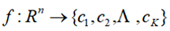
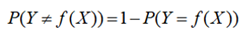
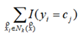
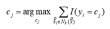

[TOC]

# 机器学习

## 机器学习的步骤

1. 收集数据

2. 准备输入数据

3. 分析输入数据

4. 训练算法

5. 测试算法

6. 使用算法

## 机器学习的分类

1. 经验性归纳学习
   
   采用一些数据密集的经验方法对例子进行归纳学习

2. 分析学习
   
   从一个或几个出发，进行分析------>主要是演绎

3. 类比学习
   
   又可称为范例学习

4. 遗传算法
   
   模拟生物繁殖的突变。交换和达尔文的自然选择
   
   将问题的可能编码为一个向量，称为个体；
   
   个体的每一个元素称为基因

5. 联接学习
   
   人工神经网络

6. 增强学习
   
   通过与环境的试探交互确定和优化动作的选择

## Python近邻法

### k近邻法（k-Nearest Neighbor, kNN）

    一种基本的分类与回归方法，输入为实例的特征向量，通过计算新数据与训练数据特征值之间的距离，选取k个距离最近的邻居进行分类判断或者回归

#### 三要素

    距离、度量和分类决策规则（取均值的决策规则）

#### k取值

1. k=1

    最近邻算法，用于较小领域的训练，近似误差较小，与输入实例较近的训练实例才会对预测起作用

    估计误差会很大，对实例点很敏感，k越小模型整体越复杂，发生过拟合，过拟合就是在训练集上准确率非常高，而在测试集上准确率低

2. k大时
   
   较大领域的训练，减少估计误差
   
   近似误差大

3. 一般会进行验证，取平均误差率最小的，一般k会较小

#### 距离度量

    两点之间的距离，无论是几维空间内的，用类似坐标系的方法，对应相减取几维空间的次方，依次相加，并开几维次方

    xy坐标系（二维）称为欧氏距离

    x轴（一维）称为曼哈顿距离

#### 分类决策规则

    分类决策通常采用多数表决。也可以基于距离的远近进行加权投票，距离越近的样本权重越大

    设分类的损失函数为0-1损失函数，分类函数为，误分类概率为： 。

    误分类率是训练数据的经验风险，误分类率越小，则越大，经验风险就越小，即为多数表决：

### k近邻算法

##### k近邻法的分类算法步骤

1. 输入

   训练数据集 为实例的特征向量， 为实例的类别。给定实例特征向量 。

2. 输出

   实例 所属的类别*y* 

3. 具体步骤

   
