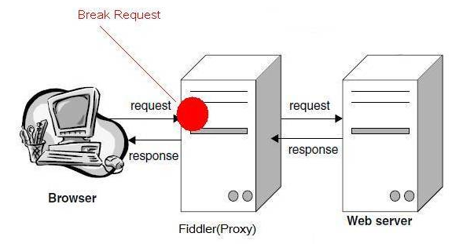
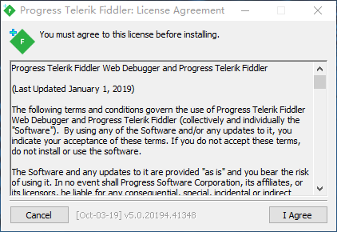
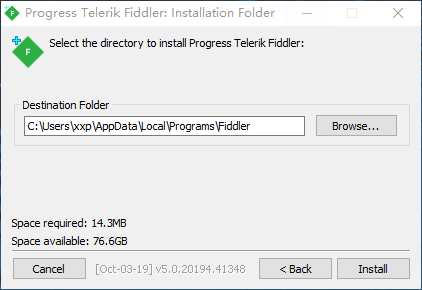
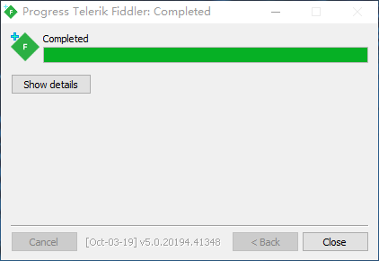
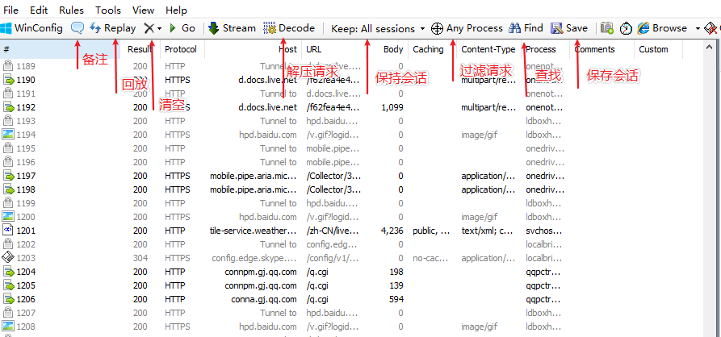
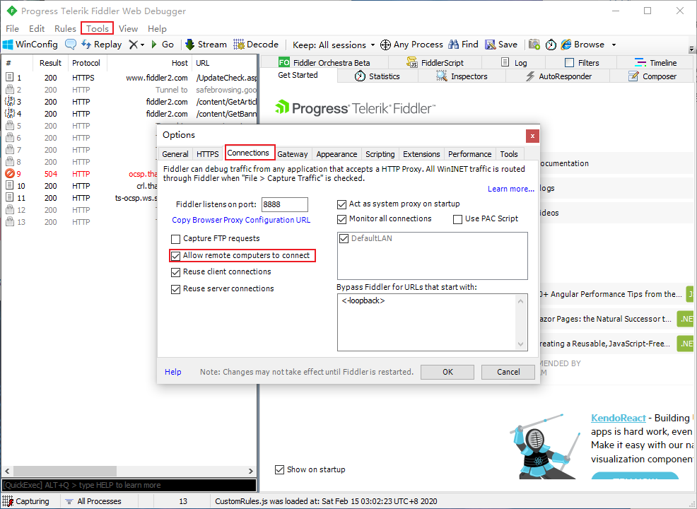
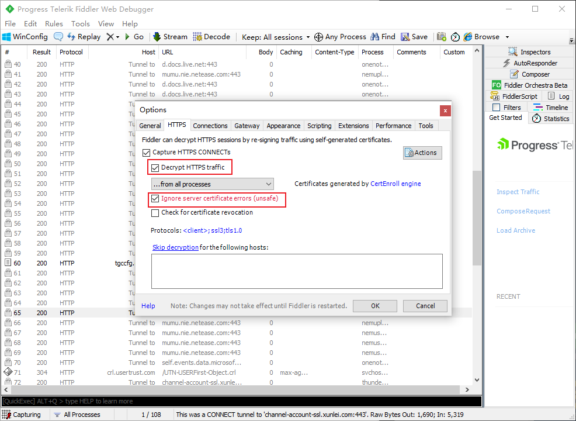

# HTTP代理神器Fiddler

### Fiddler的简介

Fiddler是位于客户端和服务器端之间的代理，也是目前最常用的抓包工具之一 。它能够记录客户端和服务器之间的所有 请求，可以针对特定的请求，分析请求数据、设置断点、调试web应用、修改请求的数据，甚至可以修改服务器返回的数据，功能非常强大，是web调试的利器。
看到这么多的应用，是不是就迫不及待的想要开始你的抓包之旅呢，不要急，俗话说的好：工欲善其事，必先利其器，我们先来安装Fiddler吧。

## 工作原理

Fiddler 是以代理web服务器的形式工作的，它使用代理地址：127.0.0.1，端口：8888

</img>

### Fiddler的下载

打开官网，官网下载地址是https://www.telerik.com/download/fiddler
打开以后选择你的相关信息如下图：

### Fiddler的下载

- 打开官网，官网下载地址是<https://www.telerik.com/download/fiddler>
- 打开以后选择你的相关信息如下图：

</img>

- 然后点击Download按钮开始下载

### Fiddler的安装

- 下载完成后双击安装包，如下图：

  </img>

+ 点击**I Agree**按钮，然后选择你想要存放的安装目录，如果不需要修改，使用默认的即可。

</img>

+ 点击**Install**按钮，等待一会时间后即可安装成功。

  </img>

- 点击**Close**按钮
- 到这里我们就初步安装成功了

</img>

## Fiddler的配置

配置连接信息：Tools > Options >Connections

- 端口默认是8888，你可以进行修改。

- 勾选 Allow remote computers to connect 选项，然后重启Fiddler，再次打开时会弹出一个信息，选择ok即可。

- </img>

  

- fiddler默认只抓http请求，若要抓https请求，要进入tools-fiddler options设置

  </img>

  

  

## Fiddler界面

设置好后，本机HTTP通信都会经过127.0.0.1:8888代理，也就会被Fiddler拦截到。

fiddler_show (1).png

#### 请求 (Request) 部分详解

> 1. Headers —— 显示客户端发送到服务器的 HTTP 请求的 header，显示为一个分级视图，包含了 Web 客户端信息、Cookie、传输状态等。
> 2. Textview —— 显示 POST 请求的 body 部分为文本。
> 3. WebForms —— 显示请求的 GET 参数 和 POST body 内容。
> 4. HexView —— 用十六进制数据显示请求。
> 5. Auth —— 显示响应 header 中的 Proxy-Authorization(代理身份验证) 和 Authorization(授权) 信息.
> 6. Raw —— 将整个请求显示为纯文本。
> 7. JSON - 显示JSON格式文件。
> 8. XML —— 如果请求的 body 是 XML 格式，就是用分级的 XML 树来显示它。

#### 响应 (Response) 部分详解

1. Transformer —— 显示响应的编码信息。
2. Headers —— 用分级视图显示响应的 header。
3. TextView —— 使用文本显示相应的 body。
4. SyntaxView——响应数据
5. ImageVies —— 如果请求是图片资源，显示响应的图片。
6. HexView —— 用十六进制数据显示响应。
7. WebView —— 响应在 Web 浏览器中的预览效果。
8. Auth —— 显示响应 header 中的 Proxy-Authorization(代理身份验证) 和 Authorization(授权) 信息。
9. Caching —— 显示此请求的缓存信息。
10. Privacy —— 显示此请求的私密 (P3P) 信息。
11. Raw —— 将整个响应显示为纯文本。
12. JSON - 显示JSON格式文件。
13. XML —— 如果响应的 body 是 XML 格式，就是用分级的 XML 树来显示它 。

