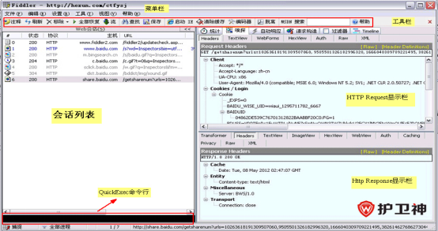
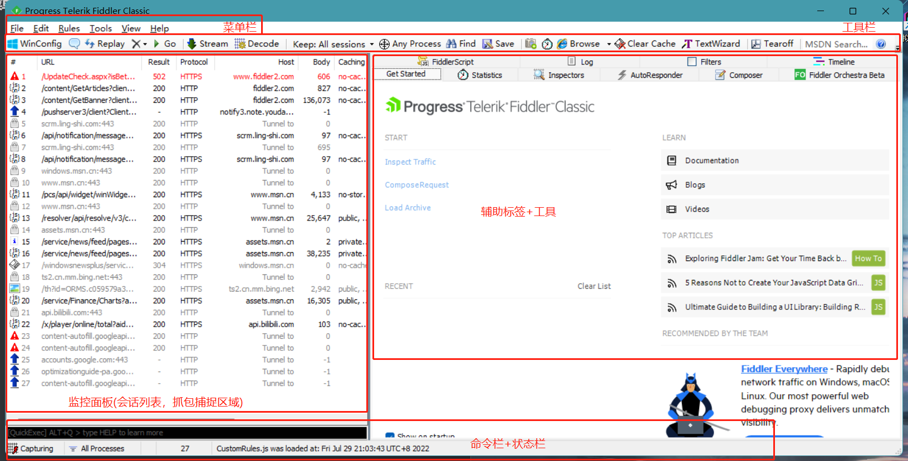
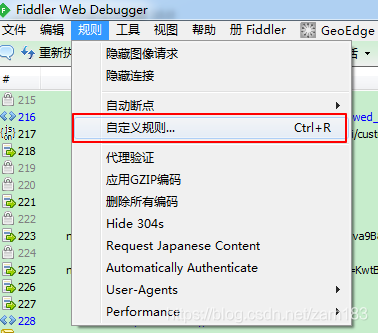
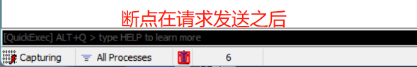
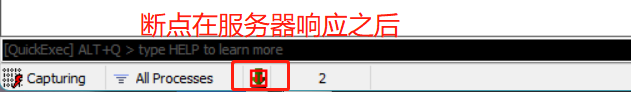
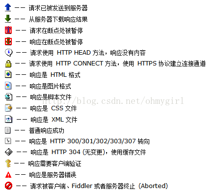
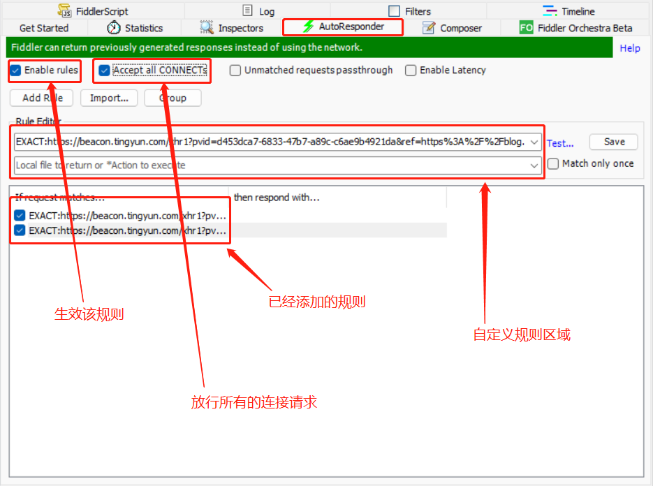
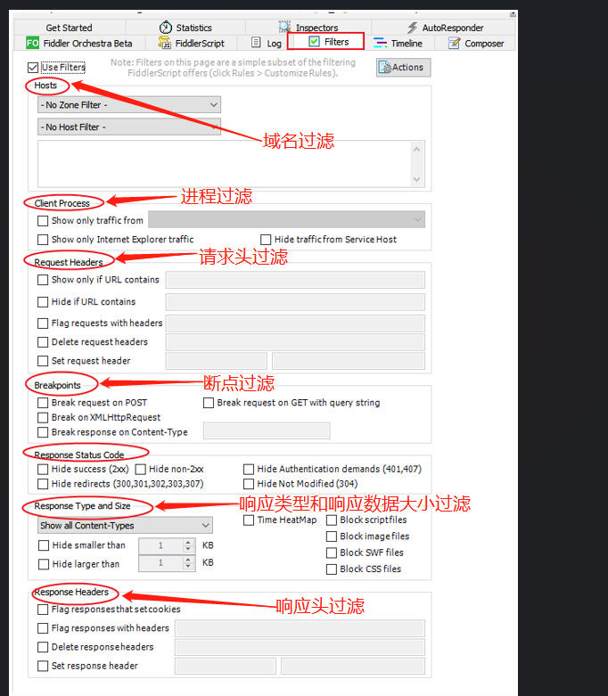
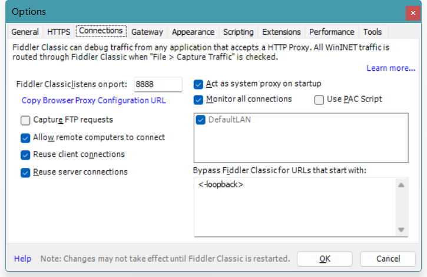
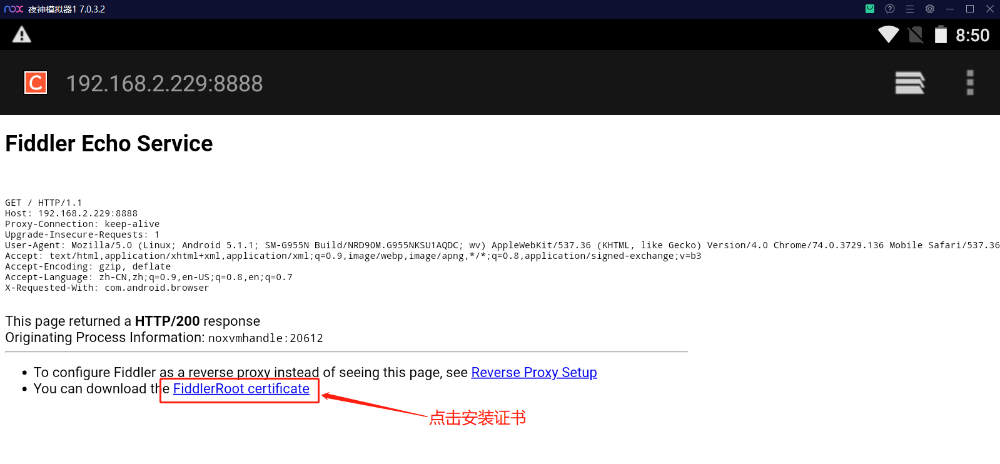

###  fiddler工具介绍

Fiddler是位于客户端和服务器端的HTTP代理，也是目前最常用的http抓包工具之一 ，同类的工具有: httpwatch, wireshark、charles

```stylus
功能非常强大，是web调试的利器
    1.监控浏览器所有的http/https流量
    2.查看，分析请求内容细节
    3.伪造客户端请求和服务器响应
    4.测试网站的性能
    5.解密https的web会话
    6.全局，局部断点功能
    7.第三方插件
 场景使用介绍
 	1.接口调试，接口测试，线上环境调试，web性能分析
 	2.判断前后端bug，开发环境hosts配置，mock，弱网断网测试
```

### fiddler原理

```stylus
Fiddler是位于客户端和服务器端的HTTP代理

	也就是说：客户端的所有请求都要先经过Fiddler，然后转发到相应的服务器
	反之，服务器端的所有响应，也都会先经过Fiddler然后发送到客户端
	基于这个原因，Fiddler支持所有可以设置http代理为127.0.0.1:8888的浏览器和应用程序
```

使用了Fiddler之后，web客户端和服务器的请求如下所示：

</img>

### fiddler安装与配置

1.启动Fiddler，打开菜单栏中的 Tools > Telerik Fiddler Options，打开“Fiddler Options”对话框。

</img>

2.对Fiddler进行设置：

- 打开工具栏->Tools->Fiddler Options->HTTPS，

- 选中Capture HTTPS CONNECTs (捕捉HTTPS连接)，

- 选中Decrypt HTTPS traffic（解密HTTPS通信）

- 另外我们要用Fiddler获取本机所有进程的HTTPS请求，所以中间的下拉菜单中选中...from all processes （从所有进程）

- 选中下方Ignore server certificate errors（忽略服务器证书错误）

  </img>

3.为 Fiddler 配置Windows信任这个根证书解决安全警告：Trust Root Certificate（受信任的根证书）。

</img>

4.Fiddler 主菜单 Tools -> Fiddler Options…-> Connections

- 选中Allow remote computers to connect（允许远程连接）

- Act as system proxy on startup（作为系统启动代理）

  

  </img>

5.重启Fiddler，使配置生效（这一步很重要，必须做）

### fiddler菜单栏

</img>

</img>

```stylus
说明：
	file：打开一个新的抓包视图，加载文档，会话保持，导入导出会话，退出
	edit：复制内容，移除，选择，粘贴
	Rules：忽略通道建立连接会话，忽略304状态码会话
抓包区域快捷键：
	键盘Delete：删除某个请求
	键盘Delete+shift：删除非选中请求
	键盘shift + R：自定义重复请求次数
	键盘shift + X：清除所有包
	键盘R：重复该请求
```

</img>

### fiddler的winconfig：配置电脑上的一些信息--fiddler5版本新增的功能模块

### fiddler的会话图标：给会话添加备注

### fiddler的Replay：重新(重构)请求

### fiddler断点调试GO

```stylus
在状态栏区域中间空白区域执行
	点击一次：断点在请求发送之后
	点击两次：断点在服务器响应之后
结合重复请求快捷方式执行
```

</img>

</img>

### fiddler流模式Stream

```stylus
默认为缓存模式：即一次性将所有的会话返回给客户端(浏览器)，优点：断点调试
流模式：即获取的会话立马返回   缺点：无法断点--一般不使用
```

### fiddler解码Decode

```stylus
有一些地址的响应在返回给客户端会进行编码和压缩的，这个时候就需要对其进行解码
```

### fiddler保持会话的数量限制Keep

```stylus
限制数量范围：100 ~ 10000
```

### fiddler选择需要抓包的应用Any Process

```stylus
点击该按钮，然后拖动到需要进行抓包的应用，监控面板只会显示该应用的会话，后面是进程id编号
```

### fiddler查找Find（或者按ctrl + f）

```stylus
根据条件，快速查找所有会话，结果会进行黄色标记
```

### fiddler保存会话Save

```stylus
将会话记录保存后缀为saz格式的归档文件----常用于测试开发人员
```

### fiddler相机图标：倒计时截图----基本没什么用

### fiddler计时器：图标时钟----基本没什么用

### fiddler浏览器Browse----快捷打开

### fiddler清除浏览器缓存Clear Cache

### fiddler文本编解码工具TextWizard（例：url的编解码，base64编解码等等）

### fiddler分离面板（将辅助标签进行窗口分离）

### fiddler的MSDN Search：微软开发者网站搜索----一半没什么用

### fiddler的online：查看本机在线信息--IP地址


### fiddler的监控面板(会话列表)

```stylus
#：会话编号
url：请求的地址
result:状态码
Protocol：协议
host：域名
body:请求体
Caching:缓存
Content-Type：响应的类型
Process:会话来源进程编号
comments:备注
custom:添加
```

</img>

### fiddler命令行和状态栏

QuickExec:命令项：输入fiddler命令------------输入help即可查看更多

Capturing:开启/关闭fiddler代理抓包

All Process：所有进程包（及过滤项）


### fiddler的辅助标签

```stylus
Statistics：查看会话的总信息统计
Inspectors：检查器（检查请求）
AutoResponse：抓取在线页面保存到本地进行调试
composer：支持手动构建和发送HTTP，HTTPS和FTP请求
FiddlerScripts：打开Fiddler脚本编辑
log：打印日志
Filters：过滤器可以对左侧的数据流列表进行过滤，我们可以标记、修改或隐藏某些特征的数据流
Timeline：时间轴，也称为Fiddler的瀑布图，展示网络请求时间的功能
```


### fiddler的AutoResponse（自动响应器）

将请求拦截下来，保存到本地进行断点调试

</img>

```stylus
示例1：以https://tool.ip138.com/html/举例
步骤：
	1.添加该网址左上角图片规则
	2.打勾Enable rules:激活规则，打勾Unmatched requests passthrough：放行其他请求
	3.浏览器访问示例网址，可发现图片请求被拦截
	4.规则选择Find a file：选择本地的某个图片
	5.浏览器访问示例网址，可发现图片已被篡改

示例2：
	以js文件为例
步骤：
	1.将某网址的访问需要加载的js文件保存到本地
	2.将本地的js文件中添加部分篡改js代码
	3.重新定义规则为js
	4.达到篡改目的
```

### fiddler的composer：设计者：支持手动构建和发送HTTP，HTTPS和FTP请求

```stylus
简单的接口测试工具
```

### fiddler的filters过滤器

</img>

```stylus
使用时：需要对Use Filters勾选激活过滤规则
```

### fiddler断点应用

```stylus
全局断点：
	在Rules中，Automatic Breakpoints
		before request：在请求前(请求服务器之前)断点
		after response：在响应后(响应未发给客户端)断点
```

```stylus
局部断点：
	命令完成：bpu：请求前断点
	bpu baidu：检测包含baidu的url地址请求进行断点
	再次输入bpu取消断点
	
	命令完成：bpafter: 响应后断点
	bpafter baidu：检测包含baidu的url地址响应进行断点
```

### fiddler的app抓包

```stylus
ios/安卓设备抓包-Fiddler设置
点击Tools > Fiddler Options > Connections
勾选Allow remote computers to connect
重启fiddler
确保防火墙允许fiddler进程可以远程连接(关闭防火墙)
ios/安卓设备连接WIFI
确保ios/安卓设备可以访问到https://FiddlerMachineIP:8888,该地址会返回Fiddler Echo Service 页面

ios需要的操作：
	在通用 > 关于本机 > 证书信任设置中 > 信任刚刚安装的证书
```

</img>

</img>


