## Charles抓包配置


## 1. Charles 抓包 HTTP

首先到 [Charles](https://www.charlesproxy.com/) 官网去下载软件，安装非常简单，一直下一步就可以了

### 1.1 初始设置

#### Charles 设置

开启 **start recording** 按钮，如下图所示：

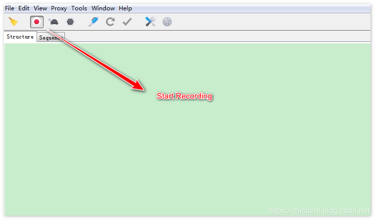</img>

查看 Charles 代理监听的端口号，Proxy -> Proxy Settings , 我机器上的是 8888 端口, 如下图所示：

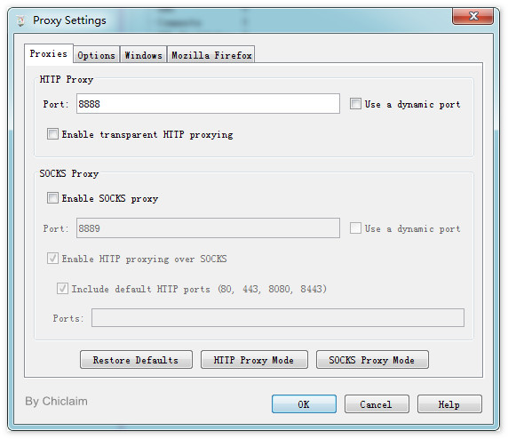</img>

#### 1.2 手机设置

以Android手机为例，进入我们已经连接的WIFI，设置该WIFI：

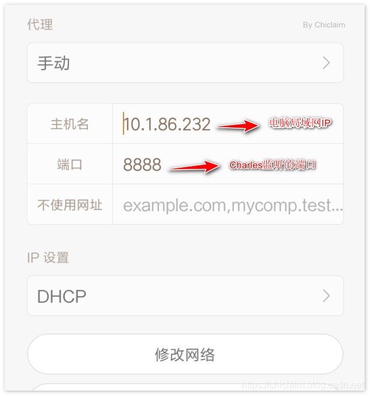</img>

设置好之后，Charles 会弹出一个框，提示是否允许手机进行连接，接受即可，如下图所示：

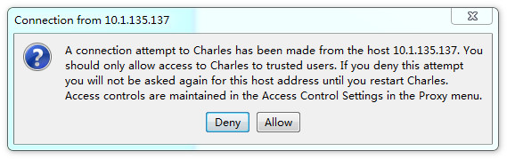</img>

如果你不小心点击了 **拒绝（Deny）**，也可以在这里： **Proxy -> Access Control Settings** 进行添加你的**手机IP**

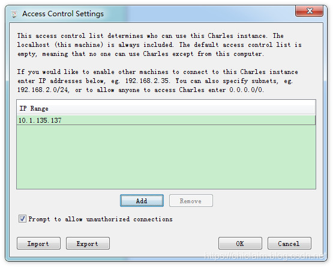</img>

通过以上的设置，Charles就可以抓HTTP请求了


## 2. Charles 抓包 HTTPS

经过上面的设置之后，我们就可以对手机的网络请求进行抓包了，但是如果请求的是 HTTPS，抓到的包无法查看，需要电脑和手机安装证书 (Help -> SSL Proxying)

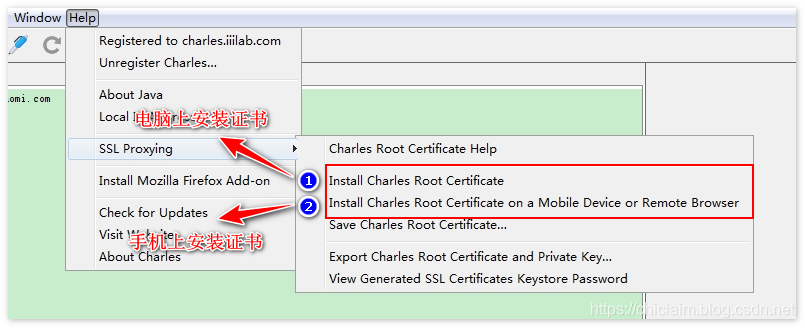</img>

电脑上安装证书很简单，直接下一步就可以了，不用任何设置。这里讲下手机上安装证书，因为手机上安装证书可能会遇到问题：

点击上图的 Install Charles Root Certificate on a Mobile Device or Remote Browser , 会给我们安装提示：

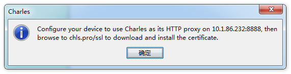</img>

上面的提示框意思是说，在手机设置好代理后，在手机浏览器中访问 chls.pro/ssl 下载证书

这里需要注意的是，有的手机可能会提示：无法安装该证书，因为无法读取证书文件

解决方法：不要使用系统的浏览器下载，使用第三方浏览器下载 UC 或者 Edge 浏览器

下载完成后，证书文件名可能是：charles-proxy-ssl-proxying-certificate.pem

证书下载完成后，在手机上安装该证书，流程如下(小米手机为例)：

打开手机 设置 -> 更多设置 -> 系统安全 -> 从SD卡安装 , 然后输入你自定义的证书名称即可：
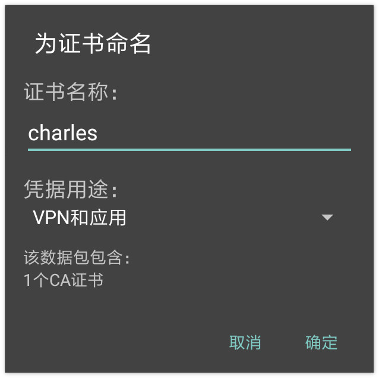</img>

```markdown
点击 “确定” 按钮，有些手机可能需要输入密码凭证，输入你的手机密码即可。
```

电脑和手机上证书都安装完毕后，在Charles上开启 SSL Proxy (Proxy -> SSL Proxying Settings )

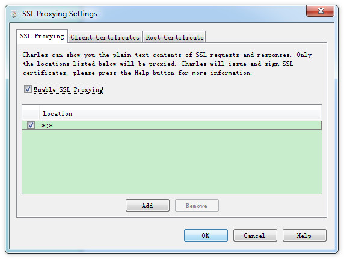</img>

```
经过以上步骤后，你就可以对 HTTPS 请求抓包了
```


## 3. Android7.0及以上系统中HTTPS抓包

在Android7.0及以上系统中，HTTPS抓包可能会失败。因为处于安全的考虑，Android7.0及以上，系统默认只会信任系统(System)级别的证书
不再信任用户添加的证书(User)，也就是说上面我们在设备上安装的 Charles 根证书，系统不再信任。

为了安全起见，一般我们只在 Debug 版本允许抓包，正式版本不应该允许抓包。可以 AndroidManifest.xml 文件中配置安全策略：

```html
<application android:networkSecurityConfig="@xml/network_security_config" >
</application>
```

**network_security_config.xml**

```html
<?xml version="1.0" encoding="utf-8"?>
<network-security-config>
    <debug-overrides>
        <trust-anchors>
            <!-- Trust user added CAs while debuggable only -->
            <certificates src="system" />
            <certificates src="user" />
        </trust-anchors>
    </debug-overrides>
    <base-config cleartextTrafficPermitted="true">
        <trust-anchors>
            <certificates src="system" />
        </trust-anchors>
    </base-config>
    <domain-config cleartextTrafficPermitted="true">
        <domain includeSubdomains="true">182.254.116.117</domain>
        <domain includeSubdomains="true">pingma.qq.com</domain>
    </domain-config>
</network-security-config>
```

然后在res目录下新建xml文件夹，然后在xml文件夹中新建 **network_security_config.xml**

```html
<?xml version="1.0" encoding="utf-8"?>
<network-security-config>
    <debug-overrides>
        <trust-anchors>
            <certificates src="system" />
			<!-- debug版本情况下，信任用户添加的证书 -->
            <certificates src="user" />
        </trust-anchors>
    </debug-overrides>
    <base-config cleartextTrafficPermitted="true">
        <trust-anchors>
            <certificates src="system" />
        </trust-anchors>
    </base-config>
</network-security-config>
```

更多的安全策略配置，可以参考官方文档：

https://developer.android.com/training/articles/security-config.html


## 4. 使用Charles模拟慢网速

可以在 Proxy -> Throttle Settings 设置网络速度，还可以自定义带宽(Bandwidth)：

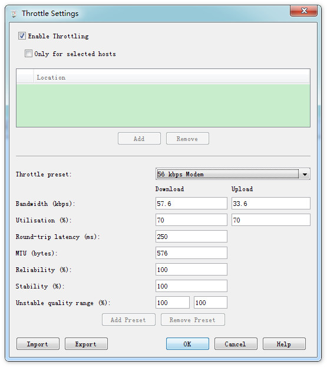</img>

## 5. Breakpoints断点功能

可以使用Charles在某个网络请求的时候进行断点， 这样可以精确的定位某个网络请求：

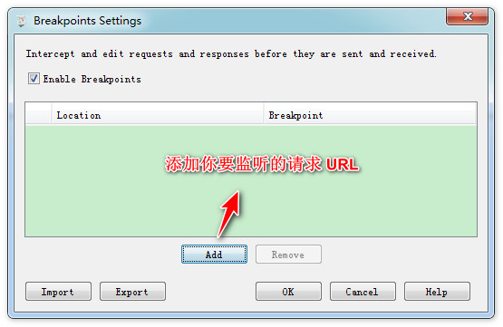</img>

除了上面的手动添加需要断点的URL，如果这个URL已经请求过，可以对该请求单击右键，然后点击 Breakpoints

通过断点功能，可以修改 Request 参数 和 Response 返回值。需要注意的是修改完 Request 参数需要点击 Excute 按钮，请求成功后，才能修改 Response 返回值

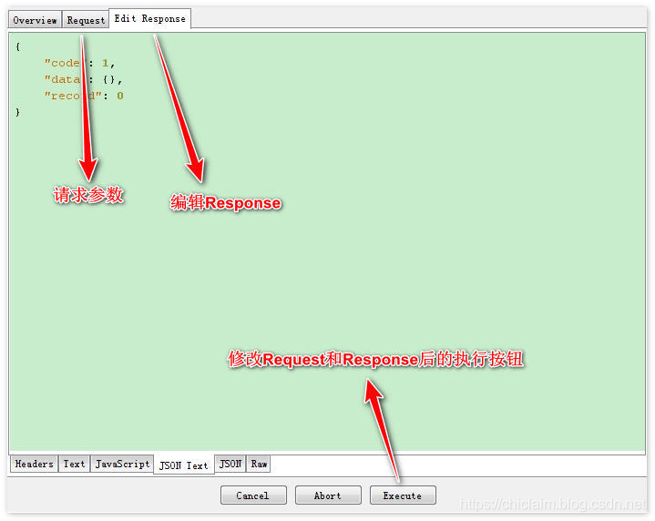</img>

## 6. Compose功能修改Request

还可以通过 Charles 修改请求的 URL、Method、Header、Parameter等.

修改方式：**对请求单击右键，然后点击 compose 按钮**

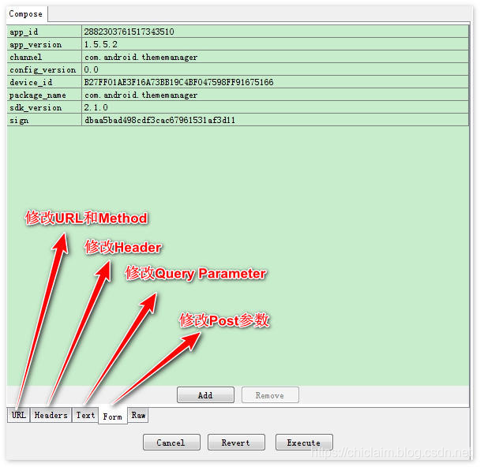</img>

## 7. Rewrite重写功能

Rewrite重写功能是全局设置的，并不是对某个请求单击右键的方式临时操作下， Rewrite可以：

修改请求头(Add/Modify/Remove Header)
修改Host/Path/URL
修改请求参数(Add/Modify/Remove Query-Parameter)
修改响应状态(Response Status)
修改Body
Rewrite设置路径： Tools -> Rewrite
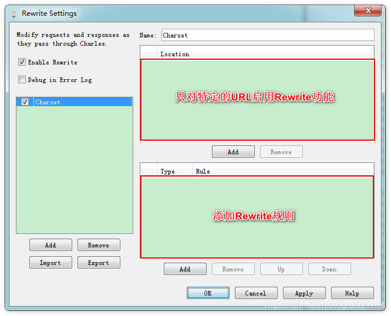</img>

Rewrite重写顾名思义就是替换，所以是基于某个固定的值替换成某个值，添加规则的时候，支持正则表达式：

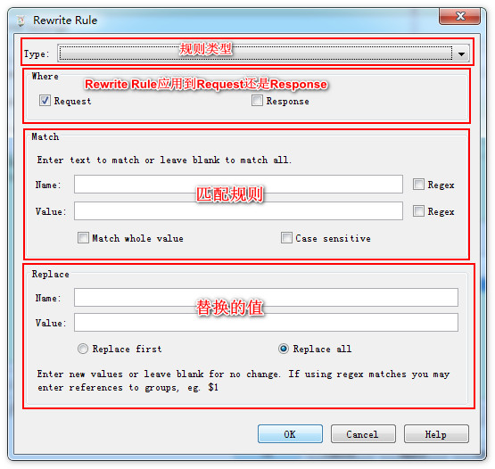</img>

## 8. Map映射功能

Map映射包含两种一种是 **Map Remote**，另一种是 **Map Local**

设置路径：**Tools -> Map Local/Remote**

**Map Remote** 顾名思义就是把匹配的请求映射到另一个远程URL：

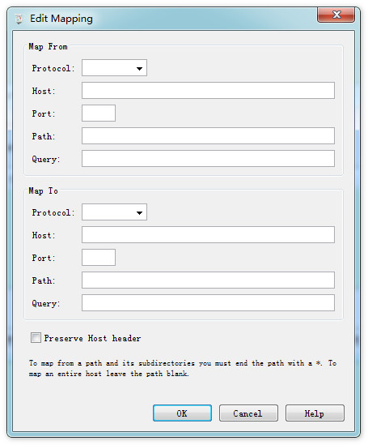</img>

**Map Local** 是将匹配的请求映射到本地文件：

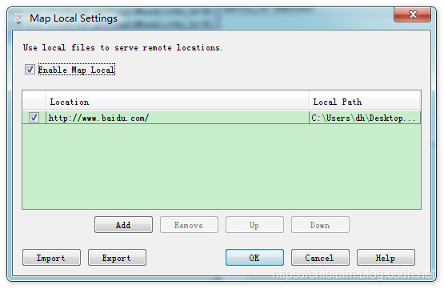</img>

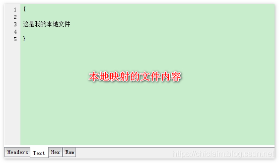</img>

## 9. Repeat 重试功能

Repeat 功能有两种：一种是简单的重试一次(Repeat)；还有一种 Repeat advances 可以设置重试的次数和并发的数量

重试一次主要用于是和服务端联调，如果接口有问题，服务端开发人员可能需要在后台代码打断点的方式来排查问题

这个时候，我们不需要在app中重新重复上次的请求(可能需要填写字段比较多或者界面链路比较长)，只需要在Charles中对该请求单击右键，然后 Repeat 即可

Repeat advances 可以来对服务器进行压力测试，或者批量提交写数据等，如：
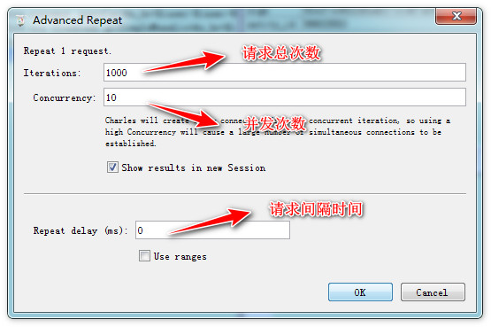</img>


## 10. 实战手机天猫抓包

通过上面的介绍我们可以抓包 HTTPS 请求的，但是打开手机天猫进入首页发现 Charles 上并没有图片的请求URL，说明 Charles 并没有抓到手机天猫的下载网络图片的请求

这个时候需要设置手机代理，下载 Drony App，然后滑到 **设置** 页面

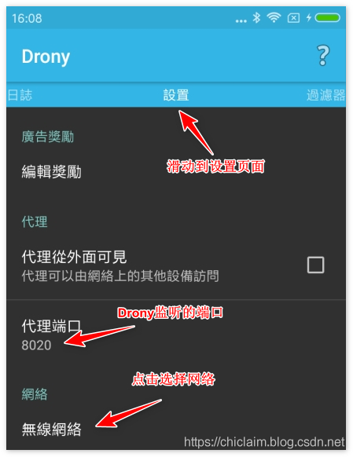</img>

点击选择网络，然后选择你已经连上的 WIFI，然后里面有 3 个地方需要设置：

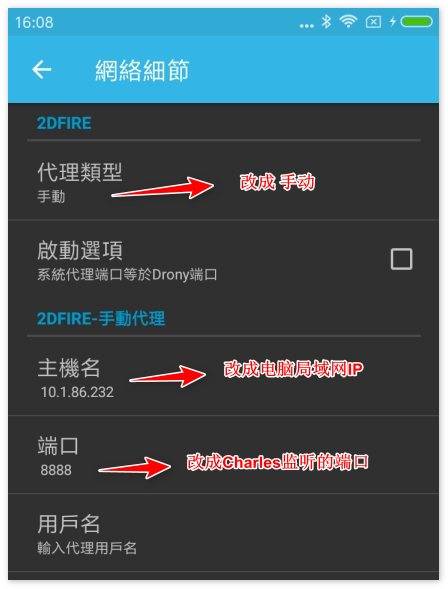</img>

设置完 Drony App 后，还需要设置 手机系统里 WIFI 选项，以前我们是设置了 Charles 局域网的 IP 和 Charles 监听的端口 现在要把IP改成 Drony所在的局域网 IP，因为 Drony 就安装在手机里面，所以可以把 IP 改成 127.0.0.1，端口改成 Drony 监听的端口 8020
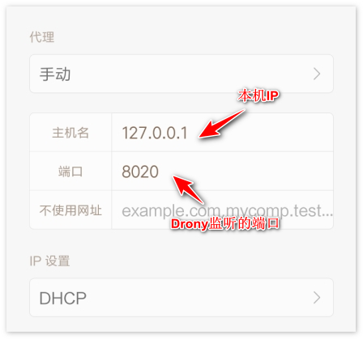</img>

最后我们成功抓取了**手机天猫**的图片了，如果图片无法展示，可以把 **_.heic** 去掉，只保留 **.jpg** 后缀，然后复制到浏览器中展示

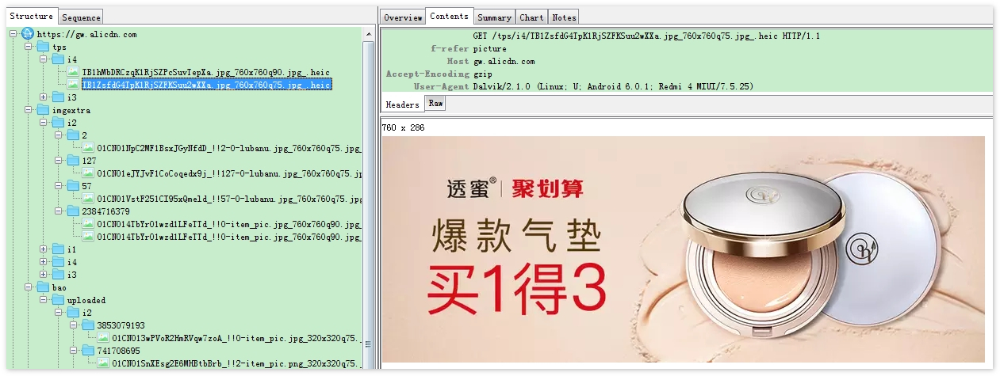</img>


