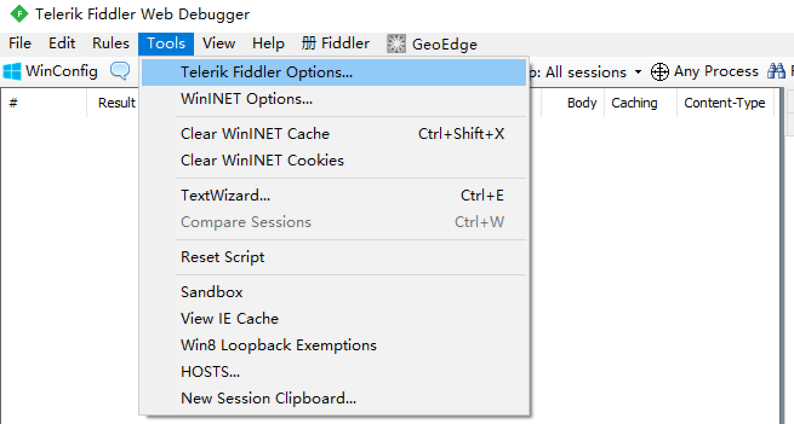
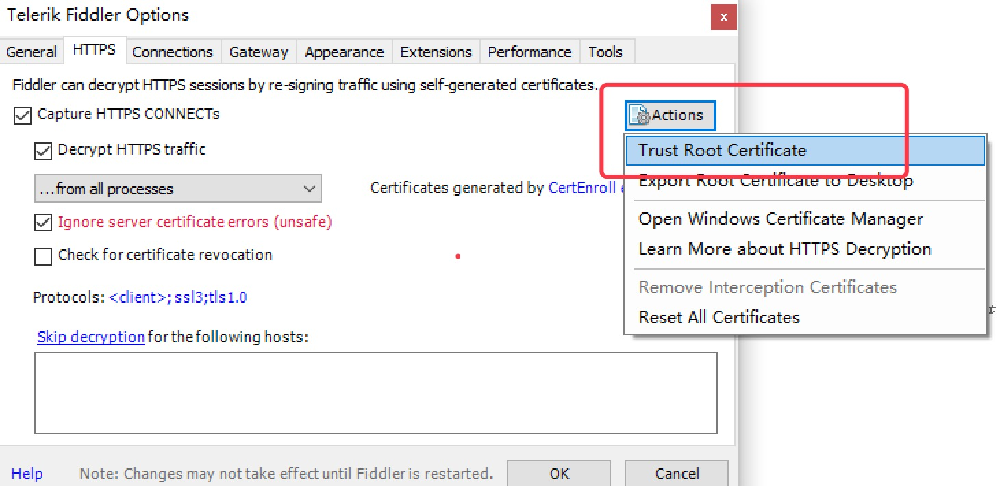

## fiddler工具介绍

**1. **Fiddler是位于客户端和服务器端的HTTP代理，也是目前最常用的http抓包工具之一 

```
功能非常强大，是web调试的利器
    1.监控浏览器所有的http/https流量
    2.查看，分析请求内容细节
    3.伪造客户端请求和服务器响应
    4.测试网站的性能
    5.解密https的web会话
    6.全局，局部断点功能
    7.第三方插件
 场景使用介绍
 	1.接口调试，接口测试，线上环境调试，web性能分析
 	2.判断前后端bug，开发环境hosts配置，mock，弱网断网测试
```

**2.** Wireshark是通用的抓包工具，但是比较庞大，对于只需要抓取http请求的应用来说，似乎有些大材小用

**3.** Httpwatch也是比较常用的http抓包工具，但是只支持IE和firefox浏览器（其他浏览器可能会有相应的插件），对于想要调试chrome浏览器的http请求，似乎稍显无力，而Fiddler2 是一个使用本地 127.0.0.1:8888 的 HTTP 代理，任何能够设置 HTTP 代理为 127.0.0.1:8888 的浏览器和应用程序都可以使用 Fiddler。

fiddler官网下载地址：https://www.telerik.com/download/fiddler

fiddler腾讯软件中心下载地址：https://pc.qq.com/detail/10/detail_3330.html

fiddler中文版下载地址：http://xiazai.zol.com.cn/detail/36/353639.shtml 安装之后，要取消自动更新，否则会更新到英文版


## **Fiddler抓取HTTPS设置**

1.启动Fiddler，打开菜单栏中的 Tools > Telerik Fiddler Options，打开“Fiddler Options”对话框。

</img>

2.对Fiddler进行设置：

- 打开工具栏->Tools->Fiddler Options->HTTPS，

- 选中Capture HTTPS CONNECTs (捕捉HTTPS连接)，

- 选中Decrypt HTTPS traffic（解密HTTPS通信）

- 另外我们要用Fiddler获取本机所有进程的HTTPS请求，所以中间的下拉菜单中选中...from all processes （从所有进程）

- 选中下方Ignore server certificate errors（忽略服务器证书错误）

  </img>

3.为 Fiddler 配置Windows信任这个根证书解决安全警告：Trust Root Certificate（受信任的根证书）。

</img>

4.Fiddler 主菜单 Tools -> Fiddler Options…-> Connections

- 选中Allow remote computers to connect（允许远程连接）

- Act as system proxy on startup（作为系统启动代理）

  

  </img>

5.重启Fiddler，使配置生效（这一步很重要，必须做）。


## Fiddler界面

</img>

#### 请求 (Request) 部分详解

> 1. Headers —— 显示客户端发送到服务器的 HTTP 请求的 header，显示为一个分级视图，包含了 Web 客户端信息、Cookie、传输状态等。
> 2. Textview —— 显示 POST 请求的 body 部分为文本。
> 3. WebForms —— 显示请求的 GET 参数 和 POST body 内容。
> 4. HexView —— 用十六进制数据显示请求。
> 5. Auth —— 显示响应 header 中的 Proxy-Authorization(代理身份验证) 和 Authorization(授权) 信息.
> 6. Raw —— 将整个请求显示为纯文本。
> 7. JSON - 显示JSON格式文件。
> 8. XML —— 如果请求的 body 是 XML 格式，就是用分级的 XML 树来显示它。

#### 响应 (Response) 部分详解

> 1. Transformer —— 显示响应的编码信息。
> 2. Headers —— 用分级视图显示响应的 header。
> 3. TextView —— 使用文本显示相应的 body。
> 4. ImageVies —— 如果请求是图片资源，显示响应的图片。
> 5. HexView —— 用十六进制数据显示响应。
> 6. WebView —— 响应在 Web 浏览器中的预览效果。
> 7. Auth —— 显示响应 header 中的 Proxy-Authorization(代理身份验证) 和 Authorization(授权) 信息。
> 8. Caching —— 显示此请求的缓存信息。
> 9. Privacy —— 显示此请求的私密 (P3P) 信息。
> 10. Raw —— 将整个响应显示为纯文本。
> 11. JSON - 显示JSON格式文件。
> 12. XML —— 如果响应的 body 是 XML 格式，就是用分级的 XML 树来显示它 。


## wireshark抓包新手使用教程

https://www.cnblogs.com/mq0036/p/11187138.html