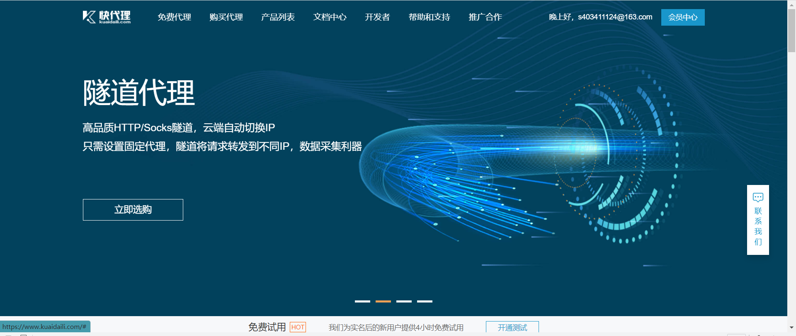
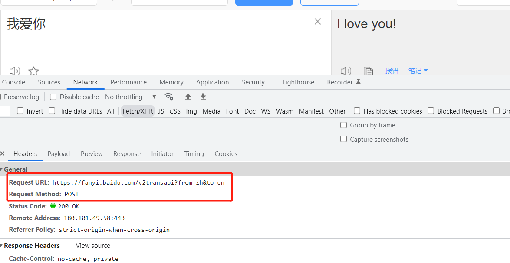
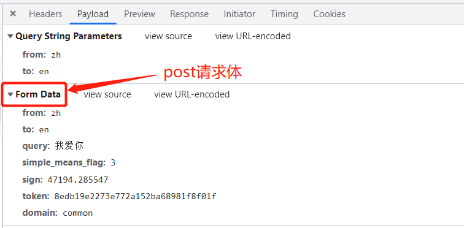
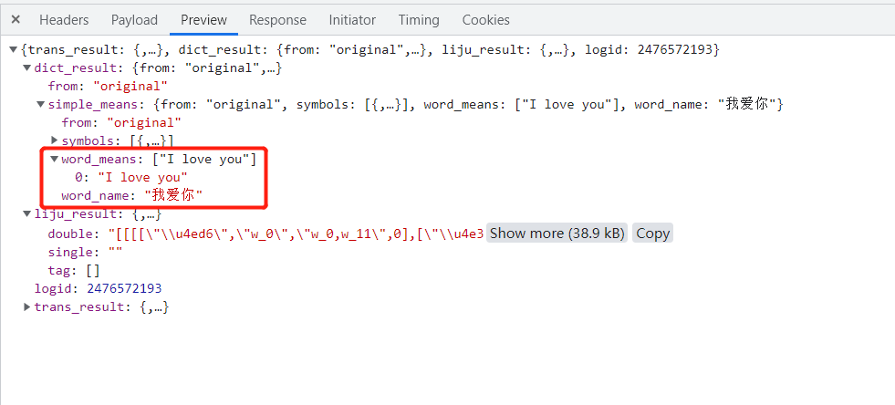
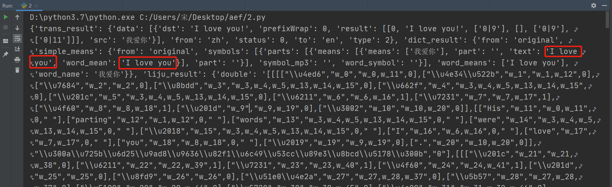

## IP代理

> proxy代理参数通过指定代理ip，让代理ip对应的正向代理服务器转发我们发送的请求，那么我们首先来了解一下代理ip以及代理服务器

### 学习目标：

```
- 掌握 超时参数timeout的使用
- 掌握 代理ip参数proxies的使用
- 掌握 使用verify参数忽略CA证书
- 掌握 requests模块发送post请求
- 掌握 利用requests.session进行状态保持
```

------

### 理解使用代理的过程----<代理相当于中介>

1. 代理ip是一个ip，指向的是一个代理服务器
2. 代理服务器能够帮我们向目标服务器转发请求

</img>

```
1.浏览器发送请求给代理>>>>2.代理接收请求，转发请求>>>>3.服务器接收请求，返回响应给代理>>>>4.在由代理把响应转发给浏览器，在这里，代理相当于扮演中介的角色
```

### 正向代理和反向代理的区别

> 前边提到proxy参数指定的代理ip指向的是正向的代理服务器，那么相应的就有反向服务器；现在来了解一下正向代理服务器和反向代理服务器的区别

1. 正向代理：对于浏览器知道服务器的真实地址，例如vpn(虚拟专用网络)

   反向代理：浏览器不知道服务器的真实地址，例如nginx(一个高性能的HTTP和反向代理web服务器)

   - 从用途上来讲
     - 正向代理-为局域网客户端向外访问Internet服务，可以使用缓冲特性减少网络使用率。
     - 反向代理-为局域网服务器向外提供Internet服务，可以使用负载平衡提高客户访问量，还可以基于高级URL策略和管理技术对服务进行高质量管控。
   - 从安全性来讲
     - 正向代理-必须采取安全措施确保内网客户端通过它访问外部网站，隐藏客户端的身份。
     - 反向代理-对外提供服务是透明的，客户端并不知道自己访问的是一个代理，隐藏服务端的身份。


## 1.代理ip（代理服务器）的分类

1. 根据代理ip的匿名程度，代理IP可以分为下面三类：

   - 透明代理(Transparent Proxy)：透明代理虽然可以直接“隐藏”你的IP地址，但是还是可以查到你是谁。目标服务器接收到的请求头如下：

     ```
     REMOTE_ADDR = Proxy IP
     HTTP_VIA = Proxy IP
     HTTP_X_FORWARDED_FOR = Your IP
     ```

   - 匿名代理(Anonymous Proxy)：使用匿名代理，别人只能知道你用了代理，无法知道你是谁。目标服务器接收到的请求头如下：

     ```
     REMOTE_ADDR = proxy IP
     HTTP_VIA = proxy IP
     HTTP_X_FORWARDED_FOR = proxy IP
     ```

   - 高匿代理(Elite proxy或High Anonymity Proxy)：高匿代理让别人根本无法发现你是在用代理，所以是最好的选择。**毫无疑问使用高匿代理效果最好**。目标服务器接收到的请求头如下：

     ```
     REMOTE_ADDR = Proxy IP
     HTTP_VIA = not determined
     HTTP_X_FORWARDED_FOR = not determined
     ```

2. 根据网站所使用的协议不同，需要使用相应协议的代理服务。从代理服务请求使用的协议可以分为：

   - http代理：目标url为http协议
   - https代理：目标url为https协议
   - socks隧道代理（例如socks5代理）等：
     1. socks 代理只是简单地传递数据包，不关心是何种应用协议（FTP、HTTP和HTTPS等）。
     2. socks 代理比http、https代理耗时少。
     3. socks 代理可以转发http和https的请求


## 2.proxies代理参数的使用

> 为了让服务器以为不是同一个客户端在请求；为了防止频繁向一个域名发送请求被封ip，所以我们需要使用代理ip；让服务器以为不是同一个客户在请求，防止我们的真实地址被泄露，防止被追究

- 用法：

  ```python
  response = requests.get(url, proxies=proxies)
  ```

- proxies的形式：字典

- 例如：

  ```python
  proxies = { 
      "http": "http://12.34.56.79:9527", 
      "https": "https://12.34.56.79:9527", 
  }
  ```

- 注意：如果proxies字典中包含有多个键值对，发送请求时将按照url地址的协议来选择使用相应的代理ip

### 快代理国内代理平台：https://www.kuaidaili.com/

</img>

### 极客云国外代理平台：https://jike138.com/user##

https://cloud.tencent.com/developer/article/1937190


## 3.使用verify参数忽略CA证书

</img>

- 原因：该网站的CA证书没有经过【受信任的根证书颁发机构】的认证
- **[关于CA证书以及受信任的根证书颁发机构点击了解更多](https://blog.csdn.net/yangyuge1987/article/details/79209473/)**，课上我们不做展开

#### 运行代码查看代码中向不安全的链接发起请求的效果

> 运行下面的代码将会抛出包含`ssl.CertificateError ...`字样的异常

```python
import requests
url = "https://sam.huat.edu.cn:8443/selfservice/"
response = requests.get(url)
```

#### 解决方案

> 为了在代码中能够正常的请求，我们使用`verify=False`参数，此时requests模块发送请求将不做CA证书的验证：verify参数能够忽略CA证书的认证

```python
import requests
url = "https://sam.huat.edu.cn:8443/selfservice/" 
response = requests.get(url, verify=False)
```


## 4.禁止响应页面重定向

```python
allow_redirects=False     禁止重定向
# 使用方法
response = requests.get(url=start_url, headers=headers, allow_redirects=False)
```


## 5.requests模块发送post请求

> 思考：哪些地方我们会用到POST请求？
>
> 1. 登录注册（ 在web工程师看来POST 比 GET 更安全，url地址中不会暴露用户的账号密码等信息）
> 2. 需要传输大文本内容的时候（ POST 请求对数据长度没有要求）
>
> 所以同样的，我们的爬虫也需要在这两个地方回去模拟浏览器发送post请求

### requests发送post请求的方法

```python
# data参数接收一个字典
response = requests.post(url, data)
```

- **requests模块发送post请求函数的其它参数和发送get请求的参数完全一致**


### POST请求练习

下面面我们通过有道翻译的例子看看post请求如何使用：

1. 地址：https://fanyi.baidu.com/translate


   ##### 思路分析

   1. 抓包确定请求的url地址

      

   2. 确定请求的参数

      

   3. 确定返回数据的位置

      

   4. 模拟浏览器获取数据

####  抓包分析的结论

1. url地址：https://fanyi.baidu.com/v2transapi?from=zh&to=en

2. 请求方法：POST

3. 请求所需参数：

   ```python
   data = {
       'from': 'zh',
       'to': 'en',
       'query': '我爱你',
       'simple_means_flag': '3',
       'sign': '47194.285547',
       'token': '8edb19e2273e772a152ba68981f8f01f',
       'domain': 'common'
   }
   ```

4. **pc端User-Agent**:

   `Mozilla/5.0 (Macintosh; Intel Mac OS X 10_12_6) AppleWebKit/537.36 (KHTML, like Gecko) Chrome/71.0.3578.98 Safari/537.36`

####  代码实现

> 了解requests模块发送post请求的方法，以及分析过移动端的百度翻译之后，我们来完成代码

```python
import requests

url = 'https://fanyi.baidu.com/v2transapi?from=zh&to=en'
headers = {
    'Content-Type': 'application/x-www-form-urlencoded; charset=UTF-8',
    'Cookie': 'REALTIME_TRANS_SWITCH=1; HISTORY_SWITCH=1; FANYI_WORD_SWITCH=1; SOUND_PREFER_SWITCH=1; SOUND_SPD_SWITCH=1; Hm_lvt_afd111fa62852d1f37001d1f980b6800=1622117379; BIDUPSID=94ED73D41A60F5410218DED5F26813B1; PSTM=1629094149; __yjs_duid=1_71ee7723df3a7b81f685ad7879aef7721629099675366; H_WISE_SIDS=107314_110085_127969_164870_179349_184716_185635_186743_188747_189037_189094_189253_189325_189755_191067_191251_191287_191371_192206_192389_193284_193558_194085_194519_195003_195188_195343_195631_196045_196425_197241_197711_197782_197832_197958_198034_198069_198257_198418_198515_198650_199082_199157_199176_199305_199392_199466_199575_199643_199753_199778_200127_200272_200445_200554_200738_200743_201054_201101_201192_201233_201328_201533_201556_201581_201702_201733_201808_201932_201947_201969_201979_201996_202393_202478_202553_202562_202821_202832_202911_202917_202969; MCITY=-338%3A158%3A; BDUSS=kExamJrTlJ3OFJTSnk4bHRoQko2YVRLc0ZvTERVV1hqRzVmbXk4bWJheXVXV0ppRVFBQUFBJCQAAAAAAAAAAAEAAADB7szat~y12Na0t6i52QAAAAAAAAAAAAAAAAAAAAAAAAAAAAAAAAAAAAAAAAAAAAAAAAAAAAAAAAAAAAAAAAAAAAAAAK7MOmKuzDpiZ; BDUSS_BFESS=kExamJrTlJ3OFJTSnk4bHRoQko2YVRLc0ZvTERVV1hqRzVmbXk4bWJheXVXV0ppRVFBQUFBJCQAAAAAAAAAAAEAAADB7szat~y12Na0t6i52QAAAAAAAAAAAAAAAAAAAAAAAAAAAAAAAAAAAAAAAAAAAAAAAAAAAAAAAAAAAAAAAAAAAAAAAK7MOmKuzDpiZ; BAIDUID=23E780431A4ED3E032447DF6F1110C9E:FG=1; BDORZ=B490B5EBF6F3CD402E515D22BCDA1598; BDSFRCVID_BFESS=MlDOJeC629nlUX3DJjQIMFdW_KesDRnTH6aoM-8XTEkfm6d-f39dEG0PLf8g0KuM2XL8ogKKLmOTHpKF_2uxOjjg8UtVJeC6EG0Ptf8g0f5; H_BDCLCKID_SF_BFESS=Jn4HoD--fCK3qJTph47hqR-8MxrK2JT3KC_X3b7Efh6Ssh7_bf--D6FHhbovJM3Z2H6A2lQeQM7vetOe04Txy5K_hPFLqpvn3C3hWCQeHRL5bJbHQT3mX-5bbN3i-xuHygtOWb3cWhRV8UbSKMRPBTD02-nBat-OQ6npaJ5nJq5nhMJmb67JD-50exbH55uetJFOoMK; BAIDUID_BFESS=25DB9AAB4EFE245125C6511B6296F58C:FG=1; H_PS_PSSID=36309_36367_35914_36167_34584_35978_36234_26350_36312_36061; delPer=0; PSINO=6; BA_HECTOR=2laga50h800h858gd71h7a93l0r; Hm_lvt_64ecd82404c51e03dc91cb9e8c025574=1651844287; ab_sr=1.0.1_ODRlZGYyNWM1ZDc0MTNjNjJjODAzZDEyZmYwMzVjMTQ2Y2JmMzE0YjZmODRkMzg3ZWY3ZDEzNzBkZTk3YzA3Mzg0MjRkZmQ2ZDFmYTgyMGZjZTU5YTFhZDhhM2JiMGE2ZjA1ZTBjYjkxYWJlZjgyYWI0YTYwNTg3ZmNmZDBiNjUzMzc0MzA5ZmNkM2JlNzE5Y2RhNDdhYzJmNDZiMGYzMTAxNzZlZWRlNWI2YTU2NDM0OWY3ODY5OGQ3MjMyYjE3; Hm_lpvt_64ecd82404c51e03dc91cb9e8c025574=1651844477',
    'Host': 'fanyi.baidu.com',
    'Origin': 'https://fanyi.baidu.com',
    'Referer': 'https://fanyi.baidu.com/translate?aldtype=16047&query=%E6%88%91%E7%88%B1%E4%BD%A0&keyfrom=baidu&smartresult=dict&lang=auto2zh',
    'User-Agent': 'Mozilla/5.0 (Windows NT 10.0; Win64; x64) AppleWebKit/537.36 (KHTML, like Gecko) Chrome/101.0.4951.54 Safari/537.36',
    'X-Requested-With': 'XMLHttpRequest'
    }
data = {
    'from': 'zh',
    'to': 'en',
    'query': '我爱你',
    'simple_means_flag': '3',
    'sign': '47194.285547',
    'token': '8edb19e2273e772a152ba68981f8f01f',
    'domain': 'common'
}
response = requests.post(url, headers=headers, data=data).json()
print(response)
```




## 6. 利用requests.session进行状态保持

> requests模块中的Session类能够自动处理发送请求获取响应过程中产生的cookie，进而达到状态保持的目的。接下来我们就来学习它

### requests.session的作用以及应用场景

- requests.session的作用
  - 自动处理cookie，即 **下一次请求会带上前一次的cookie**
- requests.session的应用场景
  - 自动处理连续的多次请求过程中产生的cookie

### requests.session使用方法

> session实例在请求了一个网站后，对方服务器设置在本地的cookie会保存在session中，下一次再使用session请求对方服务器的时候，会带上前一次的cookie

```python
session = requests.session() # 实例化session对象
response = session.get(url, headers, ...)
response = session.post(url, data, ...)
```

- session对象发送get或post请求的参数，与requests模块发送请求的参数完全一致

### 课堂练习

> 使用requests.session来完成github登陆，并获取需要登陆后才能访问的页面

#### 提示

1. 对github登陆以及访问登陆后才能访问的页面的整个完成过程进行抓包
2. 确定登陆请求的url地址、请求方法和所需的请求参数
   - 部分请求参数在别的url对应的响应内容中，可以使用re模块获取
3. 确定登陆后才能访问的页面的的url地址和请求方法
4. 利用requests.session完成代码

#### 参考代码

```python
import requests
import re


# 构造请求头字典
headers = {
    'User-Agent': 'Mozilla/5.0 (Windows NT 10.0; Win64; x64) AppleWebKit/537.36 (KHTML, like Gecko) Chrome/67.0.3396.87 Safari/537.36',
}

# 实例化session对象
session = requests.session()

# 访问登陆页获取登陆请求所需参数
response = session.get('https://github.com/login', headers=headers)
authenticity_token = re.search('name="authenticity_token" value="(.*?)" />', response.text).group(1) # 使用正则获取登陆请求所需参数

# 构造登陆请求参数字典
data = {
    'commit': 'Sign in', # 固定值
    'utf8': '✓', # 固定值
    'authenticity_token': authenticity_token, # 该参数在登陆页的响应内容中
    'login': input('输入github账号：'),
    'password': input('输入github账号：')
}

# 发送登陆请求（无需关注本次请求的响应）
session.post('https://github.com/session', headers=headers, data=data)

# 打印需要登陆后才能访问的页面
response = session.get('https://github.com/1596930226', headers=headers)
print(response.text)
```
