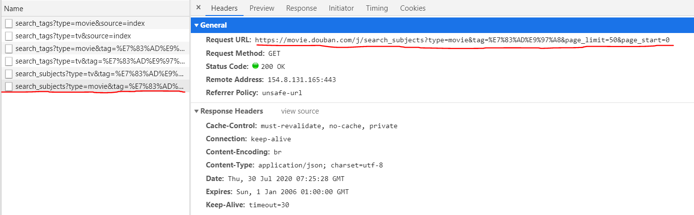
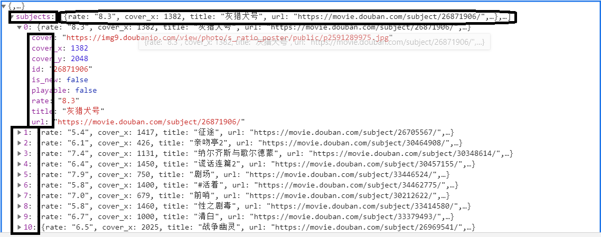
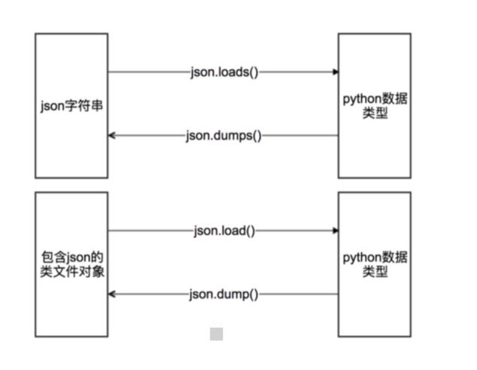

## 数据提取之json

> **目标**：理解json的概念
>
> ​		  了解爬虫中，json出现的位置
>
> ​		  掌握json相关的方法

------

## 1.  什么是json，在哪里能找到json

json是一种轻量级的数据交换格式，它使地人们很容易的进行阅读和编写，同事也方便了机器进行解析和生成，适用于进行数据交互的场景，比如web的前台和后台之间的数据交互

至于在哪里能找到能返回json数据的url，以豆瓣电影为例，下面这条url就是返回json数据的url

https://movie.douban.com/j/search_subjects?type=movie&tag=%E7%83%AD%E9%97%A8&page_limit=50&page_start=0

</img>

在url地址对应的响应中搜索关键字即可

但是注意:url地址对应的响应中，中文往往是被编码之后的内容，所以更推荐大家去搜索英文和数字；另外一个方法就是在perview中搜索，其中的类容都是转码之后的

还有一个方法，就是将浏览器切换到手机版寻找json


## 2.  json数据格式化

在preview中观察

</img>

**其中：**

​	方形方框表示json中的健

​	椭圆框表示健所对应的值，是一个列表，在列表展开之后，下面的数字表示列表中所对应的值

**在线解析工具进行解析**

​	json.cn(在线json数据解析，让数据直观易读)

**pycharm进行reformat code**

​	在pycharm中新建一个json文件，把数据存入后，点击code下面的reformat code，但是中文往往显示的是unicode格式

**json数据的其他来源：**

​	抓包app，app的抓包方式会在后面学习，但是很多时候app中的数据是被加密的，但仍然值得尝试


## 3.  json模块中方法的学习

</img>

**json.dumps**

dump的功能就是把Python对象encode为json对象，一个编码过程。注意json模块提供了json.dumps和json.dump方法，区别是dump直接到文件，而dumps到一个字符串，这里的s可以理解为string。

```python 
import json
data = [ { 'a':'A', 'b':(2, 4), 'c':3.0 } ]
print('DATA:', repr(data))

data_string = json.dumps(data)
print('JSON:', data_string)
#结果如下
DATA: [{'a': 'A', 'c': 3.0, 'b': (2, 4)}]
JSON: [{"a": "A", "c": 3.0, "b": [2, 4]}]
print type(data)
print type(data_string)
<type 'list'>
<type 'str'>
```

**json.dump**

不仅可以把Python对象编码为string，还可以写入文件。因为我们不能把Python对象直接写入文件，这样会报错TypeError: expected a string or other character buffer object，我们需要将其序列化之后才可以

```python
import json
data = [ { 'a':'A', 'b':(2, 4), 'c':3.0 } ]
with open('output.json','w') as fp:
    json.dump(data,fp)
# 结果
[{“a”: “A”, “c”: 3.0, “b”: [2, 4]}]
```

**json.loads**

从Python内置对象dump为json对象我们知道如何操作了，那如何从json对象decode解码为Python可以识别的对象呢？是的用json.loads方法，当然这个是基于string的，如果是文件，我们可以用json.load方法。

```python
decoded_json = json.loads(data_string)
# 和之前一样，还是list
print type(decoded_json)
<type 'list'>
# 像访问 data = [ { 'a':'A', 'b':(2, 4), 'c':3.0 } ]一样
print decoded_json[0]['a']
#结果如下
A
```

**json.load**

可以直接load文件

```python
with open('output.json') as fp:
    print type(fp)
    loaded_json = json.load(fp)

<type 'file'>
# 和之前一样，还是list
print type(decoded_json)
<type 'list'>
# 像访问 data = [ { 'a':'A', 'b':(2, 4), 'c':3.0 } ]一样
print decoded_json[0]['a']

#结果如下
A
```

## 4.  json.dumps常用参数

一些参数，可以让我们更好地控制输出。常见的比如sort_keys，indent，separators，skipkeys等。

**sort_keys**名字就很清楚了，输出时字典的是按键值排序的，而不是随机的。

```python
import json
data = [ { 'a':'A',  'c':3.0 ,'b':(2, 4)} ]
print('DATA:', repr(data))

unsorted = json.dumps(data)
print('JSON:', json.dumps(data))
print('SORT:', json.dumps(data, sort_keys=True))
#结果如下
DATA: [{'a': 'A', 'c': 3.0, 'b': (2, 4)}]
JSON: [{"a": "A", "c": 3.0, "b": [2, 4]}]
SORT: [{"a": "A", "b": [2, 4], "c": 3.0}]1234567891011
```

**indent**就是更个缩进，让我们更好地看清结构。

```python
import json
data = [ { 'a':'A', 'b':(2, 4), 'c':3.0 } ]
print('DATA:', repr(data))

print('NORMAL:', json.dumps(data, sort_keys=True))
print('INDENT:', json.dumps(data, sort_keys=True, indent=2))

#结果如下
DATA: [{'a': 'A', 'b': (2, 4), 'c': 3.0}]
NORMAL: [{"a": "A", "b": [2, 4], "c": 3.0}]
INDENT: [
  {
    "a": "A",
    "b": [
      2,
      4
    ],
    "c": 3.0
  }
1234567891011121314151617181920
```

**separators**是提供分隔符，可以出去白空格，输出更紧凑，数据更小。默认的分隔符是(‘, ‘, ‘: ‘)，有白空格的。不同的dumps参数，对应文件大小一目了然。

```python
import json
data = [ { 'a':'A', 'b':(2, 4), 'c':3.0 } ]
print('DATA:', repr(data))
print('repr(data)             :', len(repr(data)))
print('dumps(data)            :', len(json.dumps(data)))
print('dumps(data, indent=2)  :', len(json.dumps(data, indent=2)))
print('dumps(data, separators):', len(json.dumps(data, separators=(',',':'))))

#结果如下
DATA: [{'a': 'A', 'c': 3.0, 'b': (2, 4)}]
repr(data)             : 35
dumps(data)            : 35
dumps(data, indent=2)  : 76
dumps(data, separators): 291234567891011121314
```

**json**需要字典的的键是字符串，否则会抛出ValueError。

```python
import json
data = [ { 'a':'A', 'b':(2, 4), 'c':3.0, ('d',):'D tuple' } ]

print('First attempt')
try:
    print(json.dumps(data))
except (TypeError, ValueError) as err:
    print('ERROR:', err)

print()
print('Second attempt')
print(json.dumps(data, skipkeys=True))

#结果如下
First attempt
ERROR: keys must be a string

Second attempt
[{"a": "A", "c": 3.0, "b": [2, 4]}]
```


## **5.  案例**

爬取豆瓣电视剧的英剧和美剧的数据，并分类，地址：https://m.douban.com/tv/

```python
class Douban(object):
    def __init__(self, tv_name):
        self.start_url = 'https://movie.douban.com/j/search_subjects?type=tv&tag={}&sort=recommend&page_limit=20&page_start={}'
        self.referer = 'https://m.douban.com/movie/subject/{}/'
        self.tv_msg = 'https://m.douban.com/rexxar/api/v2/tv/{}?ck=&for_mobile=1'
        self.tv_name = tv_name

    def run(self):
        """
        拼接url，获取翻页信息
        :return:
        """
        for i in range(5):
            # 拼接url，获取翻页信息
            url = self.start_url.format(self.tv_name, i)
            # 获取url响应的json数据，并转换成字典
            tv_list_json = json.loads(session.get(url).content.decode())
            self.parse_json_data(tv_list_json)

    def parse_json_data(self, json_data):
        """
        json数据解析
        :param json_data: json_data
        :return:
        """
        # 遍历字典，获取需要的数据
        for tv in json_data['subjects']:
            # 电视剧标题
            tv_title = tv['title']
            # 电视剧的url
            tv_url = tv['url']
            # 电视剧的图片地址
            tv_img = tv['cover']
            # 电视剧的id
            tv_id = tv['id']
            self.parse_tv(tv_id, tv_title, tv_url, tv_img)

    def parse_tv(self, tv_id, tv_title, tv_url, tv_img):
        """

        :param tv_id:
        :return:
        """
        # 拼接电视剧详细信息的url
        url = self.tv_msg.format(tv_id)
        # 反反爬，拼接referer
        headers = {"User-Agent": "Mozilla/5.0 (Windows NT 10.0; Win64; x64) Appl\
                            eWebKit/537.36 (KHTML, like Gecko) Chrome/83.0.4103.116 Safari/537.36",
                   'referer': self.referer.format(tv_id)}
        # 获取json数据，转化为字典
        tv_json_data = json.loads(session.get(url, headers=headers).content.decode('utf-8'))
        # 获取电视剧简介
        intro = tv_json_data['intro']
        self.actor_msg(tv_json_data, tv_title, tv_url, tv_img, intro)

    def actor_msg(self, tv_json_data, tv_title, tv_url, tv_img, intro):
        name = []
        # 演员在字典中，循环取出演员名
        for actor in tv_json_data['actors']:
            name.append(actor)
        self.save(name, tv_title, tv_url, tv_img, intro)

    def save(self, name, tv_title, tv_url, tv_img, intro):
        with open('tv.txt', 'a+', encoding='utf-8')as f:
            # 构造上下文
            content = {
                '类别': self.tv_name,
                '标题': tv_title,
                '播放链接': tv_url,
                '封面链接': tv_img,
                '内容简介': intro,
                '演员': name
            }
            f.write(str(content) + '\r\n')
        print('{}{}保存完成'.format(self.tv_name, tv_title))


if __name__ == '__main__':
    print("1: '美剧', 2: '英剧'")
    while True:
        num = input('请输入对应的编号, 按回车结束')
        if num == '1' or num == '2':
            data = {1: '美剧', 2: '英剧'}
            douban = Douban(data[int(num)])
            douban.run()
            continue
        if num == '0':
            break
        else:
            print('输入有误')
```

