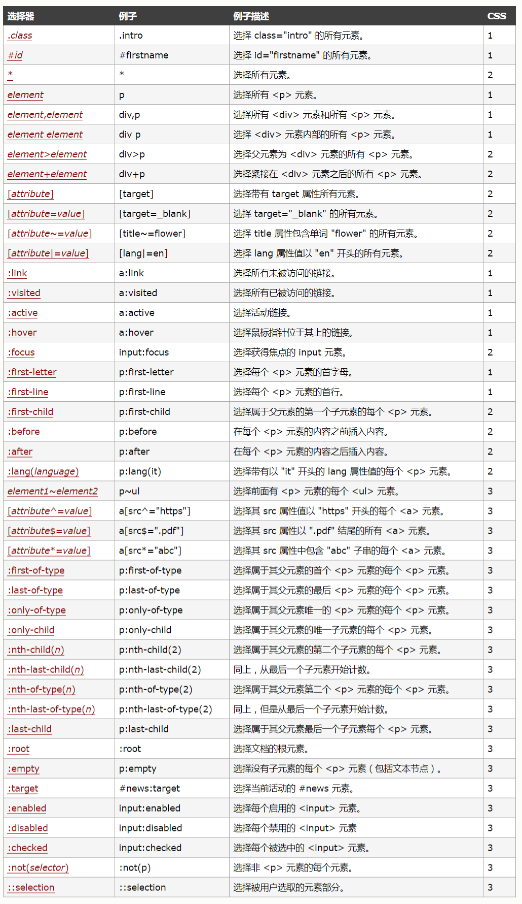
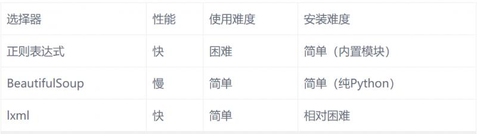

# 数据提取之BeautifuSoup模块与Css选择器(拓展)


```python
"""
# BeautifulSoup
是一个高效的网页解析库，可以从HTML或XML文件中提取数据
支持不同的解析器，比如，对HTML解析，对XML解析，对HTML5解析
就是一个非常强大的工具，爬虫利器
一个灵感又方便的网页解析库，处理高效，支持多种解析器
利用它就不用编写正则表达式也能方便的实现网页信息的抓取
"""

# 安装 pip3 install BeautifulSoup4


# 标签选择器
### 通过标签选择
#### .string() --获取文本节点及内容

html = """
<html>
    <head>
        <title>The Dormouse's story</title>
    </head>
    <body>
    <p class="title" name="dromouse"><b><span>The Dormouse's story</span></b></p>
    <p class="story">Once upon a time there were three little sisters; and their names were
    <a href="http://example.com/elsie" class="sister" id="link1"><!-- Elsie --></a>,
    <a href="http://example.com/lacie" class="sister" id="link2">Lacie</a> and
    <a href="http://example.com/tillie" class="sister" id="link3">Tillie</a>;
    and they lived at the bottom of a well.</p>
    <p class="story">...</p>
"""
from bs4 import BeautifulSoup   # 导包
soup = BeautifulSoup(html, 'lxml')  # 参数1：要解析的html  参数2：解析器

# print(soup.prettify())  # 代码补全

print(soup.html.head.title.string)

print(soup.title.string)  #title是个节点， .string是属性 作用是获取字符串文本

# 选取整个head，包含标签本身
print(soup.head) # 包含head标签在内的所有内容

print(soup.p) # 返回匹配的第一个结果


#%% md

### 获取名称
#### .name()  --获取标签本身名称  

#%%

html = """
<html><head><title>The Dormouse's story</title></head>
<body>
<p class="title" name="dromouse"><b>The Dormouse's story</b></p>
<p class="story">Once upon a time there were three little sisters; and their names were
<a href="http://example.com/elsie" class="sister" id="link1"><!-- Elsie --></a>,
<a href="http://example.com/lacie" class="sister" id="link2">Lacie</a> and
<a href="http://example.com/tillie" class="sister" id="link3">Tillie</a>;
and they lived at the bottom of a well.</p>
<p class="story">...</p>
"""
from bs4 import BeautifulSoup
soup = BeautifulSoup(html, 'lxml')

print(soup.title.name)  # 结果为标签本身  --> title
print(soup.p.name)  # --> 获取标签名

#%% md

### 获取属性值

#### .attrs()  --通过属性拿属性值 

#%%

html = """
<html><head><title>The Dormouse's story</title></head>
<body>
<p class="title asdas" name="abc" id = "qwe"><b>The Dormouse's story</b></p>
<p class="story">Once upon a time there were three little sisters; and their names were
<a href="http://example.com/123" class="sister" id="link1"><!-- Elsie --></a>,
<a href="http://example.com/lacie" class="sister" id="link2">Lacie</a> and
<a href="http://example.com/tillie" class="sister" id="link3">Tillie</a>;
and they lived at the bottom of a well.</p>
<p class="story">...</p>
"""
from bs4 import BeautifulSoup
soup = BeautifulSoup(html, 'lxml')

print(soup.p.attrs['name'])# 获取p标签name属性的属性值

print(soup.p.attrs['id']) # 获取p标签id属性的属性值
print(soup.p['id']) #第二种写法

print(soup.p['class']) # 以列表得形式保存
print(soup.a['href'])  # 也是只返回第一个值

#%% md

### 嵌套选择

一定要有子父级关系

#%%

html = """
<html><head><title>The Dormouse's story</title></head>
<body>
<p class="title" name="dromouse"><b>The abc Dormouse's story</b></p>
<p class="story">Once upon a time there were three little sisters; and their names were
<a href="http://example.com/elsie" class="sister" id="link1"><!-- Elsie --></a>,
<a href="http://example.com/lacie" class="sister" id="link2">Lacie</a> and
<a href="http://example.com/tillie" class="sister" id="link3">Tillie</a>;
and they lived at the bottom of a well.</p>
<p class="story">...</p>
"""
from bs4 import BeautifulSoup
soup = BeautifulSoup(html, 'lxml')
print(soup.body.p.b.string)  #层层往下找

#%% md

### 子节点和子孙节点

#%%

html = """
<html>
    <head>
        <title>The Dormouse's story</title>
    </head>
    <body>
        <p class="story">
            Once upon a time there were three little sisters; and their names were
            <a href="http://example.com/elsie" class="sister" id="link1">
                <span>Elsie</span>
            </a>
            <a href="http://example.com/lacie" class="sister" id="link2">Lacie</a> 
            and
            <a href="http://example.com/tillie" class="sister" id="link3">Tillie</a>
            and they lived at the bottom of a well.
        </p>
        <p class="story">...</p>
"""
from bs4 import BeautifulSoup
soup = BeautifulSoup(html, 'lxml')

# 标签选择器只能拿到部分内容 ，不能拿到所有，那如何解决？？

# .contents属性可以将tag(标签)的子节点以列表的形式输出
# print(soup.p.contents)  # 获取P标签所有子节点内容 返回一个list

for i in soup.p.contents:
    print(i)


#%%


#%%

html = """
<html>
    <head>
        <title>The Dormouse's story</title>
    </head>
    <body>
        <p class="story">
            Once upon a time there were three little sisters; and their names were
            <a href="http://example.com/elsie" class="sister" id="link1">
                <span>Elsie</span>
            </a>
            <a href="http://example.com/lacie" class="sister" id="link2">Lacie</a> 
            and
            <a href="http://example.com/tillie" class="sister" id="link3">Tillie</a>
            and they lived at the bottom of a well.
        </p>
        <p class="story">...</p>
"""
from bs4 import BeautifulSoup
soup = BeautifulSoup(html, 'lxml')

# .children是一个list类型的迭代器
print(soup.p.children)  # 获取子节点  返回一个迭代器

for i in soup.p.children:
    print(i)

for i, child in enumerate(soup.p.children):  
    print(i, child)

#%%

html = """
<html>
    <head>
        <title>The Dormouse's story</title>
    </head>
    <body>
        <p class="story">
            Once upon a time there were three little sisters; and their names were
            <a href="http://example.com/elsie" class="sister" id="link1">
                <span>Elsie</span>
            </a>
            <a href="http://example.com/lacie" class="sister" id="link2">Lacie</a> 
            and
            <a href="http://example.com/tillie" class="sister" id="link3">Tillie</a>
            and they lived at the bottom of a well.
        </p>
        <p class="story">...</p>
"""
from bs4 import BeautifulSoup
soup = BeautifulSoup(html, 'lxml')
print(soup.p.descendants)  # 获取子孙节点  返回一个迭代器
for i, child in enumerate(soup.p.descendants):
    print(i, child)

#%% md

### 父节点和祖先节点

#%%

html = """
<html>
    <head>
        <title>The Dormouse's story</title>
    </head>
    <body>
        <p class="story">
            Once upon a time there were three little sisters; and their names were
            <a href="http://example.com/elsie" class="sister" id="link1">
                <span>Elsie</span>
            </a>
            <a href="http://example.com/lacie" class="sister" id="link2">Lacie</a> 
            and
            <a href="http://example.com/tillie" class="sister" id="link3">Tillie</a>
            and they lived at the bottom of a well.
        </p>
        <p class="story">...</p>
"""
from bs4 import BeautifulSoup
soup = BeautifulSoup(html, 'lxml')
print(soup.a.parent)  # 获取父节点

#%%

html = """
<html>
    <head>
        <title>The Dormouse's story</title>
    </head>
    <body>
        <p class="story">
            Once upon a time there were three little sisters; and their names were
            <a href="http://example.com/elsie" class="sister" id="link1">
                <span>Elsie</span>
            </a>
            <a href="http://example.com/lacie" class="sister" id="link2">Lacie</a> 
            and
            <a href="http://example.com/tillie" class="sister" id="link3">Tillie</a>
            and they lived at the bottom of a well.
        </p>
        <p class="story">...</p>
"""
from bs4 import BeautifulSoup
soup = BeautifulSoup(html, 'lxml')
print(list(enumerate(soup.a.parents)))  # 获取祖先节点

#%% md

### 兄弟节点

#%%

html = """
<html>
    <head>
        <title>The Dormouse's story</title>
    </head>
    <body>
        <p class="story">
            <span>abcqweasd</span>
            Once upon a time there were three little sisters; and their names were
            <a href="http://example.com/elsie" class="sister" id="link1">
                <span>Elsie</span>
            </a>
            <a href="http://example.com/lacie" class="sister" id="link2">Lacie</a> 
            and
            <a href="http://example.com/tillie" class="sister" id="link3">Tillie</a>
            and they lived at the bottom of a well.
        </p>
        <p class="story">...</p>
"""
from bs4 import BeautifulSoup
soup = BeautifulSoup(html, 'lxml')
print(list(enumerate(soup.a.next_siblings)))  # 后边的所有的兄弟节点
print('---'*15)
print(list(enumerate(soup.a.previous_siblings))) # 前边的

#%% md

## 实用：标准选择器

#%% md

### find_all( name , attrs , recursive , text , **kwargs )

#%% md

可根据标签名、属性、内容查找文档

#%% md

#### 使用find_all根据标签名查找

#%%

html='''
<div class="panel">
    <div class="panel-heading">
        <h4>Hello</h4>
    </div>
    <div class="panel-body">
        <ul class="list" id="list-1">
            <li class="element">Foo</li>
            <li class="element">Bar</li>
            <li class="element">Jay</li>
        </ul>
        <ul class="list list-small" id="list-2">
            <li class="element">Foo-2</li>
            <li class="element">Bar-2</li>
        </ul>
    </div>
</div>
'''
from bs4 import BeautifulSoup
soup = BeautifulSoup(html, 'lxml')

print(soup.find_all('ul'))  # 拿到所有ul标签及其里面内容
print(soup.find_all('ul')[0])

ul = soup.find_all('ul')
print(ul) # 拿到整个ul标签及其里面内容
print('____________'*10)

for ul in soup.find_all('ul'):
#     print(ul)  # 遍历ul标签
    for li in ul:
#         print(li)  #遍历li标签
        print(li.string)  # 拿到所有li标签里的文本内容

#%% md

#### 获取文本值

#%%

for ul in soup.find_all('ul'):
    for i in ul.find_all("li"):
        print(i.string)

#%% md

#### 根据属性查找

#%%

html='''
<div class="panel">
    <div class="panel-heading">
        <h4>Hello</h4>
    </div>
    <div class="panel-body">
        <ul class="list" id="list-1" name="elements">
            <li class="element">Foo</li>
            <li class="element">Bar</li>
            <li class="element">Jay</li>
        </ul>
        <ul class="list list-small" id="list-2">
            <li class="element">Foo</li>
            <li class="element">Bar</li>
        </ul>
    </div>
</div>
'''
from bs4 import BeautifulSoup
soup = BeautifulSoup(html, 'lxml')

# 第一种写法 通过attrs
# print(soup.find_all(attrs={'id': 'list-1'})) # 根据id属性
print("-----"*10)
# print(soup.find_all(attrs={'name': 'elements'}))  # 根据name属性

for ul in soup.find_all(attrs={'name': 'elements'}):
    print(ul)  
    print(ul.li.string)  #只能给你返回第一个值
# # # #     print('-----')
    for li in ul:
#         print(li)
        print(li.string)

#%% md

#### 特殊的属性查找  

#%%

html='''
<div class="panel">
    <div class="panel-heading">
        <h4>Hello</h4>
    </div>
    <div class="panel-body">
        <ul class="list" id="list-1">
            <li class="element">Foo</li>
            <li class="element">Bar</li>
            <li class="element">Jay</li>
        </ul>
        <ul class="list list-small" id="list-2">
            <li class="element">Foo</li>
            <li class="element">Bar</li>
        </ul>
    </div>
</div>
'''

from bs4 import BeautifulSoup
soup = BeautifulSoup(html, 'lxml')

# 第二种写法
print(soup.find_all(id='list-1'))
print(soup.find_all(class_='element'))  # class属于Python关键字，做特殊处理 _

# 推荐的查找方法 li标签下的class属性
print(soup.find_all('li',{'class','element'}))  

#%% md

####  根据文本值选择 text

#%%

html='''
<div class="panel">
    <div class="panel-heading">
        <h4>Hello</h4>
    </div>
    <div class="panel-body">
        <ul class="list" id="list-1">
            <li class="element">Foo</li>
            <li class="element">Bar</li>
            <li class="element">Jay</li>
        </ul>
        <ul class="list list-small" id="list-2">
            <li class="element">Foo</li>
            <li class="element">Bar</li>
        </ul>
    </div>
</div>
'''
from bs4 import BeautifulSoup
soup = BeautifulSoup(html, 'lxml')

print(soup.find_all(text='Foo')) # 可以做内容统计用
print(soup.find_all(text='Bar'))
print(len(soup.find_all(text='Foo'))) # 统计数量

#%% md

### find( name , attrs , recursive , text , **kwargs )

#%% md

find返回单个元素，find_all返回所有元素

#%%

html='''
<div class="panel">
    <div class="panel-heading">
        <h4>Hello</h4>
    </div>
    <div class="panel-body">
        <ul class="list" id="list-1">
            <li class="element">Foo</li>
            <li class="element">Bar</li>
            <li class="element">Jay</li>
        </ul>
        <ul class="list list-small" id="list-2">
            <li class="element">Foo</li>
            <li class="element">Bar</li>
        </ul>
    </div>
</div>
'''
from bs4 import BeautifulSoup
soup = BeautifulSoup(html, 'lxml')
print(soup.find('ul')) # 只返回匹配到的第一个
print(soup.find('li'))

print(soup.find('page')) # 如果标签不存在返回None

#%% md

### find_parents()  find_parent()

#%% md

find_parents()返回所有祖先节点，find_parent()返回直接父节点。

#%% md

### find_next_siblings()  find_next_sibling()

#%% md

find_next_siblings()返回后面所有兄弟节点，find_next_sibling()返回后面第一个兄弟节点。

#%% md

### find_previous_siblings()  find_previous_sibling()

#%% md

find_previous_siblings()返回前面所有兄弟节点，find_previous_sibling()返回前面第一个兄弟节点。

#%% md

### find_all_next()  find_next()

#%% md

find_all_next()返回节点后所有符合条件的节点, find_next()返回第一个符合条件的节点

#%% md

### find_all_previous() 和 find_previous()

#%% md

find_all_previous()返回节点后所有符合条件的节点, find_previous()返回第一个符合条件的节点

#%% md

## CSS选择器

#%% md

通过select()直接传入CSS选择器即可完成选择

如果对HTML里的CSS选择器很熟悉可以考虑用此方法

#%% md

注意：

    1，写CSS时，标签名不加任何修饰，类名前加. , id名前加# 
    
    2，用到的方法时soup.select()，返回类型是list
    
    3，多个过滤条件需要用空格隔开,从前往后是逐层筛选


#%%

html='''
<div class="pan">q321312321</div>
<div class="panel">
    <div class="panel-heading">
        <h4>Hello</h4>
    </div>
    <div class="panel-body">
        <ul class="list" id="list-1">
            <li class="element">Foo</li>
            <li class="element">Bar</li>
            <li class="element">Jay</li>
        </ul>
        <ul class="list list-small" id="list-2">
            <li class="element">Foo</li>
            <li class="element">Bar</li>
        </ul>
    </div>
</div>
'''
from bs4 import BeautifulSoup
soup = BeautifulSoup(html, 'lxml')

# 层级 ul li
print(soup.select('ul li'))  # 标签不加任何修饰
print("----"*10)
print(soup.select('.panel .panel-heading')) # 类名前加.
print("----"*10)

print(soup.select('#list-1 .element')) 
print("----"*10)


#%%

html='''
<div class="panel">
    <div class="panel-heading">
        <h4>Hello</h4>
    </div>
    <div class="panel-body">
        <ul class="list" id="list-1">
            <li class="element">Foo</li>
            <li class="element">Bar</li>
            <li class="element">Jay</li>
        </ul>
        <ul class="list list-small" id="list-2">
            <li class="element">Foo</li>
            <li class="element">Bar</li>
        </ul>
    </div>
</div>
'''
from bs4 import BeautifulSoup
soup = BeautifulSoup(html, 'lxml')
for ul in soup.select('ul'):
    for i in ul.select('li'):
        print(i.string)
        

### 获取属性


html='''
<div class="panel">
    <div class="panel-heading">
        <h4>Hello</h4>
    </div>
    <div class="panel-body">
        <ul class="list" id="list-1">
            <li class="element">Foo</li>
            <li class="element">Bar</li>
            <li class="element">Jay</li>
        </ul>
        <ul class="list list-small" id="list-2">
            <li class="element">Foo</li>
            <li class="element">Bar</li>
        </ul>
    </div>
</div>
'''
from bs4 import BeautifulSoup
soup = BeautifulSoup(html, 'lxml')
# []获取id属性  attrs获取class属性
for ul in soup.select('ul'):
    print(ul['id'])
    print(ul.attrs['class'])


### 获取内容
### get_text()    

html='''
<div class="panel">
    <div class="panel-heading">
        <h4>Hello</h4>
    </div>
    <div class="panel-body">
        <ul class="list" id="list-1">
            <li class="element">Foo</li>
            <li class="element">Bar</li>
            <li class="element">Jay</li>
        </ul>
        <ul class="list list-small" id="list-2">
            <li class="element2">Foo</li>
            <li class="element2">Bar</li>
        </ul>
    </div>
</div>
'''
from bs4 import BeautifulSoup
soup = BeautifulSoup(html, 'lxml')
for li in soup.select('li'):
    print(li.string)
    print(li.get_text())  # 获取内容

* 推荐使用lxml解析库，必要时使用html.parser
* 标签选择筛选功能弱但是速度快
* 建议使用find()、find_all() 查询匹配单个结果或者多个结果
* 如果对CSS选择器熟悉建议使用select()
* 记住常用的获取属性和文本值的方法
```


# 数据提取之CSS选择器


## css 语法概要

熟悉前端的同学对 css 选择器一定不会陌生，比如 jquery 中通过各种 css 选择器语法进行 DOM 操作等

</img>

数据提取性能比较

</img>


## 在爬虫中使用css选择器，代码教程

```python
>>> from requests_html import session

# 返回一个Response对象
>>> r = session.get('https://python.org/')

# 获取所有链接
>>> r.html.links
{'/users/membership/', '/about/gettingstarted/'}

# 使用css选择器的方式获取某个元素
>>> about = r.html.find('#about')[0]

>>> print(about.text)
About
Applications
Quotes
Getting Started
Help
Python Brochure
```


