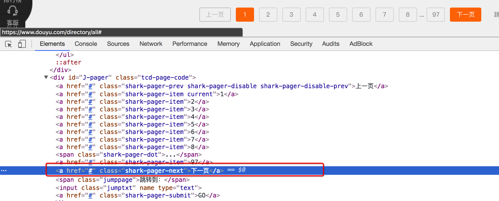
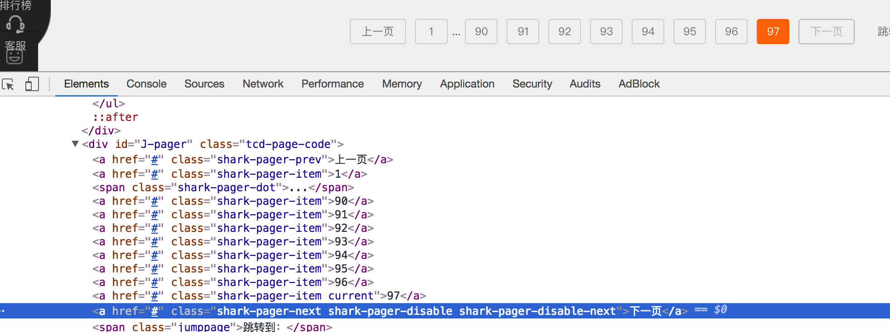
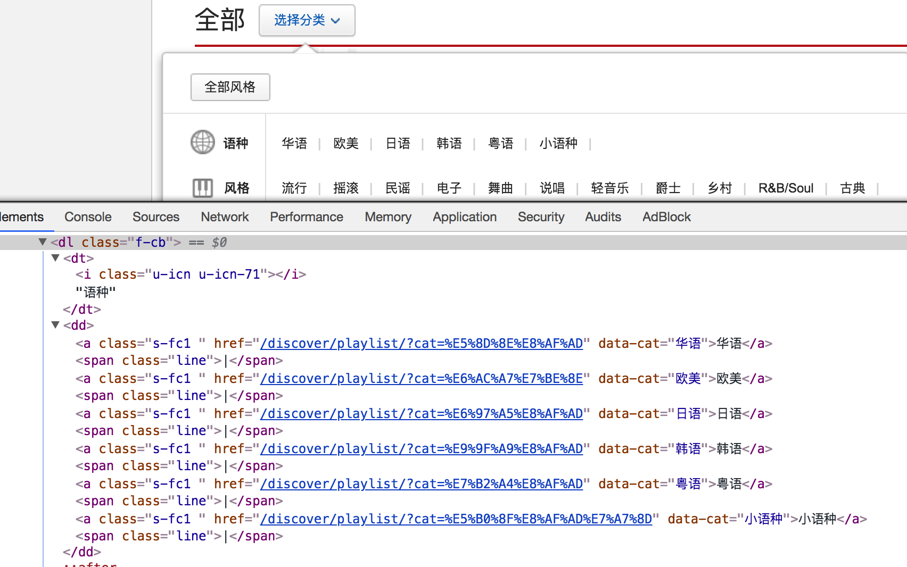
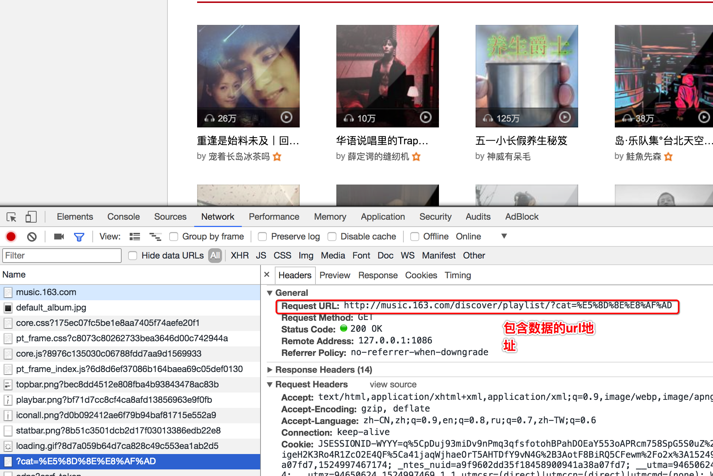
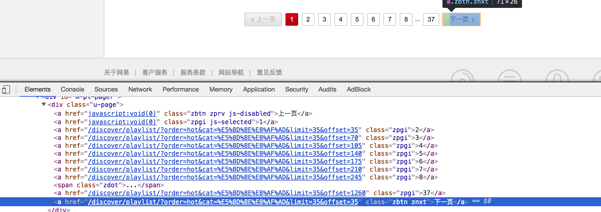
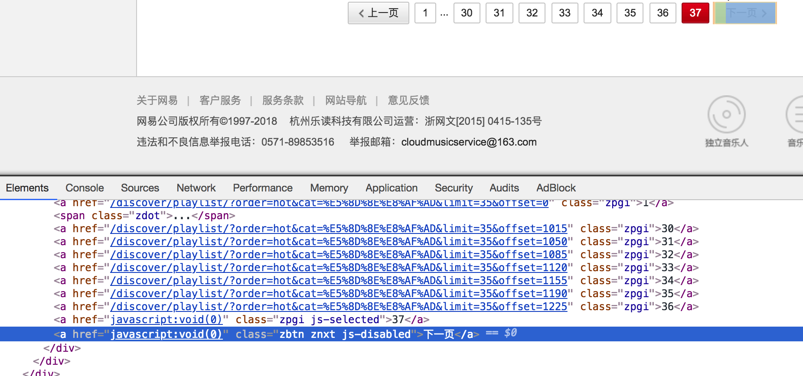

## 斗鱼爬虫

爬取斗鱼直播平台的所有房间信息：https://www.douyu.com/directory/all

##### 思路分析：

1. 数据的位置

   每个房间的数据都在`id=live-list-contentbox`的ul中

   </img>

2. 实现翻页和控制程序结束

   selenium中通过点击就可以实现翻页，观察存在下一页和不存在下一页时候标签的变化

   存在下一页时：

   </img>

   不存在下一页时：

   </img>

### 2. 作业

完成网易云音乐的所有分类下的所有的播放列表，包括：播放列表的标题和url地址

思路分析：

1. 确定程序入口的位置 首先可以定位到所有的大分类和所有的小分类

   获取所有的小分类的地址后，遍历请求获取播放列表页的首页

   </img>

2. 确定首页数据的位置和url地址

   数据不是在url地址对应的响应中，而是在另一个url地址中，可以使用selenium，也可以使用requests来获取 

   </img>

3. 实现翻页和程序停止的判断

   存在下一页的情况：

   </img>

   不存在下一页的情况

   </img>

地址：http://music.163.com/#/discover/playlist