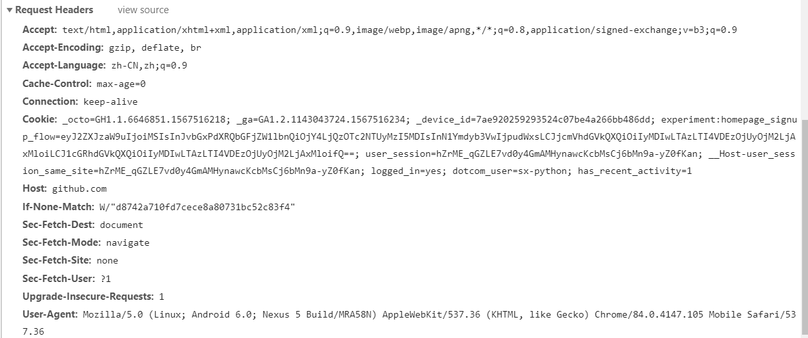
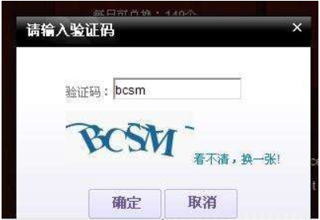

## 反爬虫介绍

目标：理解什么是反爬

​		  掌握常见的反爬手段


## 1.  反爬虫的原因

1. 　不遵守规范的爬虫会影响网站的正常使用
2. 　网站上的数据是公司的重要资产
3. 　爬虫对网站的爬取会造成网站统计数据的污染


## 2.  概念

爬虫：使用任何技术手段，批量获取网站信息的一种方式，关键在于批量

反爬虫：使用任何技术手段，阻止别人批量获取自己网站信息的一种方式，关键也在于批量

误伤：在反爬虫过程中，错误的将普通用户识别为爬虫，误伤率高的反爬虫策略，效果再好也不能用

拦截：成功阻止爬虫访问，这里会有拦截率的概念，通常来说，拦截率高的反爬虫策略，误伤的可能性就越高，因此需要权衡利与弊

```txt
举个例子，这个世界存在3家公司，售卖相同的电商产品。三家公司的名字分别是A，B，C。

这个时候，客户去A公司查询了下某商品的价格，看了下发现价格不好。于是他不打算买了。他对整个行业的订单贡献为0。

然而A公司的后台会检测到，我们有个客户流失了，原因是他来查询了一个商品，这个商品我们的价格不好。没关系，我去爬爬别人试试。

于是他分别爬取了B公司和C公司。

B公司的后台检测到有人来查询价格，但是呢，最终没有下单。他会认为，嗯，我们流失了一个客户。怎么办呢？

我可以爬爬看，别人什么价格。于是他爬取了A和C。

C公司的后台检测到有人来查询价格。。。。。

过了一段时间，三家公司的服务器分别报警，访问量过高。三家公司的CTO也很纳闷，没有生成任何订单啊，怎么访问量这么高？ 一定是其他两家禽兽写的爬虫没有限制好频率。妈的，老子要报仇。于是分别做反爬虫，不让对方抓自己的数据。然后进一步强化自己的爬虫团队抓别人的数据。一定要做到：宁叫我抓天下人，休叫天下人抓我。

然后，做反爬虫的就要加班天天研究如何拦截爬虫。做爬虫的被拦截了，就要天天研究如何破解反爬虫策略。大家就这么把资源全都浪费在没用的地方了。直到大家合并了，才会心平气和的坐下来谈谈，都少抓点。

最近国内的公司有大量的合并，我猜这种“心平气和”应该不少吧？
```


## 3.反爬分类

在看完上面的故事之后，相信大家对爬虫和反爬有了一定的理解，针对反爬策略的不同，反爬策略大致可以分为以下几个方向：

基于身份识别的反爬

基于爬虫行为的反爬

基于数据加密的反爬


## 4.基于身份识别的反爬

目标：掌握身份识别反爬的方式与解决办法


### 4.1通过headers字段来反爬

#### @通过headers中的user-agent字段来反爬

反爬原理：爬虫默认情况下没有user-agent，而是使用模块默认设置

解决方法：请求之前添加user-agent即可，更好的方式是使用user-agent池来解决（收集一堆的user-agent的方式，或者是随机生成user-agent）

```python 
import random

def get_ua():
    first_num = random.randint(55, 62)
    third_num = random.randint(0, 3200)
    fourth_num = random.randint(0, 140)
    os_type = [
        '(Windows NT 6.1; WOW64)', '(Windows NT 10.0; WOW64)', '(X11; Linux x86_64)',
        '(Macintosh; Intel Mac OS X 10_12_6)'
    ]
    chrome_version = 'Chrome/{}.0.{}.{}'.format(first_num, third_num, fourth_num)

    ua = ' '.join(['Mozilla/5.0', random.choice(os_type), 'AppleWebKit/537.36',
                   '(KHTML, like Gecko)', chrome_version, 'Safari/537.36']
                  )
    return ua
```


#### @通过referer字段或者是其他字段来反爬

反爬原理：爬虫默认情况下不会带上referer字段，服务器通过判断请求发起的源头，以此判断请求是否合法

解决方法：添加referer字段

例子：之前豆瓣电视剧爬虫案例


#### @通过cookie来反爬

反爬原理：通过检查cookies来查看发起请求用户是否具备相应权限，以此来进行反爬

解决方案：进行模拟登录，成功获取cookies之后在进行数据爬取


### 4.2通过请求参数来反爬

#### @通过从html静态文件中获取请求数据（github登录数据）

反爬原理：通过增加获取请求参数的难度进行反爬

解决方法：仔细分析抓包得到的每一个包，搞清楚之间的联系

</img>


#### @通过发送请求获取请求数据

反爬原理：通过增加获取请求参数的难度进行反爬

解决方法：仔细分析抓包得到的每一个包，搞清楚之间的联系，搞清楚请求参数的来源


#### @通过js生成请求参数（后面的js逆向破解加密）

反爬原理：js生成了请求参数

解决方法：分析js，观察加密实现的过程，通过js2py获取js的执行结果，或者使用selenium来实现


### 4.3通过验证码来反爬

反爬原理：对方服务器通过弹出验证码强制检验用户浏览行为

解决方法：打码平台或者是机器学习的方法识别验证码，其中打码平台廉价易用，更值得推荐

</img>


## 5.基于爬虫行为的反爬

目标：掌握爬虫行为反爬的方式与解决办法


### 5.1基于请求频率或总请求数量

#### @通过请求ip/账号单位时间内总请求数量进行反爬

反爬原理：正常浏览器请求网站，速度不会太快，同一个IP/账号大量请求了对方服务器，有更大可能性会被识别为爬虫

解决方法：对应的通过购买高质量的IP的方式能够解决问题/IP代理池


#### @通过同一IP/账号请求之间的间隔进行反爬

反爬原理：正常人操作浏览器浏览网站，请求之间的时间间隔是随机的，而爬虫前后两个请求之间时间间隔通常比较固定同时时间间隔比较短，因此可以用来做反爬

解决方法：请求之间进行随机等待，模拟真实用户操作，在添加时间间隔之后，为空能够高速获取数据，尽量使用IP代理池，如果是账号，则将账号请求之间设置随机休眠


#### @通过对请求IP/账号每天请求次数设置值进行反爬

反爬原理：正常的浏览器行为，其一天的请求次数是有限的，通常超过够一个值，服务器就会拒绝响应

解决方法：对应的通过购买高质量的IP的方法/多账号，同时设置请求间随机休眠


### 5.2根据爬取行为进行反爬，通常在爬取步骤上做分析

#### @通过js实现跳转来反爬

反爬原理：js实现页面跳转，无法在源码中获取下一页url

解决方法：多次抓包获取条状url，分析规律


#### @通过蜜罐（陷阱）获取爬虫IP（或者代理IP），进行反爬

反爬原理：在爬虫获取链接请求的过程中，爬虫会根据正则，xpath，css等方式进行后续链接的提取，此时服务器端可以设置一个陷阱url，会被提取规则获取，但是正常用户无法获取，这样就能有效的区分爬虫和正常用户

解决方法：完成爬虫的编写之后，使用代理批量爬取测试/仔细分析响应内容结构，找出页面中存在的陷阱


#### @通过假数据反爬

反爬原理：向返回的响应中添加假数据污染数据库，通常假数据不会被正常用户看见

解决方法：长期运行，核对数据库中数据同实际页面中数据对应情况，如果存在问题/分析响应内容


#### @阻塞任务队列

反爬原理：通过生成大量垃圾url，从而阻塞任务队列，降低爬虫的实际工作效率

解决方法：观察运行过程中请求响应状态/仔细分析源码获取垃圾url生成规则，对url进行过滤


#### @阻塞网络IO

反爬原理：发送请求获取响应的过程实际上就是下载的过程，在任务队列中混入一个大文件的url，当爬虫在进行该请求时将会占用网络io，如果是有多线程，则会占用线程

解决方法：观察爬虫运行状态/多线程请求线程计时/发送请求


#### @运维平台综合审计

反爬原理：通过运维平台综合管理，通常采用复合型反爬虫策略，多种手段同时使用

解决方法：仔细观察分析，长期运行测试目标网站，检查数据采集速度，多方面处理


## 6.基于数据加密进行反爬

目标：掌握数据加密反爬的方式与解决办法

对响应中含有的数据进行特殊化处理


### @通过自定义字体来反爬

反爬思路：使用自定义字体文件

解决思路：切换到手机版/解析字体文件进行翻译

(此图来自猫眼电影电脑版）

</img>


### @通过css来反爬

反爬原理：源码数据不为真实数据，需要通过css位移才能产生真实数据

解决方法：计算css的偏移


### @通过js动态生成数据进行反爬

反爬原理：通过js动态生成

解决思路：解析关键js，获得数据生成流程，模拟生成数据


### @通过编码格式进行反爬（飞卢小说）

反爬原理：不使用默认编码格式，在获取响应之后，通常爬虫使用utf-8格式进行解码，此时解码结果将会是乱码或者报错

解决思路：根据源码进行多格式解码，获取真正的解码格式