## 图片识别引擎

目标：掌握图片识别引擎方法的使用


## 1.  图片识别引擎介绍

在爬虫场景中，我们会遇到反爬拦截，弹出验证码验证；登录注册，也会有验证码验证，对此反爬策我们改怎么做呢？

**OCR引擎**：

OCR（Optical Character Recognition）是指使用[扫描仪](https://baike.baidu.com/item/扫描仪)或[数码相机](https://baike.baidu.com/item/数码相机)对文本资料进行[扫描](https://baike.baidu.com/item/扫描)成图像文件，然后对图像文件进行分析处理，自动识别获取文字信息及版面信息的软件。

国内最好的OCR引擎公司有：锐图信息、北京[文通](https://baike.baidu.com/item/文通)、北京[汉王](https://baike.baidu.com/item/汉王)、厦门云脉、上海合合

**Tesseract**：

Tesseract 是一个 OCR 库,目前由 Google 赞助(Google 也是一家以 OCR 和机器学习技术闻名于世的公司)。Tesseract 是目前公认最优秀、最精确的开源 OCR 系统，除了极高的精确度，Tesseract 也具有很高的灵活性。它可以通过训练识别出任何字体，也可以识别出任何 Unicode 字符

**机器视觉**：

机器视觉是人工智能正在快速发展的一个分支。简单说来，机器视觉就是用机器代替人眼来做测量和判断。机器视觉系统是通过机器视觉产品(即图像摄取装置，分CMOS和CCD两种)将被摄取目标转换成图像信号，传送给专用的图像处理系统，得到被摄目标的形态信息，根据像素分布和亮度、颜色等信息，转变成数字化信号;图像系统对这些信号进行各种运算来抽取目标的特征，进而根据判别的结果来控制现场的设备动作


## 2.  爬虫使用的识别引擎Tesseract

我们以下面识别的这首诗为例：

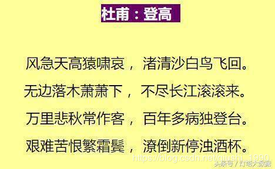</img>

需要让程序识别这张图片，我们需要

第一步安装：

两个库：pytesseract和PIL

安装识别引擎tesseract-ocr

```python 
pip install PIL  若报错，切换 pip install pillow
pip install pytesseract
```

若是用的pycharm编辑器，可以直接借助pycharm实现快速安装，在pycharm的settings设置页按照下面步骤操作

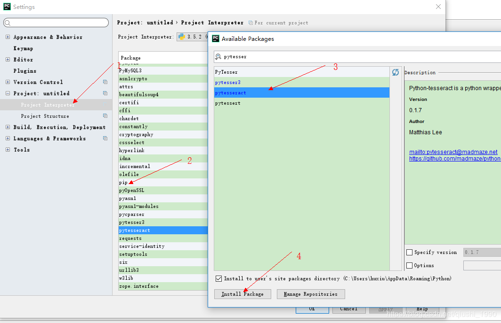</img>

这样就能成功安装pytesseract，安装PIL只需要在上面的第三步里搜索PIL并点击安装即可

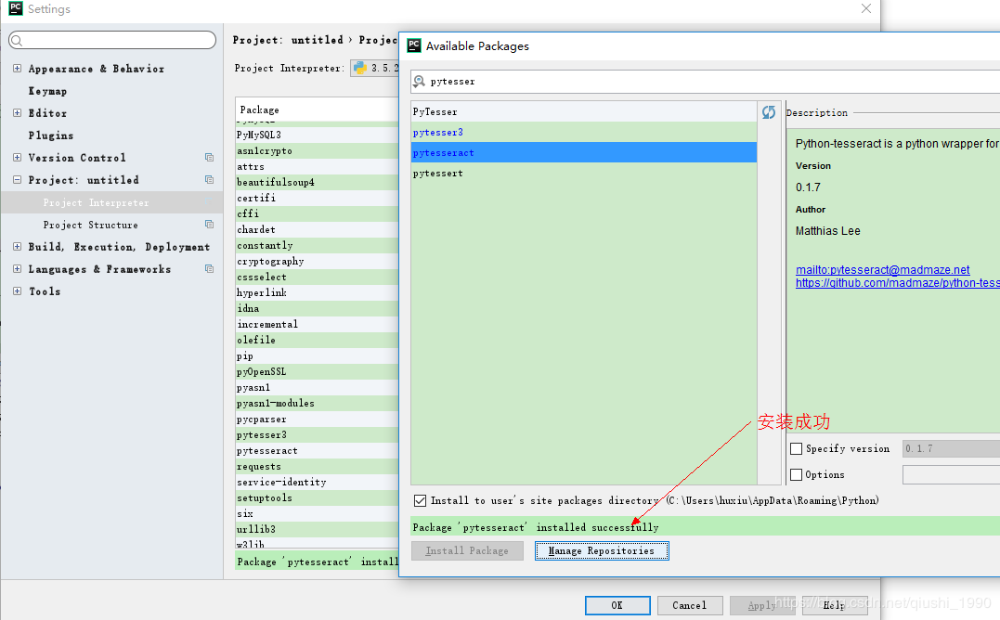</img>

这时我们安装好库之后，运行代码

```python
from PIL import Image
import pytesseract
text=pytesseract.image_to_string(Image.open('denggao.jpeg'),lang='chi_sim')
print(text)
```

会报下面错误，错误原因是：没有安装识别引擎tesseract-ocr

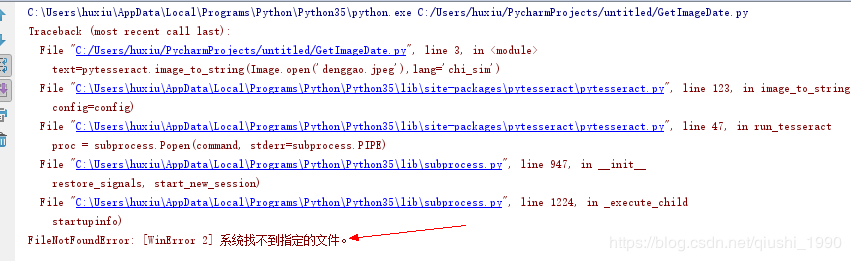</img>

第二步：安装识别引擎tesseract-ocr        

版本选择：https://digi.bib.uni-mannheim.de/tesseract/

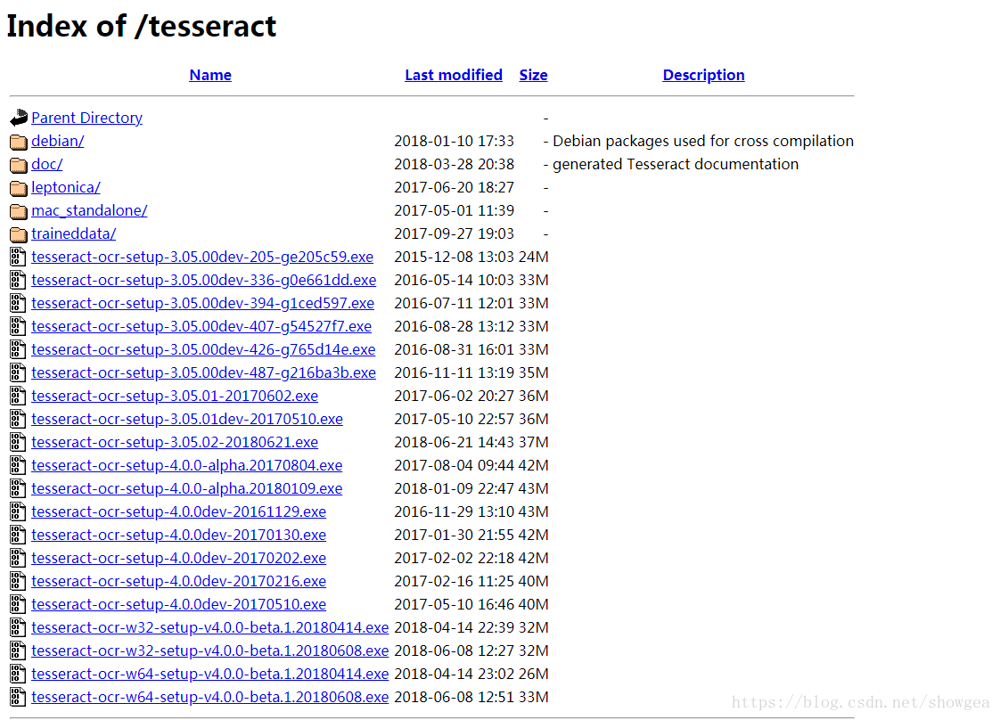</img>

其中文件名中带有dev的为开发版本，不带dev的为稳定版本，可以选择下载不带dev的版本，例如可以选择下载tesseract-ocr-setup-3.05.02.exe。

下载完成后双击，此时会出现如下图所示的页面

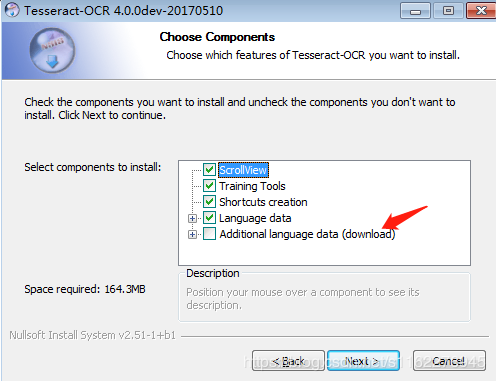</img>

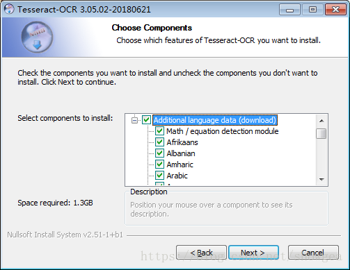</img>

### 2、配置环境变量

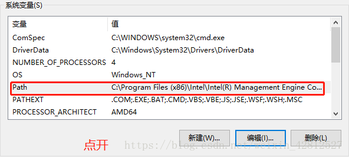</img>

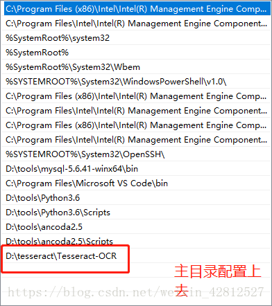</img>

三：同样再系统变量中添加一个变量名字为：

```
TESSDATA_PREFIX //变量名字
D:\tesseract\Tesseract-OCR\tessdata  // 自己的tessdata
```

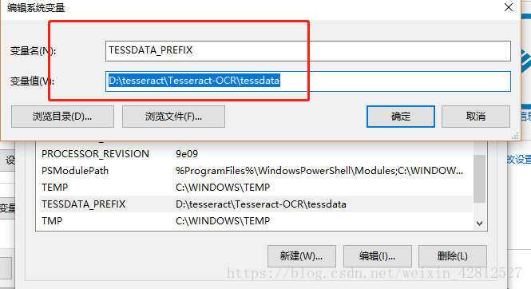</img>

安装完之后，我们还需要做一下配置

```python
# CHANGE THIS IF TESSERACT IS NOT IN YOUR PATH, OR IS NAMED DIFFERENTLY
#tesseract_cmd = 'tesseract'
tesseract_cmd = 'C:/Program Files (x86)/Tesseract-OCR/tesseract.exe'
```

通过pycharm快速打开pytesseract.py

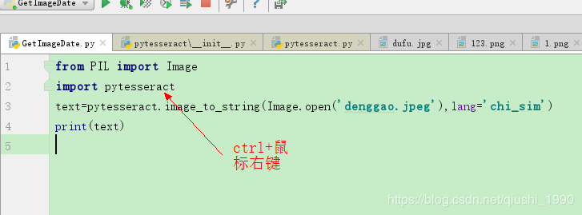</img>

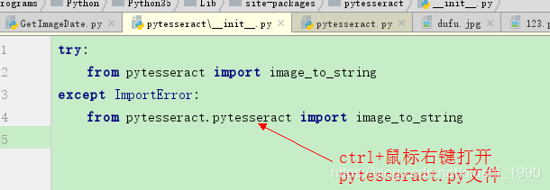</img>

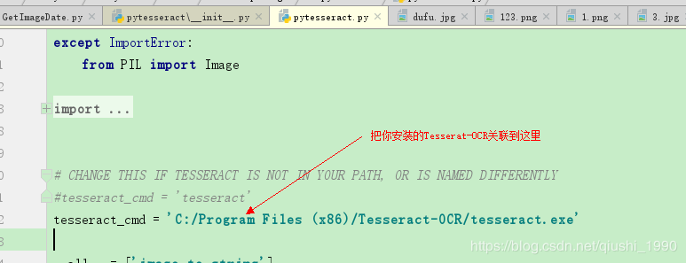</img>

在第37行，**重启pycharm**

至此我们所有的配置就完成了，运行下面代码就可以把杜甫的登高这首图片诗解析成文字了

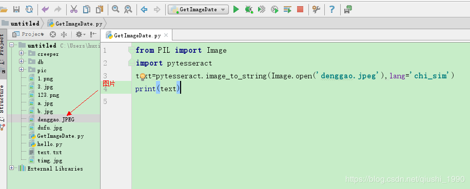</img>

识别结果

```txt
风急天高猿啸哀 渚芸胄芳少白鸟飞凤
无边落木萧萧下, 不尽长量工盲衮宕衮来
万里悲秋常1乍窨, 百年多病独登氤
艰难苦恨擎霜量 漂倒新停澍酉帆
```

可以看到，只能识别出大部分字体，少部分字体还是识别不出来，对于这个问题，我们怎么解决呢？