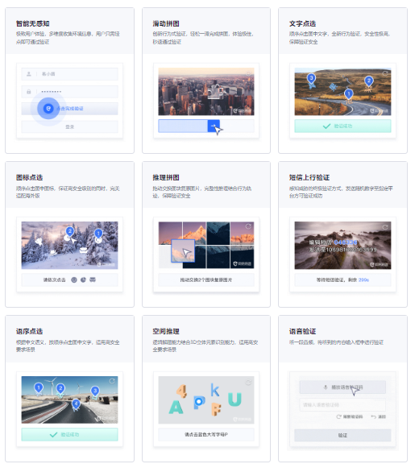

## @验证码分类

</img>


## @数字&文字&字母验证码--------根据图片输入

```python
from selenium import webdriver
from PIL import Image
from requests_html import HTMLSession

session = HTMLSession()
import base64
import time
driver = webdriver.Chrome()
# 窗口最大化
driver.maximize_window()
start_url = 'http://www.jianjiaoshuju.com/path/login.htm'
driver.get(start_url)
"""第一种：通过截图"""
driver.find_element_by_xpath('/html/body/div[2]/div/div[1]/ul/li[1]/input').send_keys('16607440667')
driver.find_element_by_xpath('/html/body/div[2]/div/div[1]/ul/li[2]/input').send_keys('songxu3523520')
"""核心操作 (一)：通过截图，获得验证码图片"""
# driver.save_screenshot('首页.png')
# # 获取验证码所在的标签
# img = driver.find_element_by_xpath('/html/body/div[2]/div/div[1]/ul/li[3]/div/span/img')
# # 实例化标签对象
# location = img.location
# # 获取标签大小
# size = img.size
# # 获取验证码上下左右的坐标
# left = location['x'] + 300
# top = location['y'] + 110
# right = left + size['width'] + 20
# bot = top + size['height'] + 10
# # 打开首页.png图片
# photo = Image.open('首页.png')
# img_obj = photo.crop((left, top, right, bot))
# img_obj.save('验证码.png')
# """
# AppCode：	20B9054575C6917DE9BC05175DDAD2D2
# AppKey：	AKIDa0fac224bccad10c4ea86d9b73bd4f62
# AppSecret：	a5a51b5a2cff7dcd5fdc9cd82d11e7bd
#
# """
"""核心操作(二)：直接获取验证码图片"""
# 定位验证码所在的标签位置
img_obj = driver.find_element_by_xpath('/html/body/div[2]/div/div[1]/ul/li[3]/div/span/img')
# 截图 ---- 直接截图
img_obj.screenshot('验证码2.png')
"""验证码图片base64加密字符串"""
with open('验证码2.png', 'rb')as f:
    base64_data = base64.b64encode(f.read()).decode()
img_url = 'http://apigateway.jianjiaoshuju.com/api/v_1/yzm.html'
headers = {
    'AppCode': '20B9054575C6917DE9BC05175DDAD2D2',
    'AppKey': 'AKIDa0fac224bccad10c4ea86d9b73bd4f62',
    'AppSecret': 'a5a51b5a2cff7dcd5fdc9cd82d11e7bd'
}

data = {
    'v_pic': base64_data,
    'v_type': 'ne4'
}

response = session.post(img_url, data=data, headers=headers).json()
img_code = response['v_code']
driver.find_element_by_xpath('/html/body/div[2]/div/div[1]/ul/li[3]/div/div/input').send_keys(img_code)
driver.find_element_by_xpath('/html/body/div[2]/div/div[1]/ul/li[4]/button').click()
time.sleep(1)
driver.find_element_by_xpath('//*[@id="layui-layer2"]/div[3]/a').click()
```


## @滑块验证码--------以豆瓣为例(对接打码平台计算滑动距离)

```python
from selenium import webdriver
from requests_html import HTMLSession
import base64
session = HTMLSession()
import time
driver = webdriver.Chrome()
driver.implicitly_wait(10)
# 窗口最大化
driver.maximize_window()
start_url = 'https://accounts.douban.com/passport/login_popup?login_source=anony'
driver.get(start_url)
# 点击密码登录
driver.find_element_by_xpath('/html/body/div[1]/div[1]/ul[1]/li[2]').click()
driver.find_element_by_id('username').send_keys('16607440667')
driver.find_element_by_id('password').send_keys('aef123456')
driver.find_element_by_xpath('/html/body/div[1]/div[2]/div[1]/div[5]/a').click()
"""在登录之后会弹出验证码"""
time.sleep(10)
el_iframe_1 = driver.find_element_by_id('tcaptcha_iframe')
driver.switch_to.frame(el_iframe_1)
# 定位滑动验证码标签位置
img_obj = driver.find_element_by_css_selector('#slideBg')
print(img_obj)
# 保存验证码
img_obj.screenshot('豆瓣.png')
"""核心部分"""
headers = {
    'AppCode': '20B9054575C6917DE9BC05175DDAD2D2',
    'AppKey': 'AKIDa0fac224bccad10c4ea86d9b73bd4f62',
    'AppSecret': 'a5a51b5a2cff7dcd5fdc9cd82d11e7bd'
}
with open('豆瓣.png', 'rb')as f:
    base64_data = base64.b64encode(f.read()).decode()
img_url = 'http://apigateway.jianjiaoshuju.com/api/v_1/yzmCrd.html'
data = {
    'v_pic': base64_data,
    'v_type': 'sld'
}
response = session.post(img_url, headers=headers, data=data).json()
print(response)
```


## @图案点击验证码--------B站登录案例

```python
# !/usr/bin/env python
# -*- coding: utf-8 -*-
# ------------------------------

import time, base64, json, requests
from selenium import webdriver
from selenium.webdriver import ActionChains


# def main():
# 1、实例化 driver对象
driver = webdriver.Chrome()
driver.maximize_window()
driver.get(r'https://passport.bilibili.com/login')
driver.implicitly_wait(10)

# aef、定位 账号 和 密码标签
driver.find_element_by_id('login-username').send_keys(r'')
time.sleep(2)
driver.find_element_by_id('login-passwd').send_keys('')
time.sleep(2)
driver.find_element_by_css_selector('#geetest-wrap > div > div.btn-box > a.btn.btn-login').click()

# 3、获取弹窗验证图片
time.sleep(2)
driver_img = driver.find_element_by_css_selector('body > div.geetest_panel.geetest_wind > div.geetest_panel_box.geetest_no_logo.geetest_panelshowclick > div.geetest_panel_next > div')
driver_img.screenshot('验证码.png')
time.sleep(3)

# 4、对接打码平台
print(r'-----------------------------正在对接打码平台--------------------------------' + '\n')
with open('./验证码.png', 'rb') as f:
    base64_data = base64.b64encode(f.read())
    b64 = base64_data.decode()
data = {"username": '15675209157', "password": 'q6631801', "image": b64, 'typeid': 21}
result = json.loads(requests.post("http://api.ttshitu.com/imageXYPlus", json=data).text)
if result['success']:
    code_result = result["data"]["result"]
else:
    code_result = result["message"]
print(r'----------------识别成功：当前验证码识别结果为：{}---------'.format(code_result) + '\n')

# 5、获取验证字 定位
print(r'-----------------------------正在点击验证码----------------------------------' + '\n')
for code in code_result.split(r'|'):
    x = int(code.split(',')[0])
    y = int(code.split(',')[1])

    # 6、设置验证码点击方式
    ActionChains(driver).move_to_element_with_offset(driver_img, x, y).click().perform()
    time.sleep(1)
print(r'--------------------------------验证码点击完成---------------------------------' + '\n')

# 点击确定，登录账号
time.sleep(3)
driver.find_element_by_css_selector('body > div.geetest_panel.geetest_wind > div.geetest_panel_box.geetest_no_logo.geetest_panelshowclick > div.geetest_panel_next > div > div > div.geetest_panel > a > div').click()
print(r'---------------------------------账号登录成功----------------------------------')
```


## @京东登录案例(参考：精确度低)--------滑动验证<计算型>

```python
from 案例文件夹.selenium处理验证码 import pwd
from selenium.webdriver import ActionChains
from urllib import request
from selenium import webdriver
import numpy as np
import time, cv2


"""创建driver对象"""
driver = webdriver.Chrome()
driver.maximize_window()


"""准备起始的访问url地址"""
start_url = 'https://www.jd.com/'


"""访问"""
driver.get(start_url)
time.sleep(2)


"""跳转登录页面"""
driver.find_element_by_link_text('你好，请登录').click()
time.sleep(1.5)


"""账号密码登录"""
driver.find_element_by_link_text('账户登录').click()


"""账户密码输入"""
driver.find_element_by_id('loginname').send_keys('16607440667')
driver.find_element_by_id('nloginpwd').send_keys(pwd)


"""登录按钮点击"""
driver.find_element_by_id('loginsubmit').click()


"""获取验证码缺口图片url地址"""
# 背景缺口图链接
backimgUrl = driver.find_element_by_xpath(r'//div/div[@class="JDJRV-bigimg"]/img').get_attribute("src")
# 块状缺口链接
gapUrl = driver.find_element_by_xpath(r'//div/div[@class="JDJRV-smallimg"]/img').get_attribute("src")
request.urlretrieve(backimgUrl, "backing.png")
request.urlretrieve(gapUrl, "gap.png")


"""将图片灰度化"""
# 获取图片并灰度化
block = cv2.imread("gap.png", 0)
template = cv2.imread("backing.png", 0)
# 二值化后的图片名称
blockName = "block.jpg"
templateName = "template.jpg"
# 将二值化后的图片进行保存
cv2.imwrite(blockName, block)
cv2.imwrite(templateName, template)
block = cv2.imread(blockName)
block = cv2.cvtColor(block, cv2.COLOR_RGB2GRAY)
block = abs(255 - block)
cv2.imwrite(blockName, block)
block = cv2.imread(blockName)
template = cv2.imread(templateName)
# 获取偏移量
result = cv2.matchTemplate(block, template,
                           cv2.TM_CCOEFF_NORMED)  # 查找block在template中的位置，返回result是一个矩阵，是每个点的匹配结果
x, y = np.unravel_index(result.argmax(), result.shape)
print(x, y)


"""计算滑动距离"""
print("需要移动的距离", y)
track = []  # 移动轨迹
current = 0  # 当前位移
# 减速阈值
mid = y * 4 / 5  # 前4/5段加速 后1/5段减速
t = 0.2  # 计算间隔
v = 0  # 初速度
while current < y:
    if current < mid:
        a = 3  # 加速度为+3
    else:
        a = -3  # 加速度为-3
    v0 = v  # 初速度v0
    v = v0 + a * t  # 当前速度
    move = v0 * t + 1 / 2 * a * t * t  # 移动距离
    current += move  # 当前位移
    track.append(round(move))  # 加入轨迹


"""执行滑动"""
slider = driver.find_elements_by_xpath(r'//div[@class="JDJRV-slide-inner JDJRV-slide-btn"]')[0]
ActionChains(driver).click_and_hold(slider).perform()
for x in track:  # 只有水平方向有运动 按轨迹移动
    ActionChains(driver).move_by_offset(xoffset=x-20, yoffset=0).perform()
time.sleep(1)
ActionChains(driver).release().perform()  # 松开鼠标

```


## @图案点击&滑块双重验证--------12306登录案例

```python
from my_Spider import user_12306, pass_wd_12306
from selenium import webdriver
from selenium.webdriver import ActionChains
driver = webdriver.Chrome()
from requests_html import HTMLSession
session = HTMLSession()
import time, base64, random

start_url = 'https://kyfw.12306.cn/otn/resources/login.html'
# 窗口最大化
driver.maximize_window()
driver.get(start_url)
# 点击账号登录
driver.find_element_by_xpath('/html/body/div[2]/div[2]/ul/li[2]/a').click()
driver.find_element_by_id('J-userName').send_keys(user_12306)
driver.find_element_by_id('J-password').send_keys(pass_wd_12306)
# 由于验证码只显示一半，需要执行窗口向下滑动
js = 'scrollTo(0, {})'.format(500)
driver.execute_script(js)
time.sleep(1)
# 定位验证码所在的标签
img_obj = driver.find_element_by_xpath('//*[@id="J-loginImg"]')
img_obj.screenshot('12306验证码.png')
# 读取验证码然后base64加密
with open('12306验证码.png', 'rb')as f:
    base64_data = base64.b64encode(f.read()).decode()

img_url = 'http://apigateway.jianjiaoshuju.com/api/v_1/yzmCrd.html'
data = {
    'v_pic': base64_data,
    'v_type': 'crd'
}
headers = {
    'AppCode': '20B9054575C6917DE9BC05175DDAD2D2',
    'AppKey': 'AKIDa0fac224bccad10c4ea86d9b73bd4f62',
    'AppSecret': 'a5a51b5a2cff7dcd5fdc9cd82d11e7bd',
    'user-agent': ua.chrome
}
response = session.post(img_url, headers=headers, data=data).json()
print(response)
"""对接打码平台"""
headers = {
    'AppCode': '20B9054575C6917DE9BC05175DDAD2D2',
    'AppKey': 'AKIDa0fac224bccad10c4ea86d9b73bd4f62',
    'AppSecret': 'a5a51b5a2cff7dcd5fdc9cd82d11e7bd',
    'User-Agent': 'Mozilla/5.0 (Windows NT 10.0; Win64; x64) AppleWebKit/537.36 (KHTML, like Gecko) Chrome/89.0.4389.114 Safari/537.36'
}
post_url = 'http://apigateway.jianjiaoshuju.com/api/v_1/yzmCrd.html'
with open('验证码12306.png', 'rb')as f:
    base64_data = base64.b64encode(f.read()).decode()
data = {
    'v_pic': base64_data,
    'v_type': 'crd'
}
response = session.post(post_url, headers=headers, data=data).json()
print(response)
v_code = response['v_code']
for code in v_code.split('|'):
    # 获取x坐标
    x = int(code.split(',')[0])
    # 获取y坐标
    y = int(code.split(',')[1])
    # 执行点击                                        验证码的对象，x，y
    ActionChains(driver).move_to_element_with_offset(img, x, y).click().perform()
    # 每次停留0.5秒，模拟人的判断
"""点击登录"""
time.sleep(random.randint(1, 2))
driver.find_element_by_id('J-login').click()

"""处理滑块验证码"""
# 定位滑块验证码的长度
div_size_obj = driver.find_element_by_xpath('//*[@id="nc_1__scale_text"]/span')
# 获取宽高
div_size = div_size_obj.size
# 定位滑块按钮位置
button = driver.find_element_by_xpath('//*[@id="nc_1_n1z"]')
# 实例化
button_location = button.location
# 鼠标拖动操作
# 计算出拖动距离
y = button_location['y']
print(y)  # 332
# 鼠标的拖动操作：
# ActionChains:可以控制鼠标，鼠标按钮操作，上下文切换等等
"""第一种模式"""
action = ActionChains(driver)
action.click_and_hold(button).perform()
action.move_by_offset(332, 0)
action.release().perform()
"""第二种模式"""
ActionChains(driver).click_and_hold(button).move_by_offset(y, 0).perform()
```

