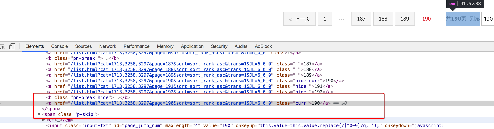
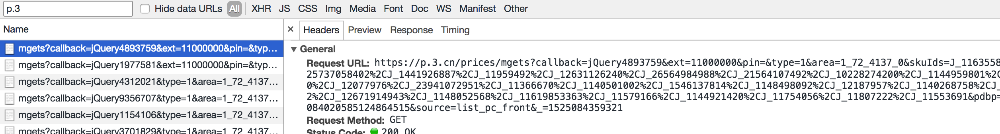

### 7. 动手

需求：抓取京东图书的信息

目标：抓取京东图书包含图书的名字、封面图片地址、图书url地址、作者、出版社、出版时间、价格、图书所属大分类、图书所属小的分类、分类的url地址

url：https://book.jd.com/booksort.html

##### 思路分析：

1. 确定数据抓取的入口

   数据都在dl下的dt和dd中，其中dt是大分类的标签，dd是小分类的标签

   对应的思路可以使选择所有的大分类后，选择他下一个兄弟节点即可

   xpath中下一个兄弟节点的语法是`following-sibling::*[1]`

   </img>

2. 确定列表页的url地址和程序终止的条件

   有下一页

   </img>

   没有下一页

   </img>

3. 确定数据的位置

   数据大部分都在url地址的响应中，但是价格不在

   </img>

   通过`search all file`的方法，找到价格的地址，

   </img>

   对url地址进行删除无用的参数和url解码之后，获取到价格的url为

   `https://p.3.cn/prices/mgets?skuIds=J_11635586613`

   其中skuId为商品的id，能够在网页中获取

4. 使用scrapy的思路完成爬虫，在settings中添加上scrapy_redis的配置

## 总结

- 本小结重点
  - 知道什么是scrapy_redis
  - 掌握scarpy_redis实现分布式的原理
  - 掌握scrapy_进行url地址加密的方法
  - 掌握request对象入队的条件
  - 能够通过scrapy_redis完成基于url地址的增量式爬虫