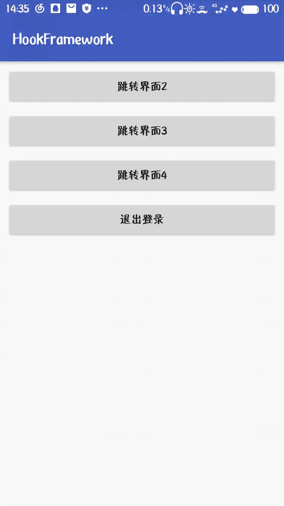
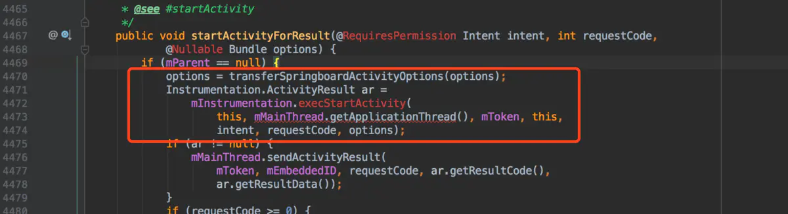
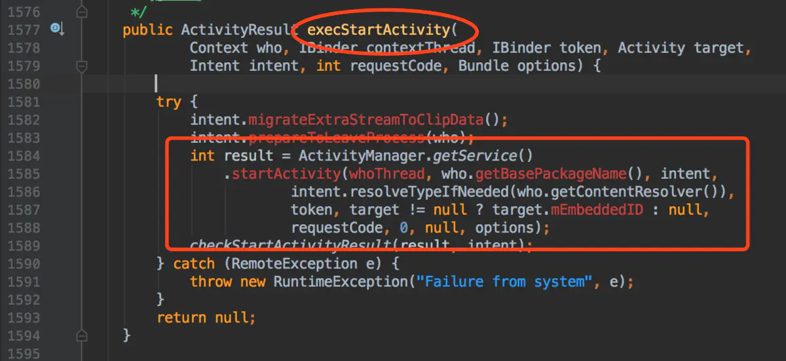
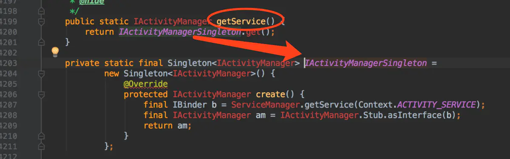
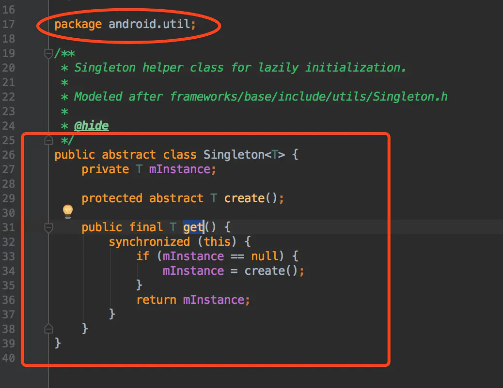
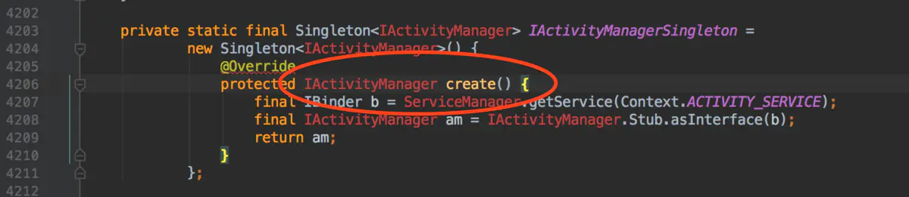
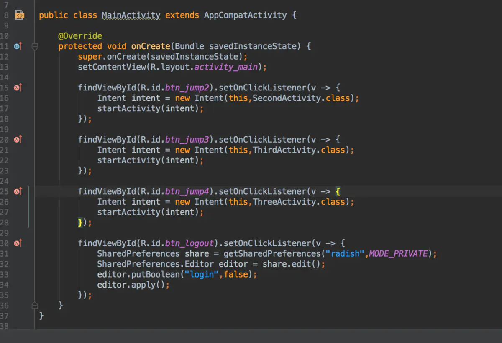
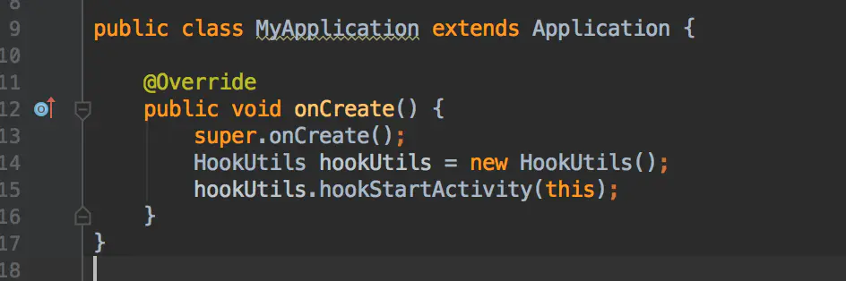
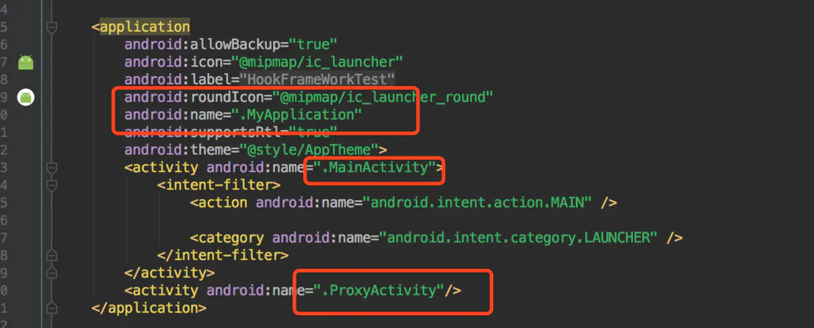
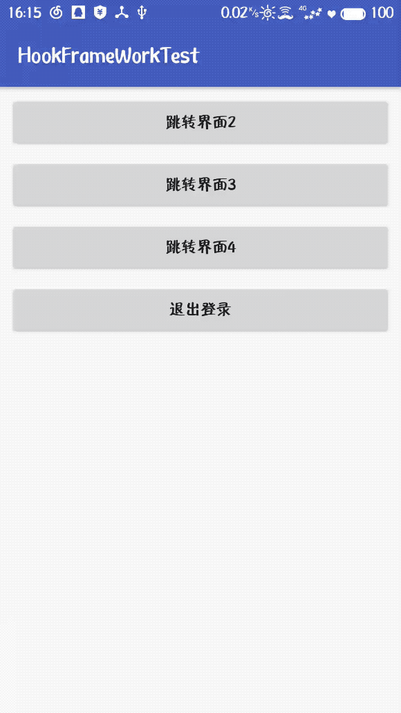

## @什么是 Hook 技术

------

  Hook 技术又叫做钩子函数，在系统没有调用该函数之前，钩子程序就先捕获该消息，钩子函数先得到控制权，这时钩子函数既可以加工处理（改变）该函数的执行行为，还可以强制结束消息的传递。简单来说，就是把系统的程序拉出来变成我们自己执行代码片段。
  要实现钩子函数，有两个步骤：

    1. 利用系统内部提供的接口，通过实现该接口，然后注入进系统（特定场景下使用）
    2. 动态代理（使用所有场景）


## @Hook 技术实现的步骤

------

  Hook 技术实现的步骤也分为两步
  1.找到 hook 点（Java 层），该 hook 点必须满足以下的条件：需要 hook 的方法，所属的对象必须是静态的，因为我们是通过反射来获取对象的，我们获取的是系统的对象，所以不能够 new 一个新的对象，必须用系统创建的那个对象，所以只有静态的才能保证和系统的对象一致。
  2.将 hook 方法放到系统之外执行（放入我们自己的逻辑）


## @使用 hook 技术实现免注册式跳转

------

</img>

  解释一下上面的步骤，我们有一个 MainActivity，四个按钮，前三个是打开不同的 Activity，最后一个是退出登录，这三个 Activity 其中界面2是不需要登录的，界面3和界面4都是需要登录才能看到的。
  那么既然要在打开 Activity 之前就判断是否登录了，而且要使用 hook 技术，那么我们下看一下 startActivity 的源码，因为我们知道我们需要 hook 的就是 startActivity 方法。

### 找 Hook 点

</img>

</img>

</img>

> 注意：上述源码只有部分源码，为了方便截屏，并不是全部的源码，如果想看全部源码，请自行查看。

  看到这，我们明白了，其实是 ActivityManager.getService() 最终调用了 startActivity() 方法，我们看 ActivityManager.getService() 方法。

</img>

</img>

</img>

  解释一下上面的源码，ActivityManager.getService()方法调用的是 IActivityManagerSingleton.get()方法，而这个IActivityManagerSingleton是 Singleton(android.util)，所以 IActivityManagerSingleton.get()就是调用了 Singleton 里面的 get 方法，进到 Singleton 类，发现 get() 方法里面会通过 create() 抽象方法方法给 mInstance 属性赋值，回到刚才的地方，我们发现，create() 方法返回了一个 IAcivityManager 对象。最终结果：其实最终是 IActivityManager 调用了 startActivity() 方法。
  所以我们真正想 hook 的点是 IActivityManager 对象，那么如何拿到这个静态对象呢？其实聪明的帅哥和美女肯定都发现了，这个 IActivityManagerSingleton 其实就是一个静态的，而且我们拿到该系统对象后就获取到该对象的 mInstance 属性，即 IActivityManager，那么我们就把 IActivityManagerSingleton 当做一个伪 hook 点。
  hook 点已经找到了，第一步已经完成，接下来就该第二步了，那么如何将系统执行的 startActivity() 拉到系统外执行，给其添加一些自己的逻辑呢？这里我们使用动态代理来实现。
  这里大概说一下项目，肯定有五个 Activity，一个 MainActivity 是用来展示四个按钮的，一个 LoginActivity，还有其他三个是测试的展示页面，其实还有一个 ProxyActivity，并且，在清单文件中，我们除了 MainActivity 是启动页，ProxyActivity 进行了注册，其他的 Activity 都没有在清单文件中注册，没错，你没有看错，就是没有注册，那运行会崩溃吗？空口无凭，我们先看一下代码，然后看运行结果。

```java
package com.radish.android.hookframeworktest;

import android.content.Context;
import android.content.Intent;

import java.lang.reflect.Field;
import java.lang.reflect.InvocationHandler;
import java.lang.reflect.Method;
import java.lang.reflect.Proxy;

public class HookUtils {

    private Context context;

    public void hookStartActivity(Context context) {
        this.context = context;
        try {
            /**
             * 这里注意一下，用我们分析的源码运行不了，所以稍微改了一下，
             * 思路什么都一样，只是源码的属性名做了修改
             */
//            Class<?> activityManagerClass = Class.forName("android.app.ActivityManager");
            Class<?> activityManagerClass = Class.forName("android.app.ActivityManagerNative");
            //拿到 IActivityManagerSingleton 属性
//            Field field = activityManagerClass.getDeclaredField("IActivityManagerSingleton");
            Field field = activityManagerClass.getDeclaredField("gDefault");
            field.setAccessible(true);
            //获取到是 Singleton 对象，也就是 field 对应的类型
            Object singletonObj = field.get(null);

            //然后获取 Singletone 的 mInstance 属性
            Class<?> singtonClass = Class.forName("android.util.Singleton");
            Field mInstanceField = singtonClass.getDeclaredField("mInstance");
            mInstanceField.setAccessible(true);
            //真正的 hook 点
            Object iActivityManagerObj = mInstanceField.get(singletonObj);

            //hook 第二步，动态代理
            Class<?> iActivityManagerIntercept = Class.forName("android.app.IActivityManager");
            StartActivityHandler startActivityHandler = new StartActivityHandler(iActivityManagerObj);
            Object proxyIActivityManager = Proxy.newProxyInstance(getClass().getClassLoader(),
                    new Class[]{iActivityManagerIntercept}, startActivityHandler);
            //在这我们将系统的对象更换成我们生成的动态代理对象，为了是调用动态代理的 invoke 方法，不更换不执行
            mInstanceField.set(singletonObj, proxyIActivityManager);
        } catch (Exception e) {
            e.printStackTrace();
        }
    }

    class StartActivityHandler implements InvocationHandler {

        //系统真正的对象
        private Object trueIActivityManager;

        public StartActivityHandler(Object trueIActivityManager) {
            this.trueIActivityManager = trueIActivityManager;
        }

        @Override
        public Object invoke(Object proxy, Method method, Object[] args) throws Throwable {
            if ("startActivity".equals(method.getName())) {
                System.out.println("abc : --------------------- startActivity ---------------------");
                Intent intent = null;
                int index = -1;
                for (int i = 0; i < args.length; i++) {
                    Object obj = args[i];
                    if (obj instanceof Intent) {
                        //找到 startActivity 传递进来的 Intent
                        intent = (Intent) obj;
                        index = i;
                    }
                }
                //瞒天过海，获取想要跳转的意图，进行篡改
                Intent newIntent = new Intent(context, ProxyActivity.class);
                //我们将真实的意图封装在假意图当中
                newIntent.putExtra("oldIntent", intent);
                args[index] = newIntent;
            }
            return method.invoke(trueIActivityManager, args);
        }
    }
}
```

</img>

  然后就是如何使用了

</img>

</img>

</img>

  总结下，目前我们实现的功能是，不管你跳转任何的 Activity，我们都跳转到 ProxyActivity，所以我们只需要在清单文件中注册一个 ProxyActivity 而不用注册其他的 Activity 也不会崩溃，是如何实现的呢？我们是通过使用 hook 技术篡改 Intent，并将你真正的意图存放到我们新的 Intent 中。这时候，应该有些人要打我了，我明明想去东京和巴黎，你却带我去了浪漫的土耳其~~~~~
  别急，还没完呢。

