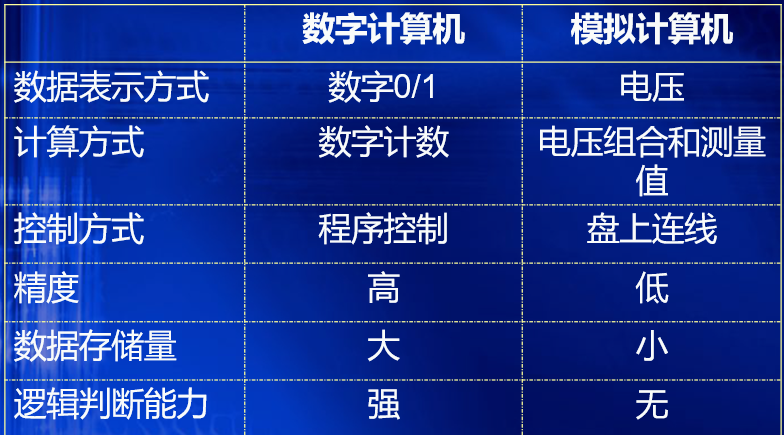

[TOC]

# 第一章

## 计算机的分类

### 电子计算机

1. 电子模拟计算机，运算过程是连续的&#x20;

2. 电子数字计算机，运算过程是变化不连续的

   

   *   专用计算机&#x20;
   *   通用计算机

       1.  &#x20;超级计算机（巨型机）&#x20;
       2.  大型机&#x20;
       3.  服务器&#x20;
       4.  PC机&#x20;
       5.  单片机&#x20;
       6.  多核机

## 计算机硬件

- 运算器

  核心：ALU（算术逻辑单元）

  执行部位，算术运算和逻辑运算

  字长一般8、16、32、64

- 控制器

  计算机指挥中心，控制计算机的每个功能部件在特定的时刻执行特定的操作

  指令译码器、时序发生器、操作控制器、指令寄存器

  通过指令来实现计算机工作控制，读取指令和访问数据

  **基本任务：按照一定的顺序一条接着一条取指令、指令译码、执行指令。包括取指周期和执行周期**

  每一个基本操作叫做一条**指令**，解算某一问题的一串指令序列叫**计算程序**。

  指令分为两部分组成，操作码（操作的性质）和地址码（操作数的地址）

  取指令的一段时间为**取指周期**，执行指令的一段时间为**执行周期**

  **取指周期中从内存读出的信息流是指令流**，它流向控制器；而在**执行器周期中从内存读出的信息流是数据流**，它由内存流向运算器。

- 存储器

  存储程序（指令）和数据

  内存（ROM，RAM）和外存

  存储器吧保持一个数的16个触发器成为一个存储单元。**主存储器由许多存储单元**组成，每个存储单元包含若干个**存储元件**，每个元件存储一位二进制代码。存储单元可存储一串二进制代码，称这串代码为**存储字**，其长度为**存储字长**，存储字长可以是一个字节或者是字节的偶数倍。每个存储单元都有编号是为**地址**。存储器所有的存储单元总数称为存储器的**存储容量**。

  地址存取方式：主存储器的工作方式是按存储单元的地址进行存取的。

- 输入设备

- 输出设备

## 冯诺依曼计算机

1. 五大部件组成
2. 存储程序。指令和数据以同等地位存于存储器， 可按地址寻访
3. 指令和数据用二进制表示
4. 指令由操作码和地址码（操作数）组成
5. 以运算器为中心

# 第三章

## 存储系统概述

### 存储器分类

- 存储介质
  - 磁表面
  - 半导体存储器
  - 光存储器
- 存取方式
  - 随机抽取
  - 顺序存取
- 读写功能
  - 只读存储器ROM
  - 随机存取存储器RAM
- 信息易失性
  - 易失性存储器
  - 非易失性存储器
- 作用
  - cache（高速缓冲存储器）
  - 内存/主存储器
  - 外存/辅助存储器
  - 控存

