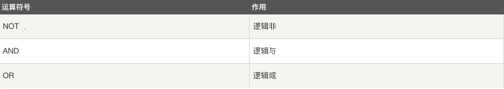

# 表数据基本操作

## 1. INSERT：插入数据

数据库与表创建成功以后，需要向数据库的表中插入数据。在 MySQL 中可以使用 INSERT 语句向数据库已有的表中插入一行或者多行数据。

```mysql
# 1. 插入完整数据（顺序插入）
# 语法一：
INSERT INTO 表名(字段1,字段2,字段3…字段n) VALUES(值1,值2,值3…值n);

# 语法二：
INSERT INTO 表名 VALUES (值1,值2,值3…值n);

# 2. 指定字段插入数据
INSERT INTO 表名(字段1,字段2,字段3…) VALUES (值1,值2,值3…);

# 3. 插入多条记录
INSERT INTO 表名 VALUES
(值1,值2,值3…值n),
(值1,值2,值3…值n),
(值1,值2,值3…值n);
```

## 2. SELECT：数据表查询语句

在 MySQL 中，可以使用 SELECT 语句来查询数据。查询数据是指从数据库中根据需求，使用不同的查询方式来获取不同的数据，是使用频率最高、最重要的操作。

```mysql
select * from 表名 [where 条件];
select 字段1,字段2 from 表名 [where 条件];
```

### where子句

where子句在sql语句中扮演了重要角色，主要通过一定的运算条件进行数据的筛选，在查询，删除，修改中都有使用。

* 算数运算符


- 比较运算符

    

- 逻辑运算符

    

## 3. UPDATE：修改数据

```mysql
update 表名 set 字段1=值1,字段2=值2,... where 条件;

# 注意:update语句后如果不加where条件,所有记录全部更新
```

## 4. DELETE：删除数据

```mysql
delete from 表名 where 条件;

# 注意:delete语句后如果不加where条件,所有记录全部清空
```

## 5. 时间类型数据

* 日期 ： DATE
* 日期时间： DATETIME，TIMESTAMP
* 时间： TIME
* 年份 ：YEAR


* 时间格式

    ```sql
    date ："YYYY-MM-DD"
    time ："HH:MM:SS"
    datetime ："YYYY-MM-DD HH:MM:SS"
    timestamp ："YYYY-MM-DD HH:MM:SS"
    ```

    > 注意:
    >
    > 1. datetime ：以系统时间存储
    > 2. timestamp ：以标准时间存储但是查看时转换为系统时区，所以表现形式和datetime相同

- 日期时间函数

    * now()  返回服务器当前日期时间,格式对应datetime类型
    * curdate() 返回当前日期，格式对应date类型
    * curtime() 返回当前时间，格式对应time类型

- 时间操作

    时间类型数据可以进行比较和排序等操作，在写时间字符串时尽量按照标准格式书写。